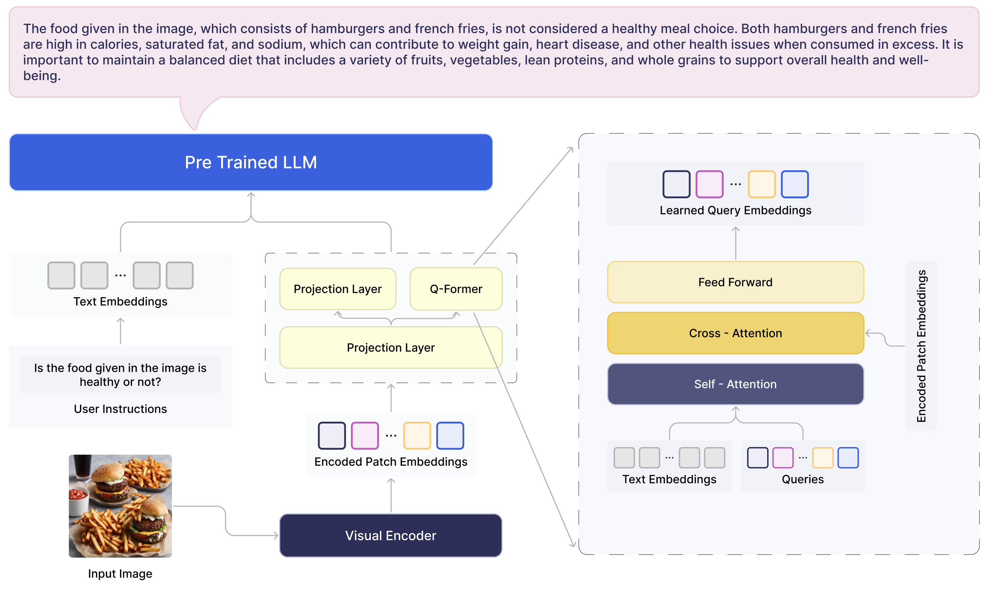
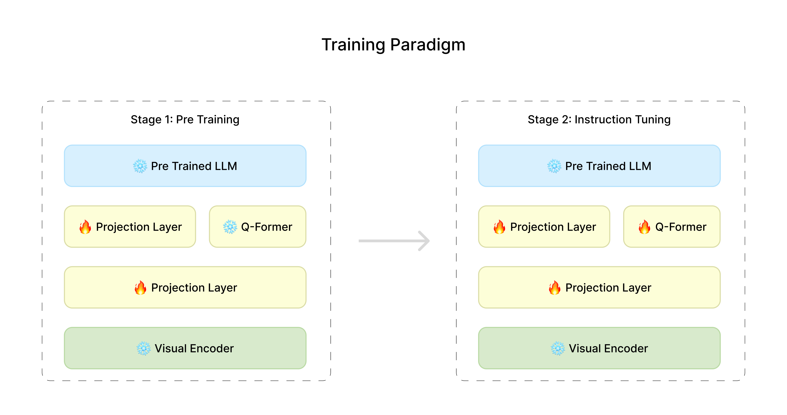
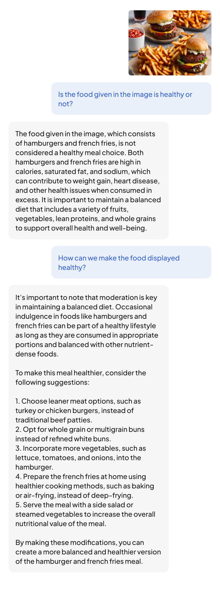
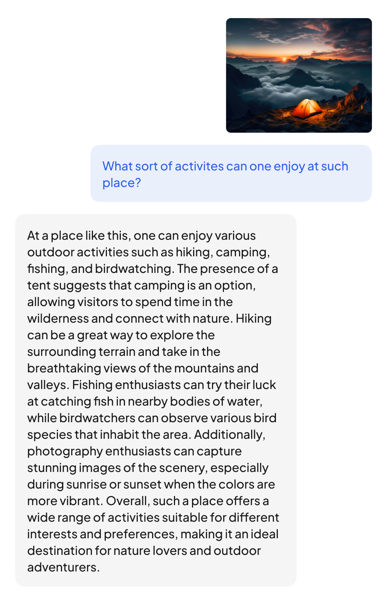
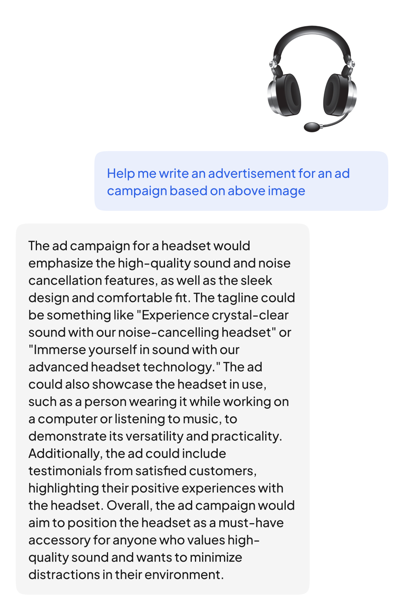
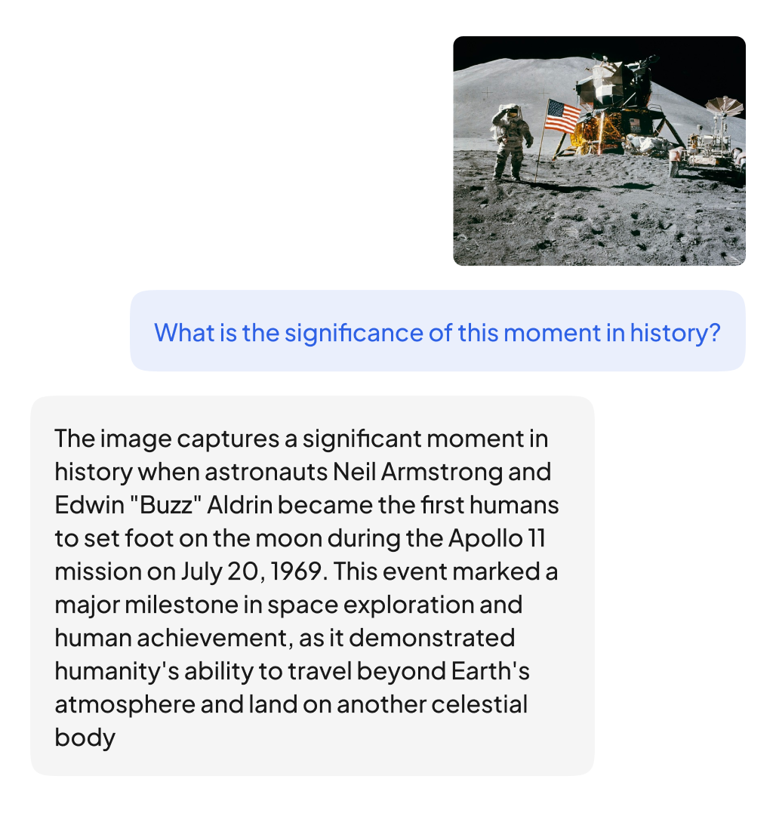

# [Veagle——探索多模态表示学习新前沿](https://arxiv.org/abs/2403.08773)

发布时间：2024年01月18日

`LLM应用` `` ``

> Veagle: Advancements in Multimodal Representation Learning

> 近年来，AI 研究人员热衷于探索语言与视觉的融合之道，从而催生了旨在完美融合文本与视觉信息的多模态模型。这类模型作为 LLMs 的延伸，在解决从图像描述、视觉问答(VQA)至视觉定位等一系列广泛任务上表现卓越。然而，尽管进步显著，当面对真实场景中常见的图像理解和问题解答时，仍面临精确解读的难题。本文提出一种创新方法，以改进现有模型的多模态性能。鉴于当前 VLMs 和 MLLMs 存在的局限性，我们的新型Veagle模型汲取前人研究成果的成功经验和洞见，融入独特设计——采用动态机制将视觉信息编码后直接嵌入语言模型之中。这一动态方法使模型能更细腻地捕捉视觉语境中的复杂细节。为验证Veagle的有效性，我们在多个基准数据集上开展了全面实验，尤其聚焦于视觉问答和图像理解任务。实验结果显示，Veagle在性能上提升了5-6个百分点，显著超越现有模型，有力证明了其在传统基准之外的强大适应性和广泛应用潜力。

> Lately, researchers in artificial intelligence have been really interested in how language and vision come together, giving rise to the development of multimodal models that aim to seamlessly integrate textual and visual information. Multimodal models, an extension of Large Language Models (LLMs), have exhibited remarkable capabilities in addressing a diverse array of tasks, ranging from image captioning and visual question answering (VQA) to visual grounding. While these models have showcased significant advancements, challenges persist in accurately interpreting images and answering the question, a common occurrence in real-world scenarios. This paper introduces a novel approach to enhance the multimodal capabilities of existing models. In response to the limitations observed in current Vision Language Models (VLMs) and Multimodal Large Language Models (MLLMs), our proposed model Veagle, incorporates a unique mechanism inspired by the successes and insights of previous works. Veagle leverages a dynamic mechanism to project encoded visual information directly into the language model. This dynamic approach allows for a more nuanced understanding of intricate details present in visual contexts. To validate the effectiveness of Veagle, we conduct comprehensive experiments on benchmark datasets, emphasizing tasks such as visual question answering and image understanding. Our results indicate a improvement of 5-6 \% in performance, with Veagle outperforming existing models by a notable margin. The outcomes underscore the model's versatility and applicability beyond traditional benchmarks.

[Arxiv](https://arxiv.org/abs/2403.08773)