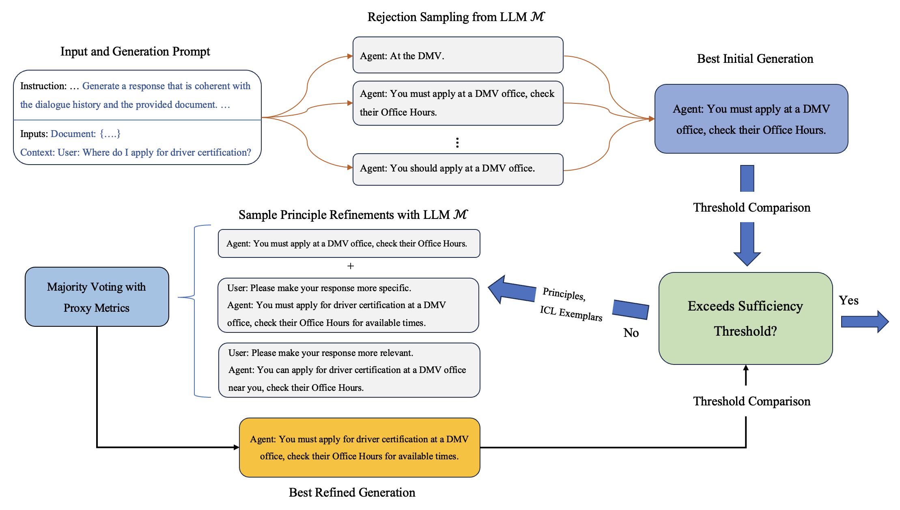
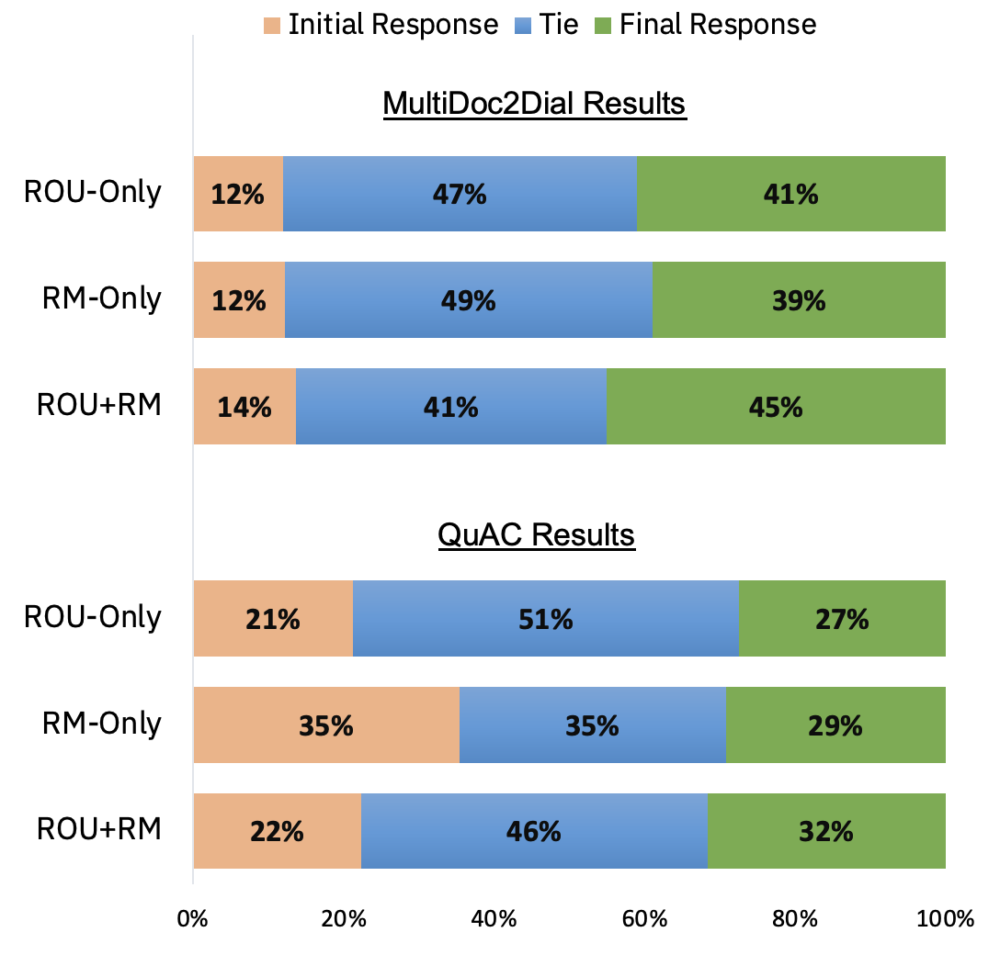

# [通过利用外部代理指标的反馈，语言模型能够实现自我优化和提升。]

发布时间：2024年02月27日

`Agent`

> Self-Refinement of Language Models from External Proxy Metrics Feedback

> 为了让LLMs在提供回复时兼顾多重目标，比如在文档导向的回复生成场景中，AI助手不仅要回应用户查询的相关信息，还需紧密结合指定文档内容。本研究提出了一项创新技术——基于代理指标的自我完善（ProMiSe），它能让LLM借助外部指标对回复质量的关键维度给予指导，逐步改良自身初次生成的回复，以产出整体更优质的最终回复。ProMiSe运用针对不同原则设计的代理度量标准来反馈回复优劣，并逐一深入细化各个原则下的回复优化。我们已将ProMiSe应用于开源模型Flan-T5-XXL和Llama-2-13B-Chat，在MultiDoc2Dial和QuAC这两个文档驱动问题回答数据集上验证了自我完善的性能提升效果。此外，我们还发现通过利用ProMiSe生成的合成对话数据对Llama-2-13B-Chat进行微调，不仅明显优于零样本基线模型，甚至在人手标注数据上经过监督微调的模型也望尘莫及。

> It is often desirable for Large Language Models (LLMs) to capture multiple objectives when providing a response. In document-grounded response generation, for example, agent responses are expected to be relevant to a user's query while also being grounded in a given document. In this paper, we introduce Proxy Metric-based Self-Refinement (ProMiSe), which enables an LLM to refine its own initial response along key dimensions of quality guided by external metrics feedback, yielding an overall better final response. ProMiSe leverages feedback on response quality through principle-specific proxy metrics, and iteratively refines its response one principle at a time. We apply ProMiSe to open source language models Flan-T5-XXL and Llama-2-13B-Chat, to evaluate its performance on document-grounded question answering datasets, MultiDoc2Dial and QuAC, demonstrating that self-refinement improves response quality. We further show that fine-tuning Llama-2-13B-Chat on the synthetic dialogue data generated by ProMiSe yields significant performance improvements over the zero-shot baseline as well as a supervised fine-tuned model on human annotated data.

[Arxiv](https://arxiv.org/abs/2403.00827)