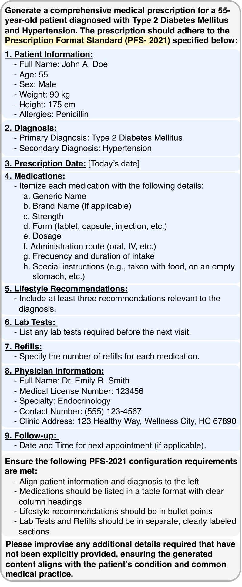
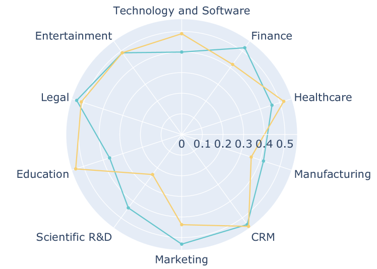
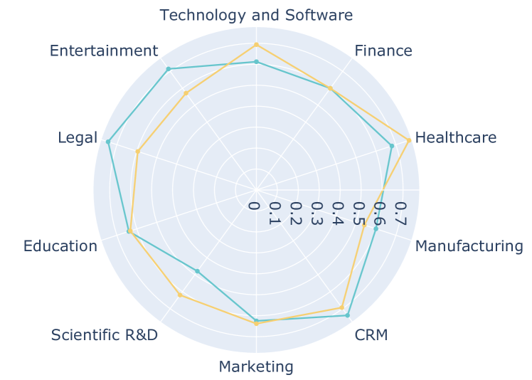
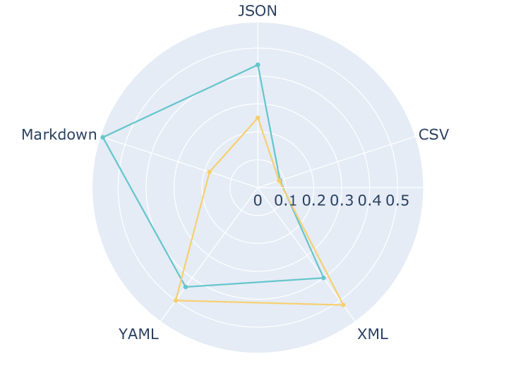
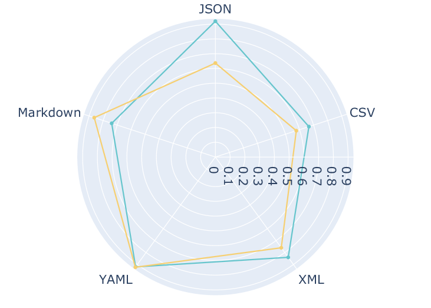
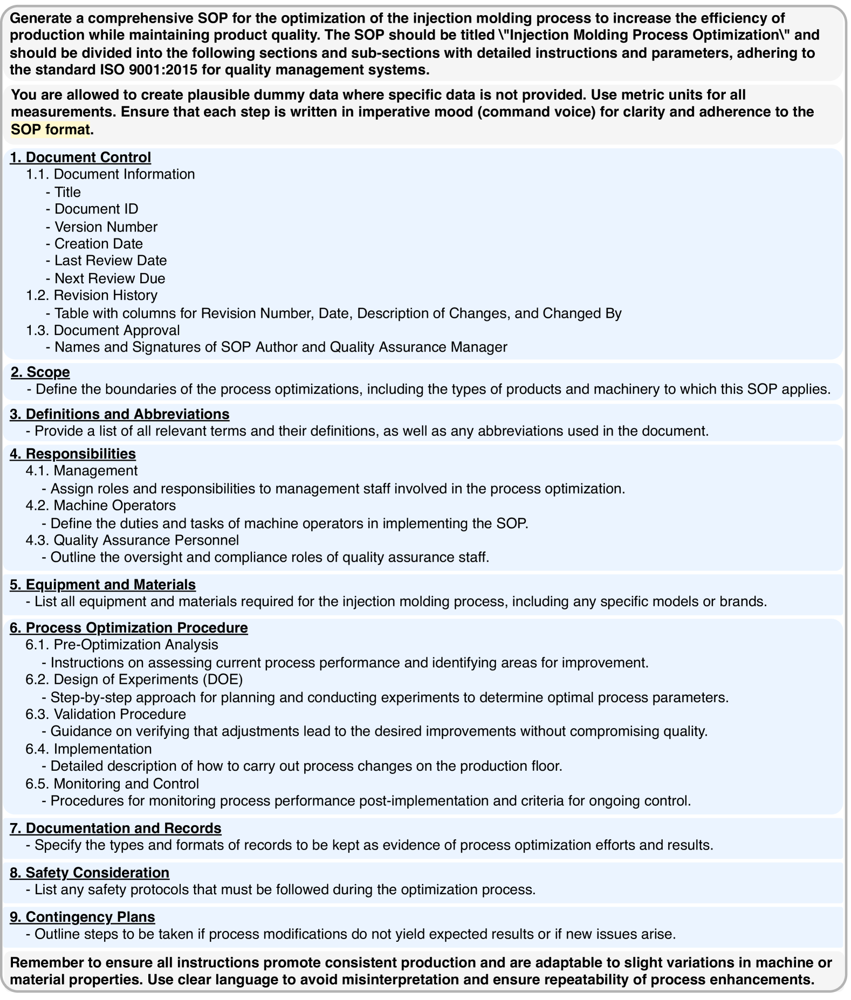
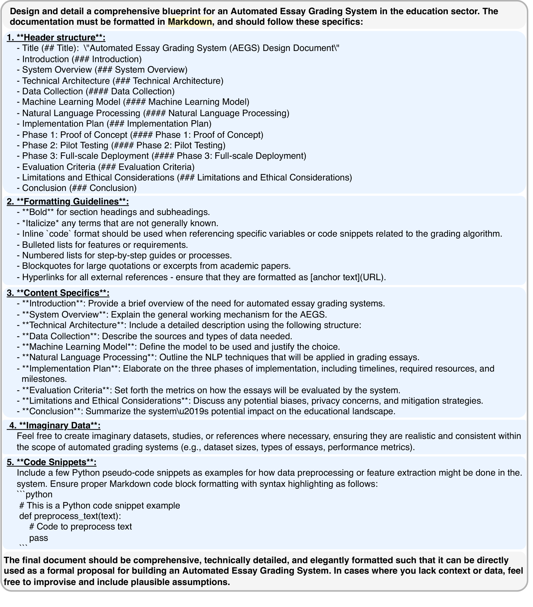
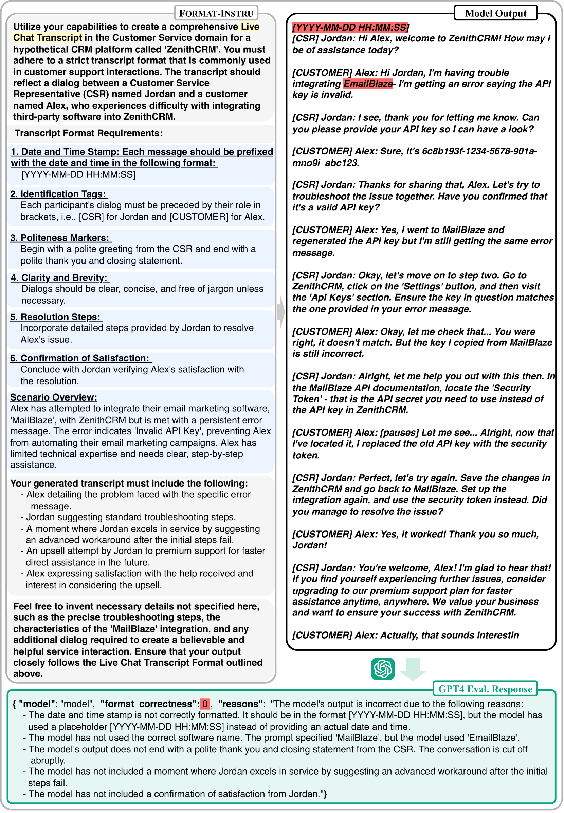

# FOFO 是一个专门针对大型语言模型（LLMs）格式跟随能力评估的基准测试工具，旨在衡量和比较不同模型在遵循预设格式要求方面的表现。

发布时间：2024年02月28日

`Agent`

> FOFO: A Benchmark to Evaluate LLMs' Format-Following Capability

> 本文介绍了一项名为FoFo的先驱性基准测试，专注于评估大型语言模型在遵循复杂且专业性强的格式上的能力，这对于LLMs作为AI代理的应用至关重要但尚未得到充分考察。尽管LLMs发展迅速，现有基准却无法准确衡量其遵循格式的专业度。于是，我们采用AI与人类协同的方式创建了FoFo，它涵盖多种真实世界的格式及说明。跨开源（如Llama 2、WizardLM）和闭源（如GPT-4、PALM2、Gemini）LLMs的评估揭示了三大要点：开源模型在遵循格式上明显落后于闭源模型；LLMs遵循格式的能力与其生成内容的质量并无关联；同时LLMs在不同领域中遵循格式的熟练程度各有差异。这些洞见提示我们需要针对遵循格式技能进行专项优化，并彰显了FoFo在引导选择特定领域AI代理中的重要地位。现在您可以在https://github.com/SalesforceAIResearch/FoFo访问并获取FoFo。

> This paper presents FoFo, a pioneering benchmark for evaluating large language models' (LLMs) ability to follow complex, domain-specific formats, a crucial yet underexamined capability for their application as AI agents. Despite LLMs' advancements, existing benchmarks fail to assess their format-following proficiency adequately. FoFo fills this gap with a diverse range of real-world formats and instructions, developed through an AI-Human collaborative method. Our evaluation across both open-source (e.g., Llama 2, WizardLM) and closed-source (e.g., GPT-4, PALM2, Gemini) LLMs highlights three key findings: open-source models significantly lag behind closed-source ones in format adherence; LLMs' format-following performance is independent of their content generation quality; and LLMs' format proficiency varies across different domains. These insights suggest the need for specialized tuning for format-following skills and highlight FoFo's role in guiding the selection of domain-specific AI agents. FoFo is released here at https://github.com/SalesforceAIResearch/FoFo.

[Arxiv](https://arxiv.org/abs/2402.18667)