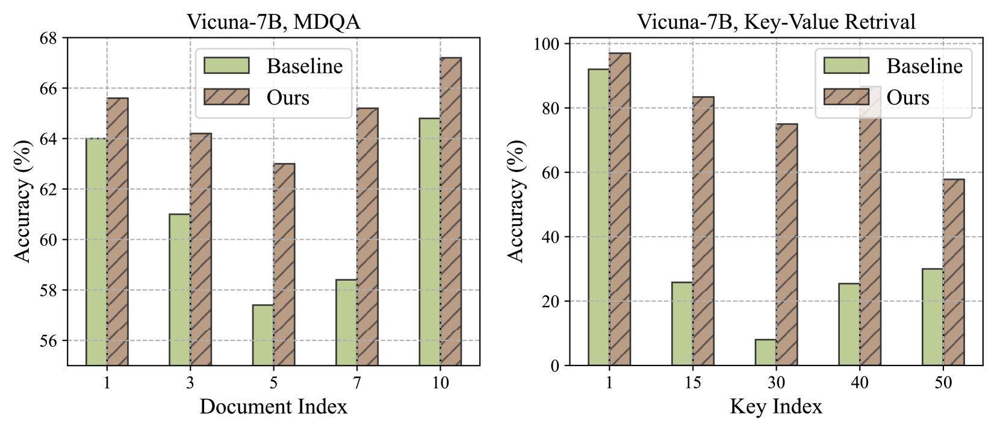
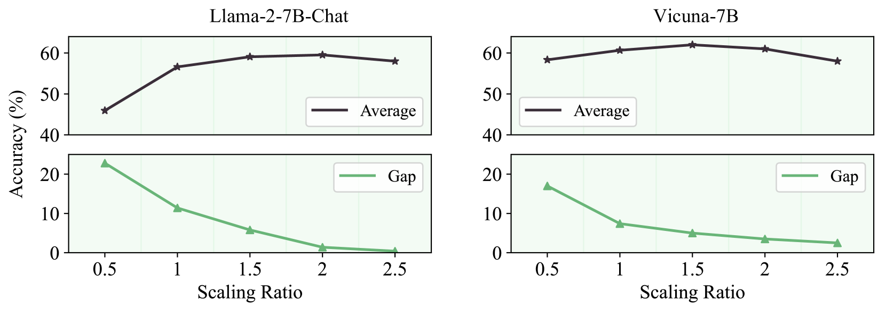
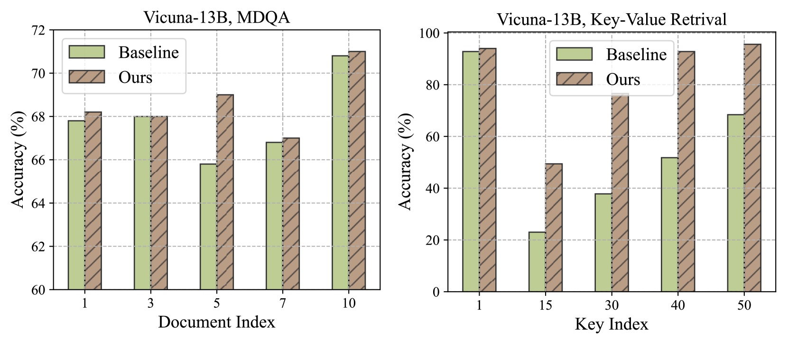

# [标题翻译：“巧用位置编码，解锁语言模型对长距离上下文的理解”正文翻译：研究表明，语言模型可通过创新的“即插即用”位置编码技术，显著提升其理解和利用长上下文信息的能力。](https://arxiv.org/abs/2403.04797)

发布时间：2024年03月04日

`LLM应用`

> Found in the Middle: How Language Models Use Long Contexts Better via Plug-and-Play Positional Encoding

> 本研究针对大型语言模型（LLMs）在处理长文本时“迷失其中”的问题提出解决方案。尽管当前LLMs已能处理数百万个标记的稳定语言建模，但对于如何有效地捕获并理解处于文本中部的关键信息仍有待突破。为此，我们创新性地设计了一种便捷易用的技术——多尺度位置编码（Ms-PoE），它无需微调或增加额外计算成本，即可显著提升LLMs对文本中部重要信息的处理能力。Ms-PoE通过重新调整位置索引以减轻RoPE带来的长期衰减影响，并巧妙地为各个注意力头设定特定的缩放比率，确保在不影响预训练阶段学习的核心知识的前提下，实现从短程到远程的多层次上下文融合。一系列广泛而深入的实验证明了这一方法的有效性，特别是在Zero-SCROLLS基准测试中，Ms-PoE助力LLMs取得了平均高达3.8点的准确率提升。相关代码已开源至https://github.com/VITA-Group/Ms-PoE。

> This paper aims to overcome the "lost-in-the-middle" challenge of large language models (LLMs). While recent advancements have successfully enabled LLMs to perform stable language modeling with up to 4 million tokens, the persistent difficulty faced by most LLMs in identifying relevant information situated in the middle of the context has not been adequately tackled. To address this problem, this paper introduces Multi-scale Positional Encoding (Ms-PoE) which is a simple yet effective plug-and-play approach to enhance the capacity of LLMs to handle the relevant information located in the middle of the context, without fine-tuning or introducing any additional overhead. Ms-PoE leverages the position indice rescaling to relieve the long-term decay effect introduced by RoPE, while meticulously assigning distinct scaling ratios to different attention heads to preserve essential knowledge learned during the pre-training step, forming a multi-scale context fusion from short to long distance. Extensive experiments with a wide range of LLMs demonstrate the efficacy of our approach. Notably, Ms-PoE achieves an average accuracy gain of up to 3.8 on the Zero-SCROLLS benchmark over the original LLMs. Code are available at https://github.com/VITA-Group/Ms-PoE.

