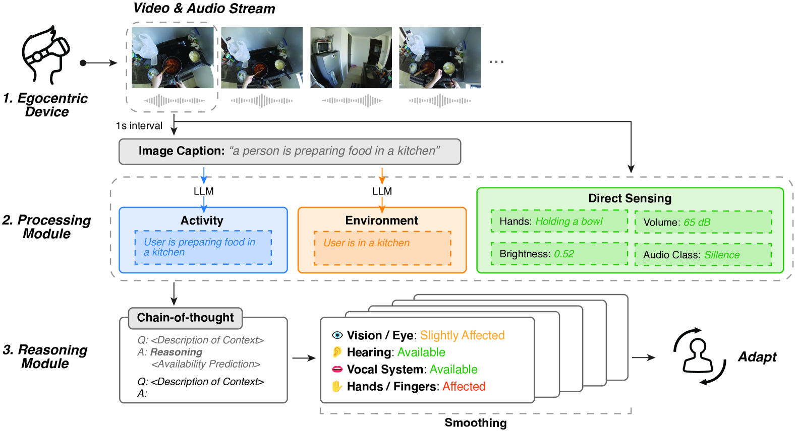
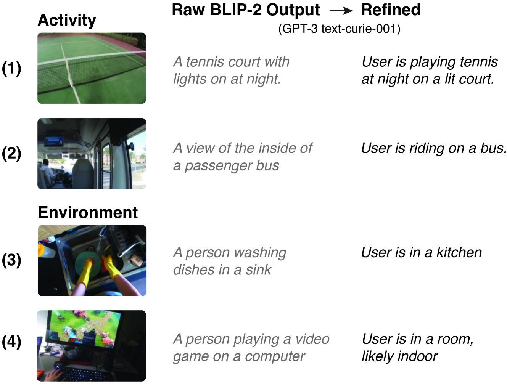
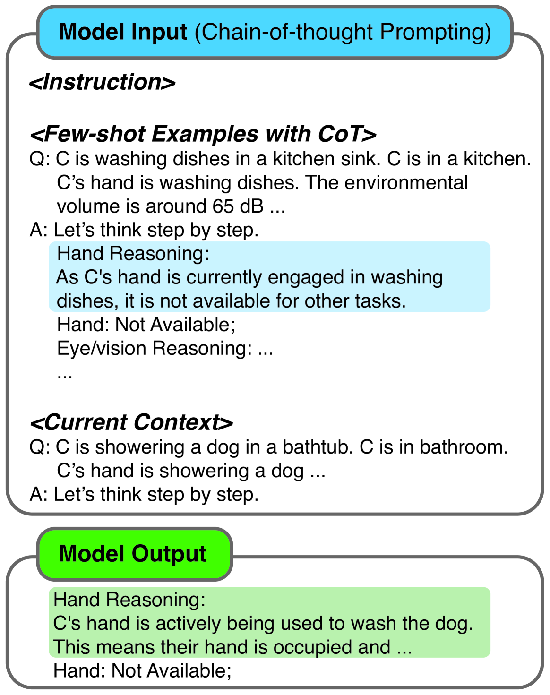
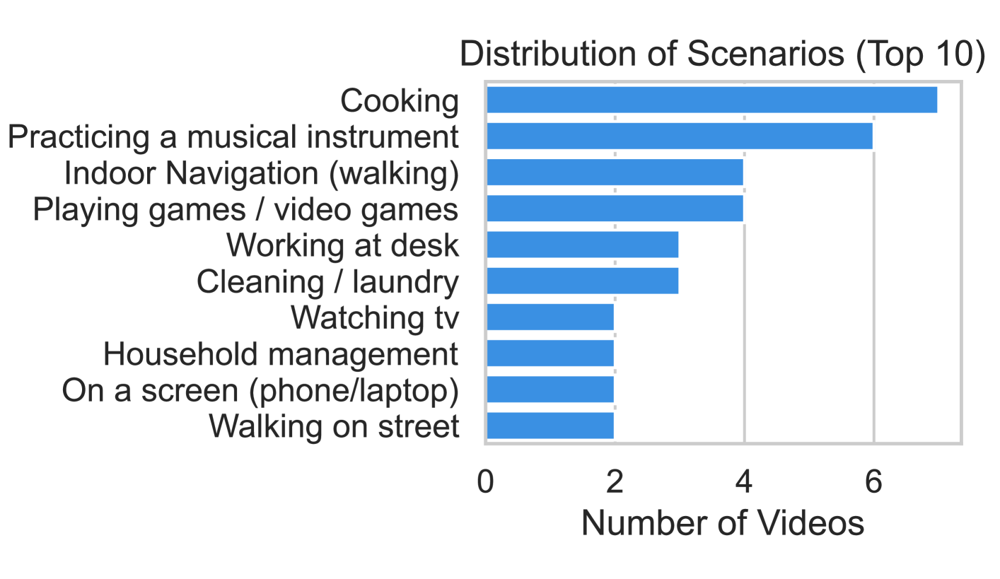
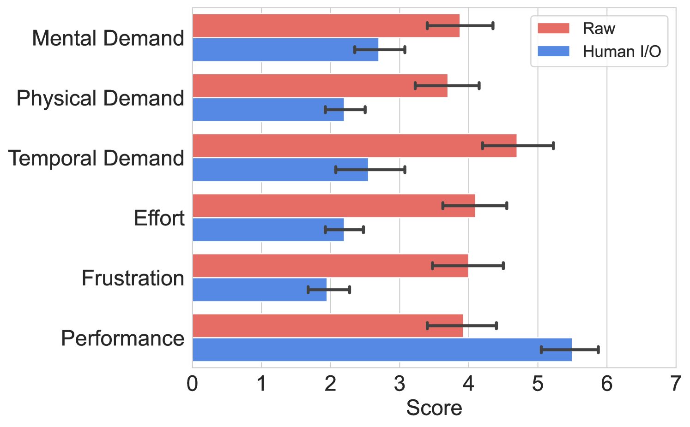
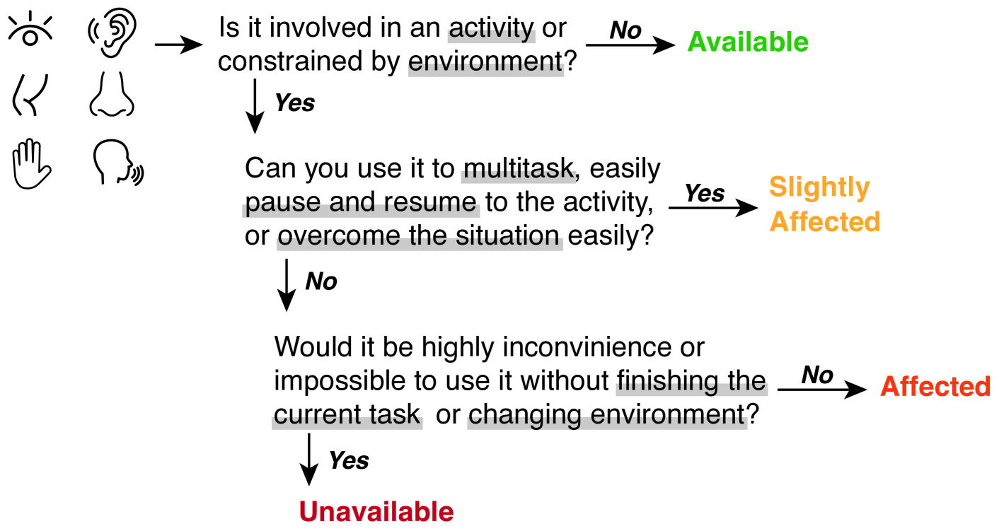
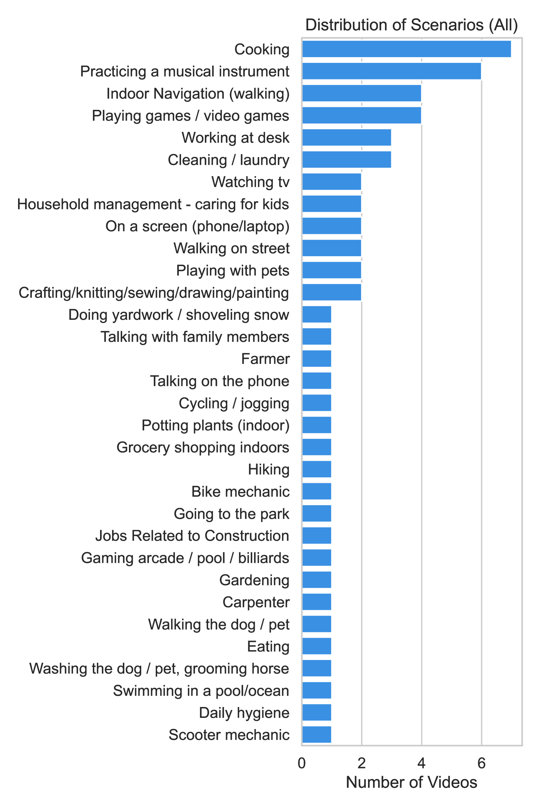

# [Human I/O：致力于构建一种用于识别情境性功能障碍的综合方法]

发布时间：2024年03月06日

`Agent` `人机交互` `可穿戴设备`

> Human I/O: Towards a Unified Approach to Detecting Situational Impairments

> SIIDs常因光照不足、噪声干扰和多任务处理等因素严重影响用户体验，而以往虽有专门针对此类问题的算法和系统，但大多局限于特定任务或环境，难以全面应对SIIDs多元化、动态化的特性。为此，我们创新提出了一种名为Human I/O的统一解决方案，通过衡量人类输入/输出通道的有效性，可有效识别各类SIIDs。结合第一人称视觉、多模态传感技术，并运用大型语言模型进行智能推理，Human I/O在对来自32个不同场景下60段真实世界第一人称视频的分析中，取得了平均绝对误差仅0.22、可用性预测准确率达到82%的好成绩。值得注意的是，尽管我们的工作重心在于SIIDs的检测，但通过与10位参与者的实际体验研究，我们成功验证了该原型系统的高效性。研究表明，Human I/O能在SIIDs存在的环境中显著减轻用户负担，提升使用体验，从而有力推动未来更加智能化、无障碍化的交互系统设计。

> Situationally Induced Impairments and Disabilities (SIIDs) can significantly hinder user experience in contexts such as poor lighting, noise, and multi-tasking. While prior research has introduced algorithms and systems to address these impairments, they predominantly cater to specific tasks or environments and fail to accommodate the diverse and dynamic nature of SIIDs. We introduce Human I/O, a unified approach to detecting a wide range of SIIDs by gauging the availability of human input/output channels. Leveraging egocentric vision, multimodal sensing and reasoning with large language models, Human I/O achieves a 0.22 mean absolute error and a 82% accuracy in availability prediction across 60 in-the-wild egocentric video recordings in 32 different scenarios. Furthermore, while the core focus of our work is on the detection of SIIDs rather than the creation of adaptive user interfaces, we showcase the efficacy of our prototype via a user study with 10 participants. Findings suggest that Human I/O significantly reduces effort and improves user experience in the presence of SIIDs, paving the way for more adaptive and accessible interactive systems in the future.

[Arxiv](https://arxiv.org/abs/2403.04008)