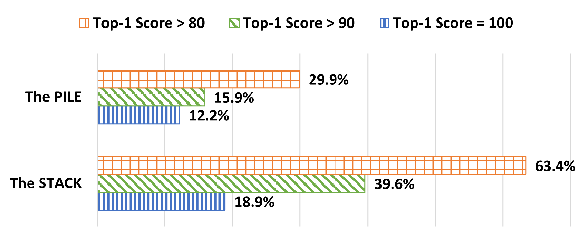
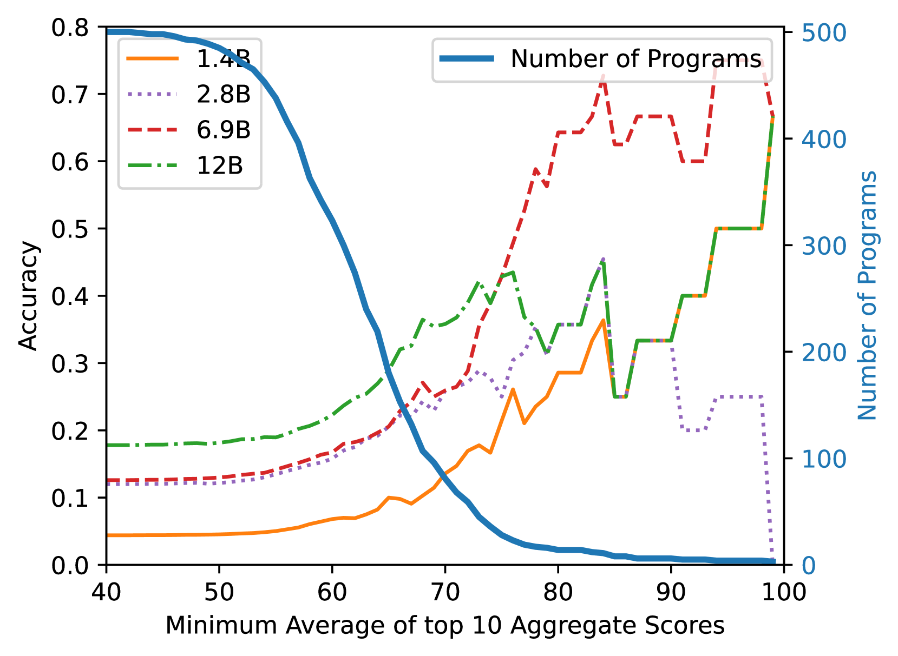
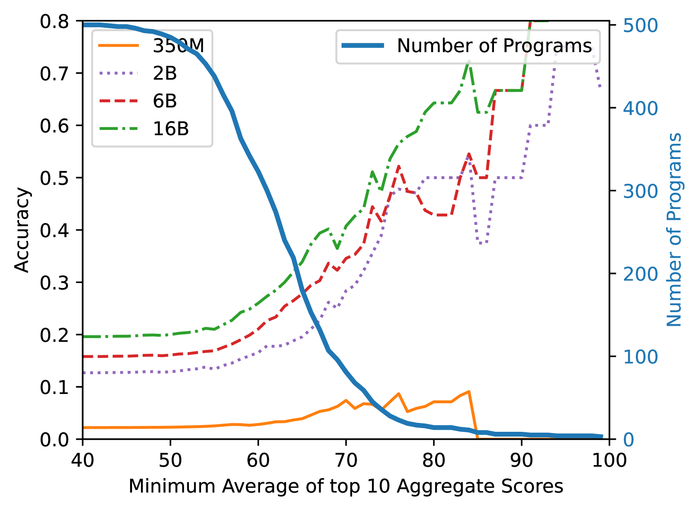
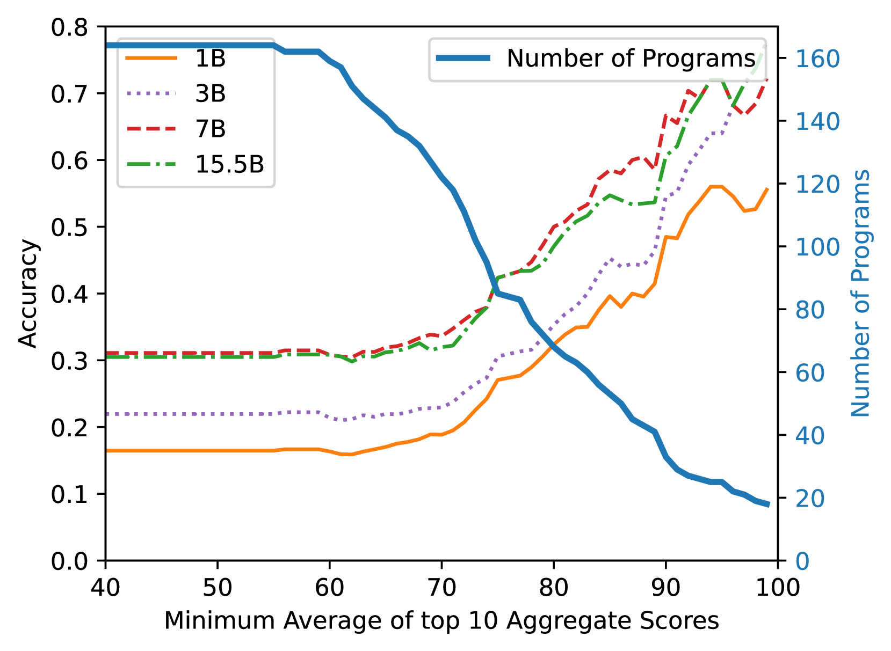
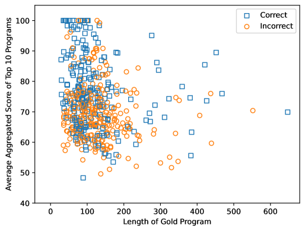

# [在衡量语言模型进行代码生成的能力时，本研究专注于量化其中的“污染”因素，以准确评估其真实性能。](https://arxiv.org/abs/2403.04811)

发布时间：2024年03月06日

`LLM应用`

> Quantifying Contamination in Evaluating Code Generation Capabilities of Language Models

> 尽管大型语言模型在各类代码生成任务上表现卓越，但关于基准数据可能污染预训练和微调阶段的问题引起了广泛关注。当前研究虽已探究过自然语言任务中的数据污染现象，但在编程场景下LLM的可靠性和健壮性评估中关键的一环——代码生成任务受污染数据影响的具体状况尚缺乏深度研究。本研究对此展开了全面探讨，细致地通过表面及语义层面的匹配，精准测量了主流代码生成基准与预训练语料库之间的重复程度。实验揭示，许多热门基准数据与开放训练语料有显著交集，且模型在训练时接触过类似解法的部分基准上表现出色。此外，我们还深入剖析了模型大小、问题难度、题目长度等因素对模型记忆和泛化能力的影响，并将整个匹配过程中产生的所有相关文件公之于众，以供后续研究参考。

> While large language models have achieved remarkable performance on various code generation benchmarks, there have been growing concerns regarding potential contamination of these benchmarks as they may be leaked into pretraining and finetuning data. While recent work has investigated contamination in natural language generation and understanding tasks, there has been less extensive research into how data contamination impacts the evaluation of code generation, which is critical for understanding the robustness and reliability of LLMs in programming contexts. In this work, we perform a comprehensive study of data contamination of popular code generation benchmarks, and precisely quantify their overlap with pretraining corpus through both surface-level and semantic-level matching. In our experiments, we show that there are substantial overlap between popular code generation benchmarks and open training corpus, and models perform significantly better on the subset of the benchmarks where similar solutions are seen during training. We also conduct extensive analysis on the factors that affects model memorization and generalization, such as model size, problem difficulty, and question length. We release all resulting files from our matching pipeline for future research.

