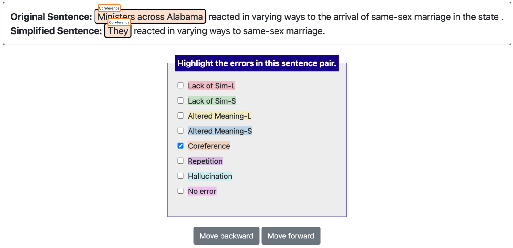
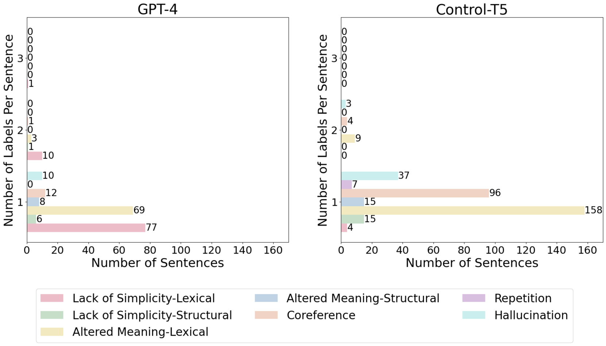
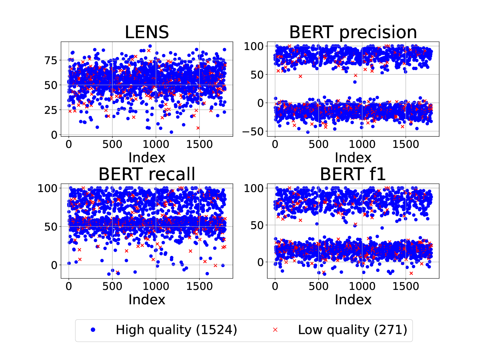
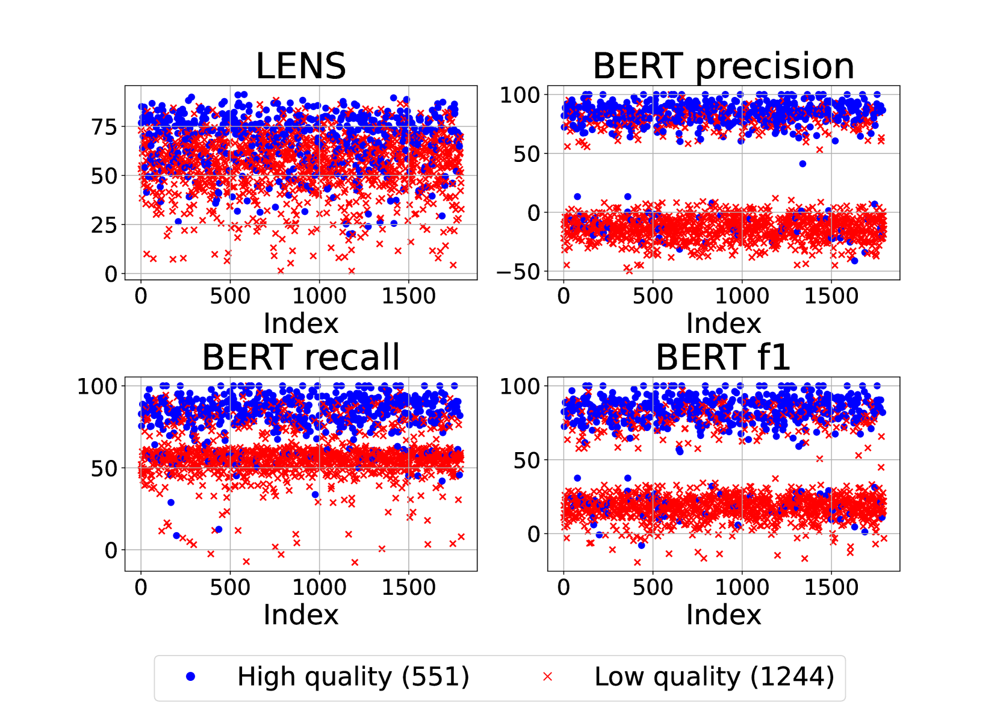
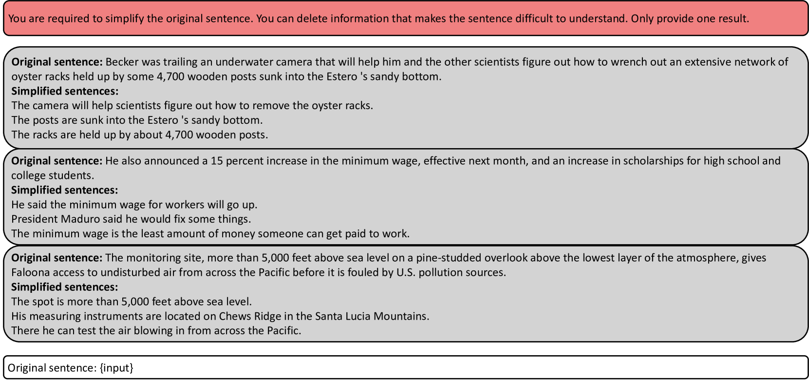

# 通过细致的错误导向人工评估，我们对GPT-4在句子简化任务中的表现进行了深度剖析。

发布时间：2024年03月07日

`LLM应用`

> An In-depth Evaluation of GPT-4 in Sentence Simplification with Error-based Human Assessment

# 摘要

> 句子简化技术通过将复杂句子改写得更通俗易懂，为各类阅读困难人群提供了有力支持。鉴于先进大型语言模型（LLMs）的崛起，对其在句子简化任务中的表现进行评估变得势在必行。先前的研究已结合自动评估指标与人工评估来检测LLMs的简化效能，但目前的评估方法是否适用于LLMs仍存在争议。一方面，现行自动评估标准对于LLMs简化效果的衡量并不稳定；另一方面，现有的句子简化人工评估手段或流于表面、难以全面揭示模型性能，或过于繁琐易变，降低了评估的一致性和可靠性。为此，本研究在保证评估可靠性的前提下，深度剖析了LLMs在句子简化任务上的实际表现。我们构建了一个基于错误的人工标注框架，专门用来考察GPT-4的简化能力。结果显示，相比当前最先进的模型，GPT-4在简化过程中产生的错误输出较少。然而，即使是强大的LLMs如GPT-4，在处理词汇替换等复杂场景时也暴露出一定的局限性。另外，我们借助人工标注数据对广泛应用的自动评估指标进行了深入元评估，发现在判断明显质量差距时，这些指标具有一定效力，但对于精准评估GPT-4生成的整体高质量简化成果，则显得敏感度不够。

> Sentence simplification, which rewrites a sentence to be easier to read and understand, is a promising technique to help people with various reading difficulties. With the rise of advanced large language models (LLMs), evaluating their performance in sentence simplification has become imperative. Recent studies have used both automatic metrics and human evaluations to assess the simplification abilities of LLMs. However, the suitability of existing evaluation methodologies for LLMs remains in question. First, the suitability of current automatic metrics on LLMs' simplification evaluation is still uncertain. Second, current human evaluation approaches in sentence simplification often fall into two extremes: they are either too superficial, failing to offer a clear understanding of the models' performance, or overly detailed, making the annotation process complex and prone to inconsistency, which in turn affects the evaluation's reliability. To address these problems, this study provides in-depth insights into LLMs' performance while ensuring the reliability of the evaluation. We design an error-based human annotation framework to assess the GPT-4's simplification capabilities. Results show that GPT-4 generally generates fewer erroneous simplification outputs compared to the current state-of-the-art. However, LLMs have their limitations, as seen in GPT-4's struggles with lexical paraphrasing. Furthermore, we conduct meta-evaluations on widely used automatic metrics using our human annotations. We find that while these metrics are effective for significant quality differences, they lack sufficient sensitivity to assess the overall high-quality simplification by GPT-4.

[Arxiv](https://arxiv.org/abs/2403.04963)