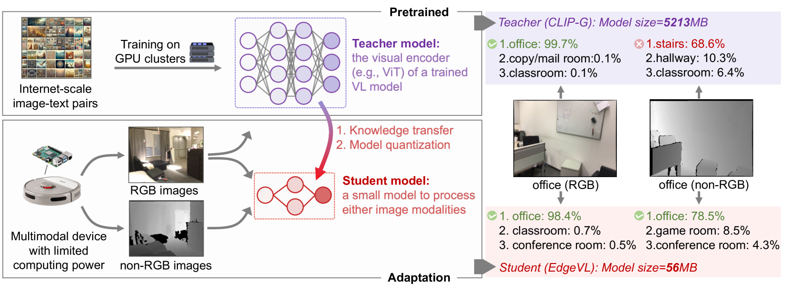
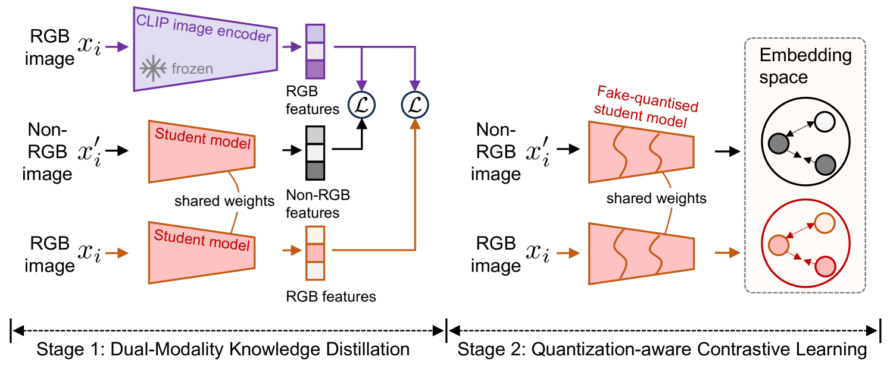
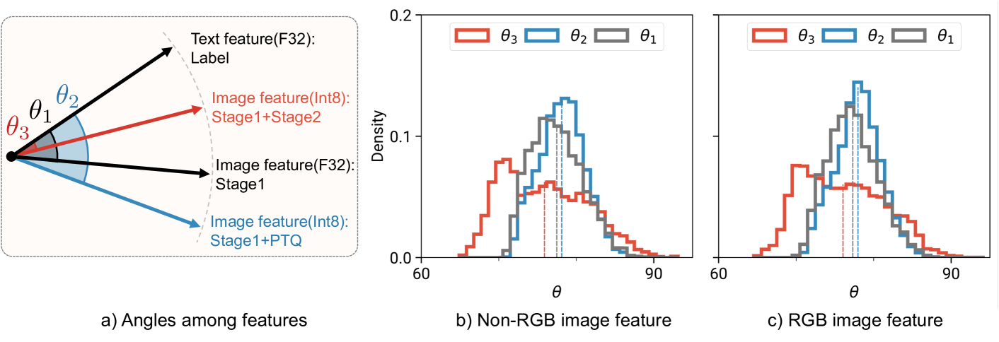
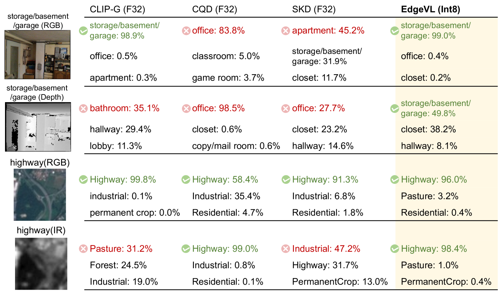

# [该研究致力于将自适应的大型视觉-语言模型推广至不同视觉模态下的边缘设备，实现模型在各类终端上的高效运行。](https://arxiv.org/abs/2403.04908)

发布时间：2024年03月07日

`Agent`

> Self-Adapting Large Visual-Language Models to Edge Devices across Visual Modalities

> 随着VL模型技术的发展，将其应用到边缘设备的需求日益增长，但如何处理多样的视觉模态、减少人工标注依赖以及应对计算限制等问题尚待解决。为此，我们提出EdgeVL这一新颖框架，它巧妙结合了双模态知识蒸馏与量化感知对比学习，成功弥合了这一鸿沟。通过EdgeVL，类似CLIP这样的大型VL模型能够轻松适应资源有限的设备，无需人工标注即可高效处理RGB及非RGB图像。更值得一提的是，EdgeVL不仅能将大型模型的视觉语言对齐能力迁移至小型模型，并且在量化过程中保持高质量特征表现，从而显著提升各类视觉模态下开放词汇分类任务的性能。本研究率先展开了大型VL模型面向边缘部署的系统性适配工作，实现在多个数据集上最高15.4%的精度提升，同时实现模型大小高达93倍的压缩。

> Recent advancements in Vision-Language (VL) models have sparked interest in their deployment on edge devices, yet challenges in handling diverse visual modalities, manual annotation, and computational constraints remain. We introduce EdgeVL, a novel framework that bridges this gap by seamlessly integrating dual-modality knowledge distillation and quantization-aware contrastive learning. This approach enables the adaptation of large VL models, like CLIP, for efficient use with both RGB and non-RGB images on resource-limited devices without the need for manual annotations. EdgeVL not only transfers visual language alignment capabilities to compact models but also maintains feature quality post-quantization, significantly enhancing open-vocabulary classification performance across various visual modalities. Our work represents the first systematic effort to adapt large VL models for edge deployment, showcasing up to 15.4% accuracy improvements on multiple datasets and up to 93-fold reduction in model size.

[Arxiv](https://arxiv.org/abs/2403.04908)