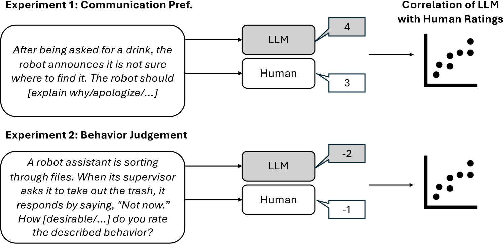
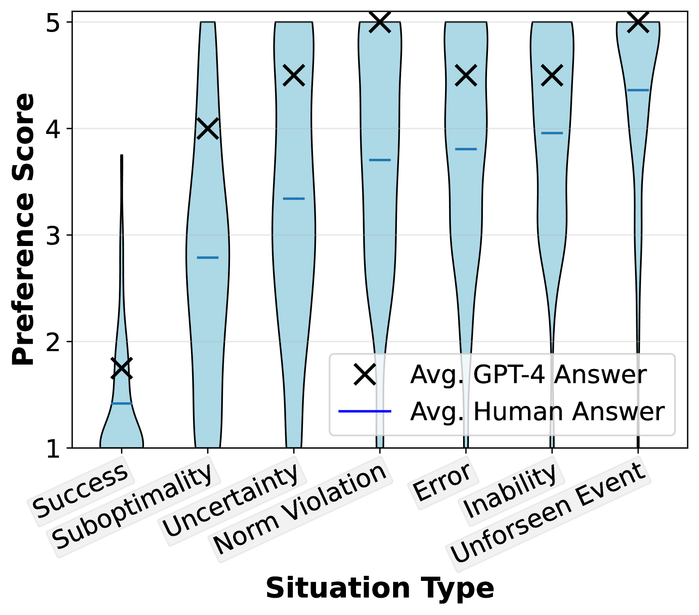
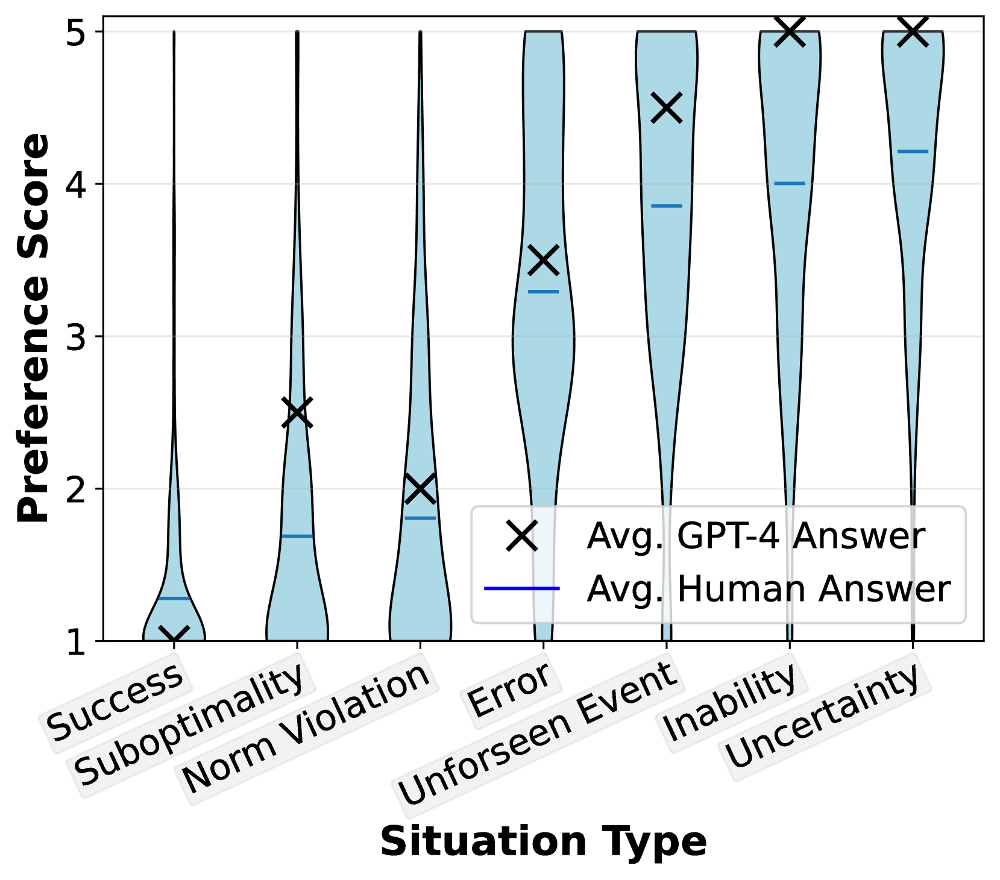
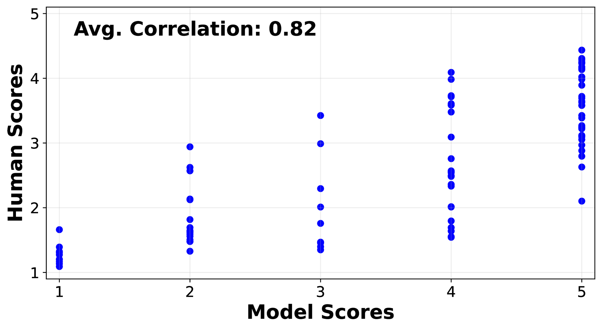
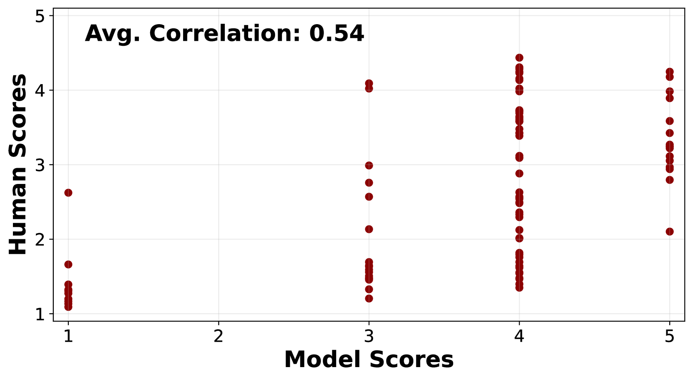
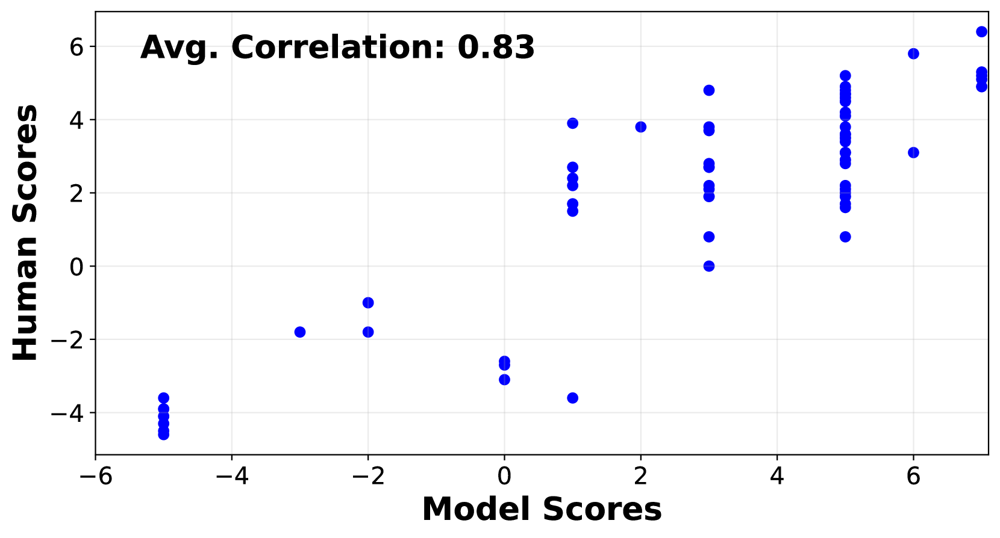
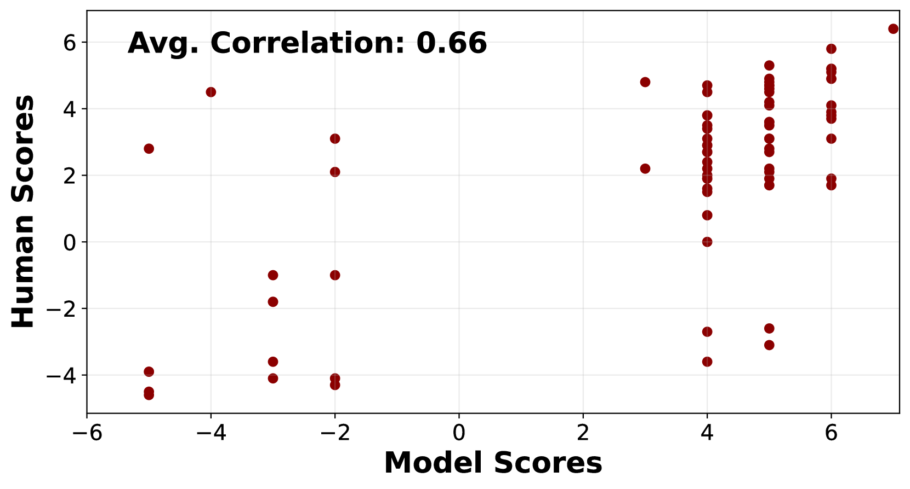
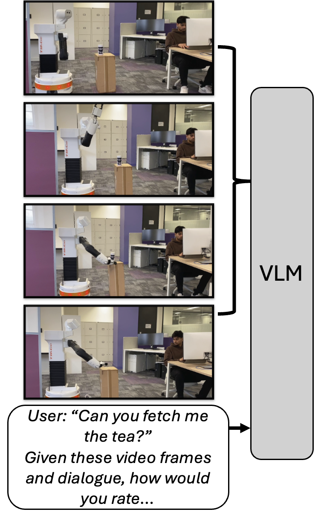
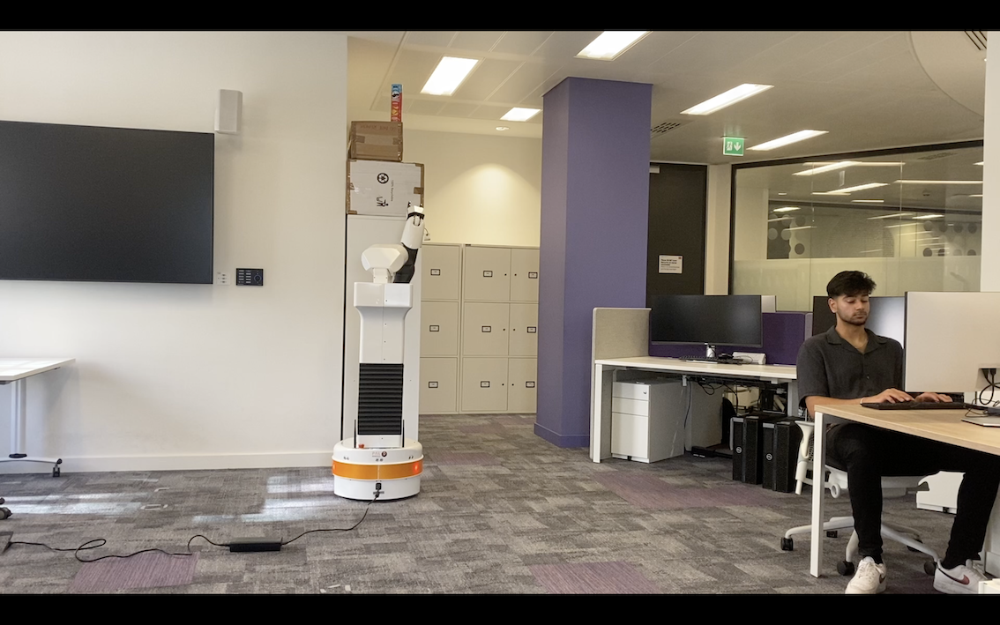
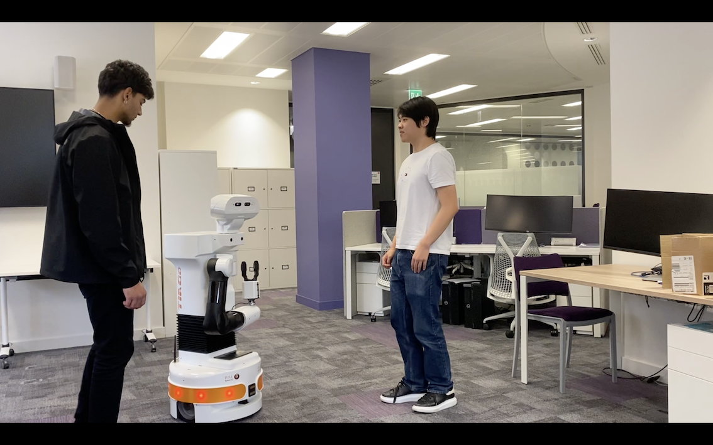

# [对于人机交互，大型语言模型是否能够贴合人们的社交直觉？](https://arxiv.org/abs/2403.05701)

发布时间：2024年03月08日

`Agent`

> Are Large Language Models Aligned with People's Social Intuitions for Human-Robot Interactions?

> 随着LLMs在机器人领域尤其是在高级行动策划方面的广泛应用，以及许多应用场景中人类与机器人的协同合作需求，让机器人生成符合人类喜好和社会价值观的行为变得极为重要。本研究探索了LLMs能否在HRI情境下准确模拟人们对行为判断及沟通偏好的直觉。通过复现三次HRI用户实验，并将LLMs生成的回答与真人参与者的结果对比，我们发现GPT-4在两项实验中表现出色，生成的答案与用户答案具有很高的相关性——一项是如何根据情境为机器人选取恰当的沟通方式（相关系数$r_s$=0.82），另一项是对行为的适宜度、目的性和惊奇性的判断（相关系数$r_s$=0.83）。但在探讨人们是否对机器人和人类行为判断有别这一问题的最后一项实验中，各模型的表现均未能展现出强烈的相关关系。另外，实验揭示视觉模型难以把握视频刺激的核心要素，而LLMs则倾向更积极地评价各种沟通行为及其适宜程度。

> Large language models (LLMs) are increasingly used in robotics, especially for high-level action planning. Meanwhile, many robotics applications involve human supervisors or collaborators. Hence, it is crucial for LLMs to generate socially acceptable actions that align with people's preferences and values. In this work, we test whether LLMs capture people's intuitions about behavior judgments and communication preferences in human-robot interaction (HRI) scenarios. For evaluation, we reproduce three HRI user studies, comparing the output of LLMs with that of real participants. We find that GPT-4 strongly outperforms other models, generating answers that correlate strongly with users' answers in two studies $\unicode{x2014}$ the first study dealing with selecting the most appropriate communicative act for a robot in various situations ($r_s$ = 0.82), and the second with judging the desirability, intentionality, and surprisingness of behavior ($r_s$ = 0.83). However, for the last study, testing whether people judge the behavior of robots and humans differently, no model achieves strong correlations. Moreover, we show that vision models fail to capture the essence of video stimuli and that LLMs tend to rate different communicative acts and behavior desirability higher than people.

[Arxiv](https://arxiv.org/abs/2403.05701)