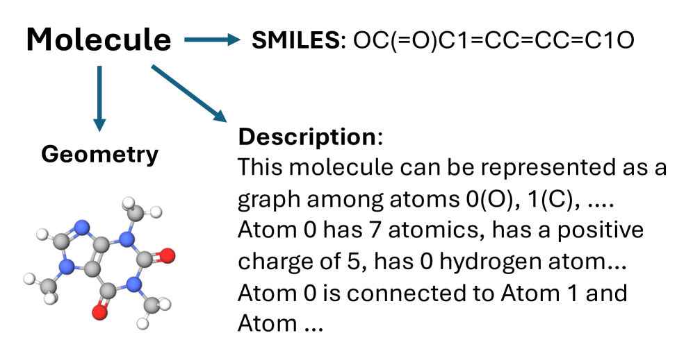
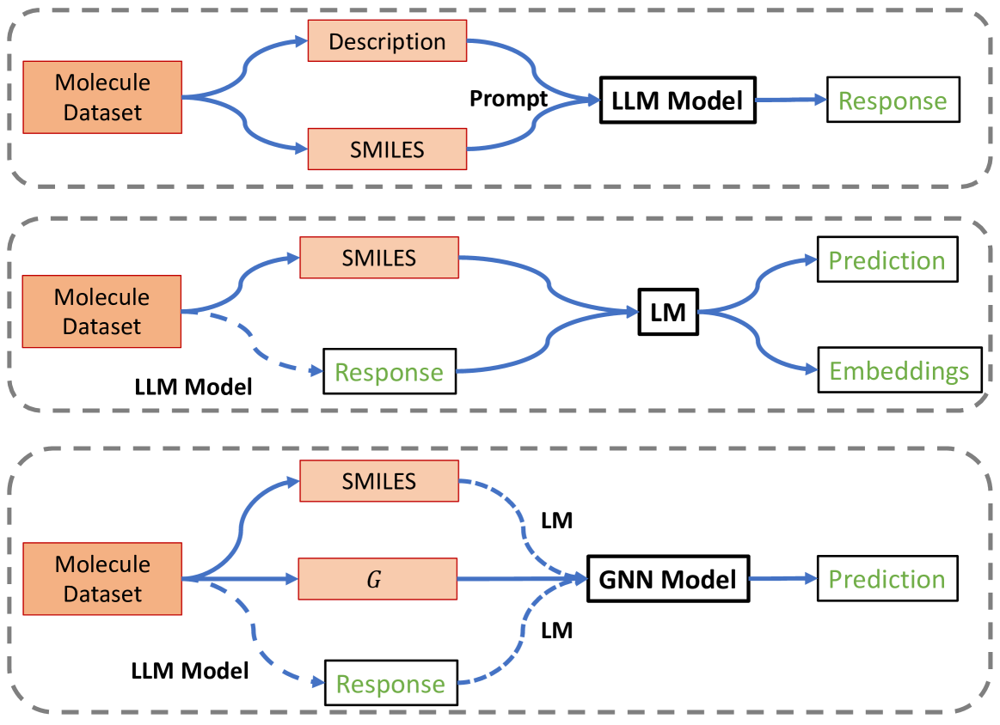
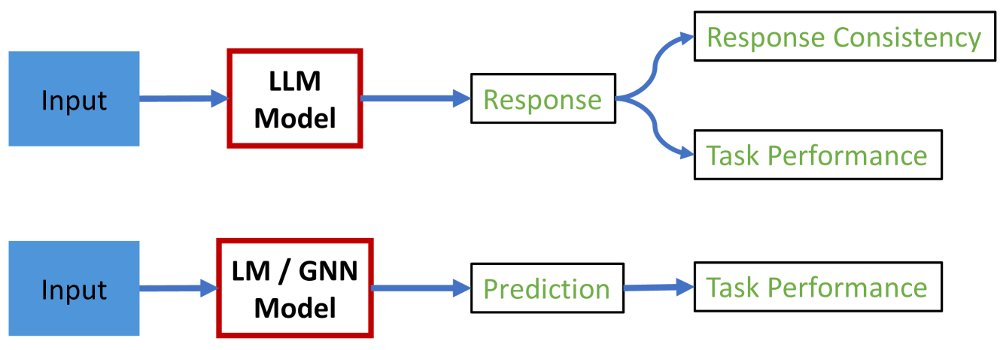
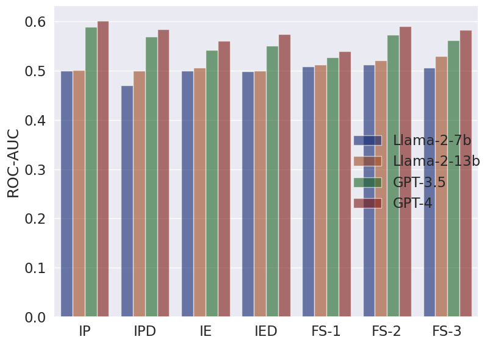
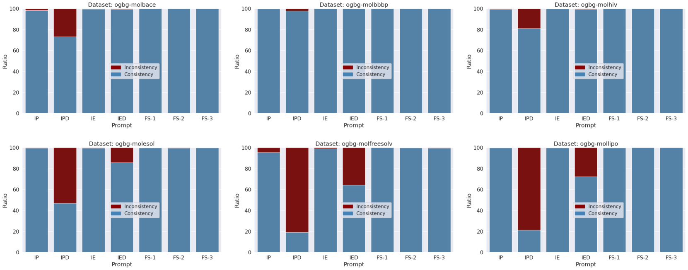

# [本研究致力于为分子预测任务设定基准，对大型语言模型的表现进行全面评估和对比。](https://arxiv.org/abs/2403.05075)

发布时间：2024年03月08日

`LLM应用`

> Benchmarking Large Language Models for Molecule Prediction Tasks

> LLMs在众多NLP任务中引领潮流，然而其在其他广阔领域的潜能仍有待深度探索，且设计与实现中尚存明显短板。尤其对于生物、化学等专业性强的领域，LLMs在处理诸如图形等结构化数据时显得力不从心。本文旨在解答一个核心问题：LLMs是否能够胜任分子预测任务？我们并不追求极致性能，而是关注LLMs如何在多种分子任务中发挥作用。为此，我们选取了六个典型分子数据集中的多个分类与回归预测任务，并细心构建了一套用于询问LLMs的提示语句，进而将LLMs的表现与现有的ML模型（包括基于文本的模型以及专为解析分子几何结构设计的模型）相比较。研究揭示了三个重要见解：一是总体而言，LLMs在分子任务上的竞争力不如ML模型，尤其是在处理分子几何结构时的能力限制明显；二是LLMs与ML模型协同工作时，有望提高整体性能；三是我们深入探讨了利用LLMs进行分子预测任务所面临的挑战以及潜在的发展路径。相关的代码和模型已发布在GitHub（https://github.com/zhiqiangzhongddu/LLMaMol）上供查阅。

> Large Language Models (LLMs) stand at the forefront of a number of Natural Language Processing (NLP) tasks. Despite the widespread adoption of LLMs in NLP, much of their potential in broader fields remains largely unexplored, and significant limitations persist in their design and implementation. Notably, LLMs struggle with structured data, such as graphs, and often falter when tasked with answering domain-specific questions requiring deep expertise, such as those in biology and chemistry. In this paper, we explore a fundamental question: Can LLMs effectively handle molecule prediction tasks? Rather than pursuing top-tier performance, our goal is to assess how LLMs can contribute to diverse molecule tasks. We identify several classification and regression prediction tasks across six standard molecule datasets. Subsequently, we carefully design a set of prompts to query LLMs on these tasks and compare their performance with existing Machine Learning (ML) models, which include text-based models and those specifically designed for analysing the geometric structure of molecules. Our investigation reveals several key insights: Firstly, LLMs generally lag behind ML models in achieving competitive performance on molecule tasks, particularly when compared to models adept at capturing the geometric structure of molecules, highlighting the constrained ability of LLMs to comprehend graph data. Secondly, LLMs show promise in enhancing the performance of ML models when used collaboratively. Lastly, we engage in a discourse regarding the challenges and promising avenues to harness LLMs for molecule prediction tasks. The code and models are available at https://github.com/zhiqiangzhongddu/LLMaMol.

