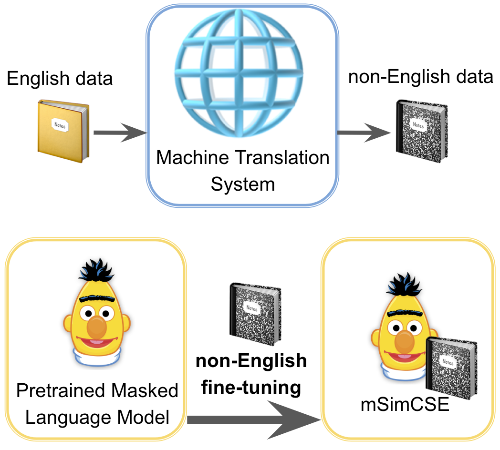
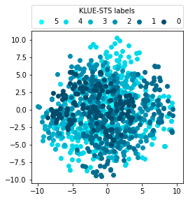
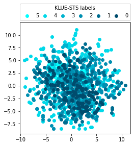
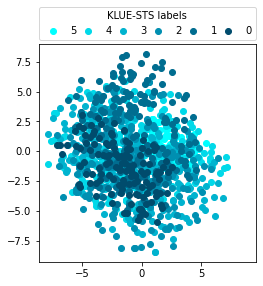
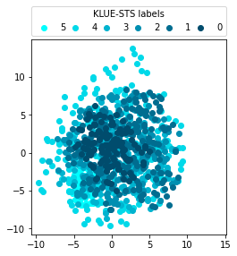

# 在探讨单语种语义文本相似度的数据增强方法时，究竟是采用跨语言迁移技术还是机器翻译策略呢？本研究旨在深入探究这一问题。

发布时间：2024年03月08日

`LLM应用`

> Cross-lingual Transfer or Machine Translation? On Data Augmentation for Monolingual Semantic Textual Similarity

> 优化句子嵌入有助于改善诸如 STS 和 NLI 等自然语言理解任务的表现。以往研究借助大型标注 NLI 数据集对掩码语言模型进行调整以生成句子嵌入时，其他语言的任务表现往往不理想。本次研究针对这一问题，直接对比了两种应用于单语 STS 的数据增强策略：一是利用单独的英语资源作为训练数据进行跨语言迁移，从而实现对非英语句子的零样本嵌入推断；二是预先采用机器翻译将英语数据转化为伪非英语训练数据。在对日语和韩语的单语 STS 实验中，我们发现两者方法效果相当。令人意外的是，相较于之前的研究所关注的以 NLI 数据为训练基础，我们发现对于这两种语言而言，Wikipedia 域的数据优于 NLI 域。综合实验结果，我们证实了 Wikipedia 数据的跨语言迁移可有效提升性能，并且直接运用本土 Wikipedia 数据还能进一步优化单语 STS 任务的表现。

> Learning better sentence embeddings leads to improved performance for natural language understanding tasks including semantic textual similarity (STS) and natural language inference (NLI). As prior studies leverage large-scale labeled NLI datasets for fine-tuning masked language models to yield sentence embeddings, task performance for languages other than English is often left behind. In this study, we directly compared two data augmentation techniques as potential solutions for monolingual STS: (a) cross-lingual transfer that exploits English resources alone as training data to yield non-English sentence embeddings as zero-shot inference, and (b) machine translation that coverts English data into pseudo non-English training data in advance. In our experiments on monolingual STS in Japanese and Korean, we find that the two data techniques yield performance on par. Rather, we find a superiority of the Wikipedia domain over the NLI domain for these languages, in contrast to prior studies that focused on NLI as training data. Combining our findings, we demonstrate that the cross-lingual transfer of Wikipedia data exhibits improved performance, and that native Wikipedia data can further improve performance for monolingual STS.

[Arxiv](https://arxiv.org/abs/2403.05257)