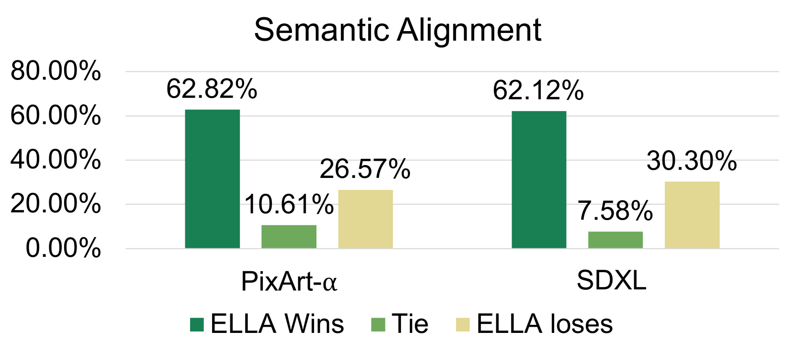
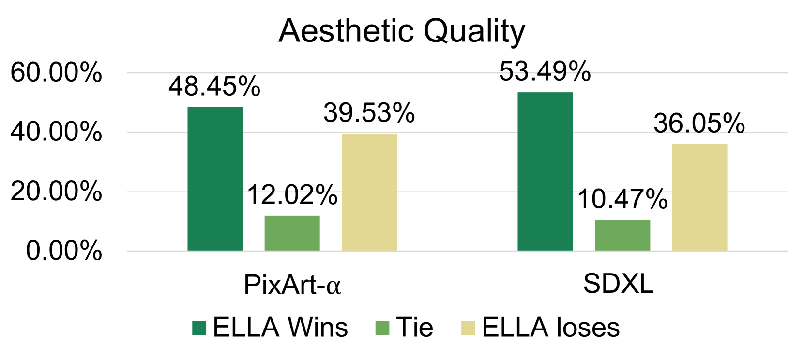

# ELLA项目通过将LLM与扩散模型相结合，旨在提升模型的语义对齐性能。

发布时间：2024年03月08日

`LLM应用`

> ELLA: Equip Diffusion Models with LLM for Enhanced Semantic Alignment

> 扩散模型在生成图像方面取得了显著成就，但现有主流模型受限于 CLIP 文本编码器，难以理解并应对包含多重元素、详尽属性、复杂关联及长文对齐等深度提示。为此，我们提出了名为 ELLA 的高效大型语言模型适配器，通过赋予文本到图像扩散模型接入强大多模态语言模型（LLM）的能力，在不额外训练 U-Net 或 LLM 的前提下提升文本匹配效果。我们探索了一系列语义对接方案，并创新设计出时序敏感语义连接器（TSC），能够根据时间步动态抽取 LLN 输出的条件信息。这种方法有助于扩散模型在采样过程中逐步解析和响应冗长而精细的提示内容。同时，ELLA 能够轻松集成各类社区模型和工具，助力提升其跟随指令的能力。为了全面检验模型处理深度提示的能力，我们构建了一个包含千余个深度提示的严苛基准测试 DPG-Bench。大量实验证明，相较于当前最优方法，ELLA 在处理深度提示尤其是含有多种属性和关系的多目标合成任务时，展现出更为出色的表现。

> Diffusion models have demonstrated remarkable performance in the domain of text-to-image generation. However, most widely used models still employ CLIP as their text encoder, which constrains their ability to comprehend dense prompts, encompassing multiple objects, detailed attributes, complex relationships, long-text alignment, etc. In this paper, we introduce an Efficient Large Language Model Adapter, termed ELLA, which equips text-to-image diffusion models with powerful Large Language Models (LLM) to enhance text alignment without training of either U-Net or LLM. To seamlessly bridge two pre-trained models, we investigate a range of semantic alignment connector designs and propose a novel module, the Timestep-Aware Semantic Connector (TSC), which dynamically extracts timestep-dependent conditions from LLM. Our approach adapts semantic features at different stages of the denoising process, assisting diffusion models in interpreting lengthy and intricate prompts over sampling timesteps. Additionally, ELLA can be readily incorporated with community models and tools to improve their prompt-following capabilities. To assess text-to-image models in dense prompt following, we introduce Dense Prompt Graph Benchmark (DPG-Bench), a challenging benchmark consisting of 1K dense prompts. Extensive experiments demonstrate the superiority of ELLA in dense prompt following compared to state-of-the-art methods, particularly in multiple object compositions involving diverse attributes and relationships.

[Arxiv](https://arxiv.org/abs/2403.05135)