# [GEAR是专为LLM设计的一种有效KV缓存压缩策略，旨在实现近无损的生成推理性能。这款新颖的压缩方案助力LLM在进行生成推理时，既能保持高效性又能实现近乎无损的质量保证。]

发布时间：2024年03月08日

`LLM应用`

> GEAR: An Efficient KV Cache Compression Recipefor Near-Lossless Generative Inference of LLM

> 为了应对大型语言模型（LLMs）推理过程中内存限制和速度瓶颈的问题，键值对（KV）缓存技术被广泛应用以提升生成速度。然而，随着序列长度增长，对缓存资源需求激增，致使LLMs推理成为受内存约束的关键问题，严重影响了系统的整体性能。当前普遍做法是丢弃无关紧要的令牌或者对所有条目进行统一量化，但这可能导致压缩矩阵出现较大误差，且误差会在自回归解码过程中累积放大，最终导致模型生成结果显著偏离，性能下滑。为此，我们创新性地提出了一种高效KV缓存压缩框架——GEAR，它能实现接近无损的高倍率压缩。GEAR首先将大量相近数值的条目精确量化至极低精度，随后运用低秩矩阵逼近量化误差，并通过稀疏矩阵精准校正异常条目的个体误差。GEAR精巧融合了这三种技术手段，充分发挥其协同效应。实验证明，相较于现有解决方案，GEAR能够在实现近乎无损的4比特KV缓存压缩的同时，最高提升2.38倍的吞吐量，并将峰值内存占用缩减至原先的2.29倍。我们的源代码已开源并托管在https://github.com/HaoKang-Timmy/GEAR。

> Key-value (KV) caching has become the de-facto to accelerate generation speed for large language models (LLMs) inference. However, the growing cache demand with increasing sequence length has transformed LLM inference to be a memory bound problem, significantly constraining the system throughput. Existing methods rely on dropping unimportant tokens or quantizing all entries uniformly. Such methods, however, often incur high approximation errors to represent the compressed matrices. The autoregressive decoding process further compounds the error of each step, resulting in critical deviation in model generation and deterioration of performance. To tackle this challenge, we propose GEAR, an efficient KV cache compression framework that achieves near-lossless high-ratio compression. GEAR first applies quantization to majority of entries of similar magnitudes to ultra-low precision. It then employs a low rank matrix to approximate the quantization error, and a sparse matrix to remedy individual errors from outlier entries. By adeptly integrating three techniques, GEAR is able to fully exploit their synergistic potentials. Our experiments demonstrate that compared to alternatives, GEAR achieves near-lossless 4-bit KV cache compression with up to 2.38x throughput improvement, while reducing peak-memory size up to 2.29x. Our code is publicly available at https://github.com/HaoKang-Timmy/GEAR.

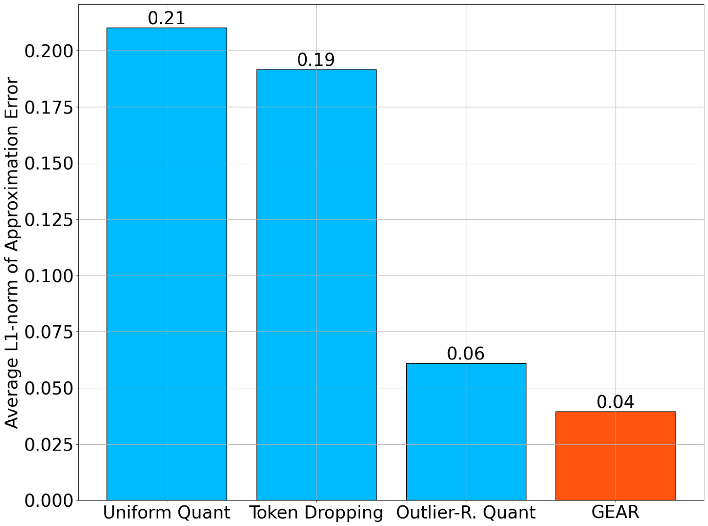

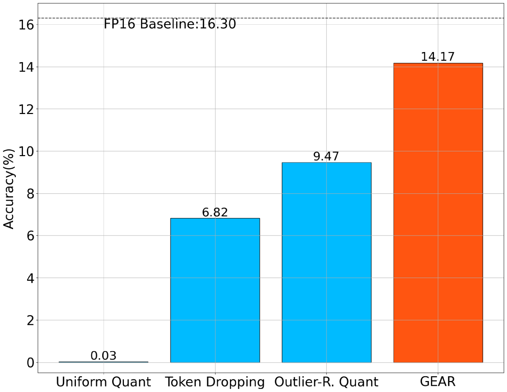

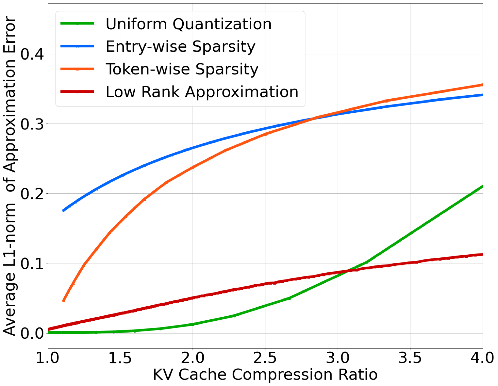

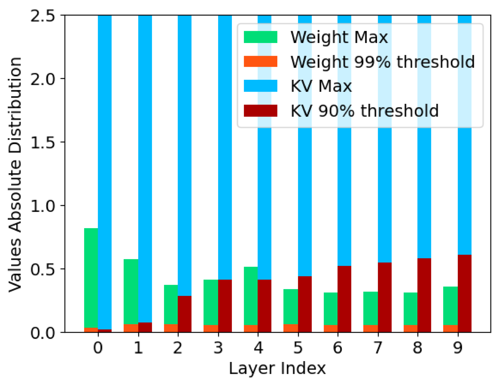

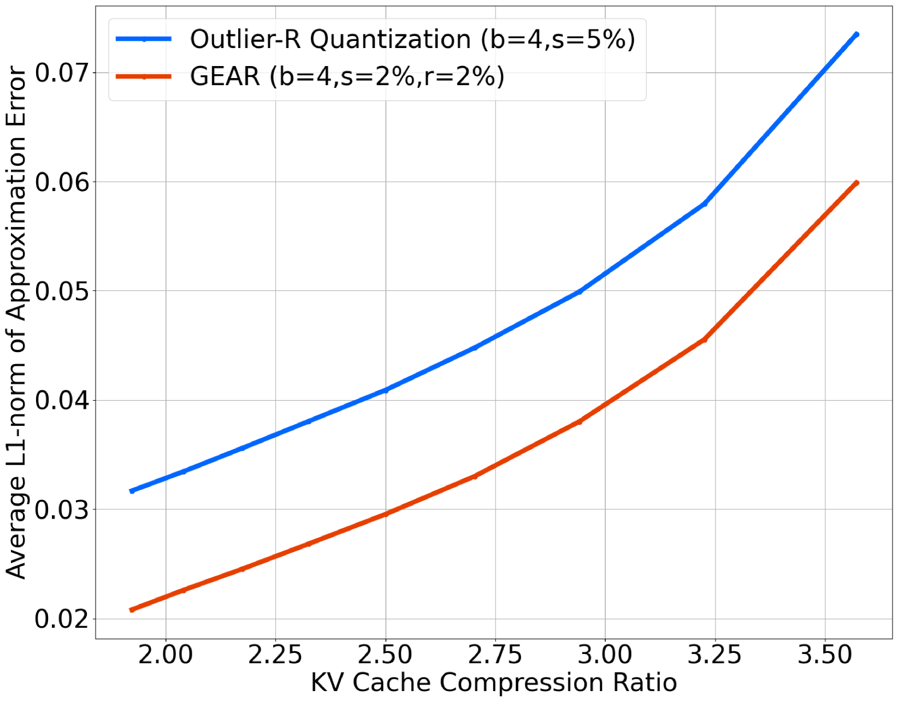

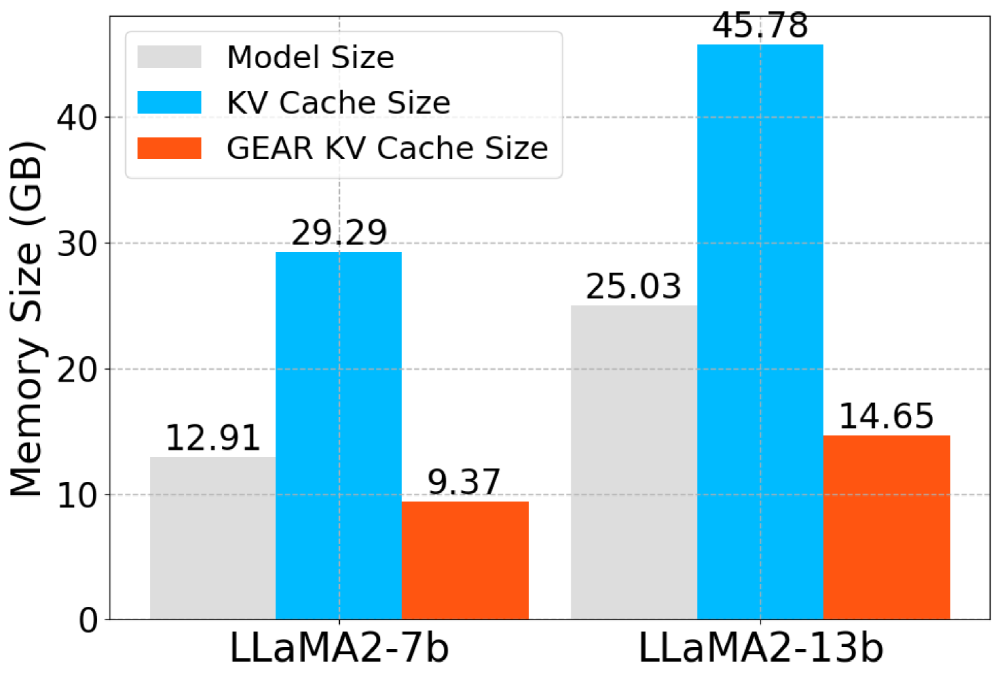

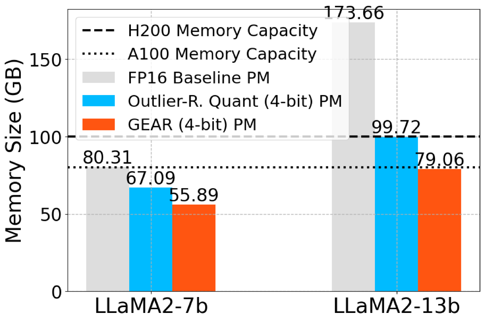

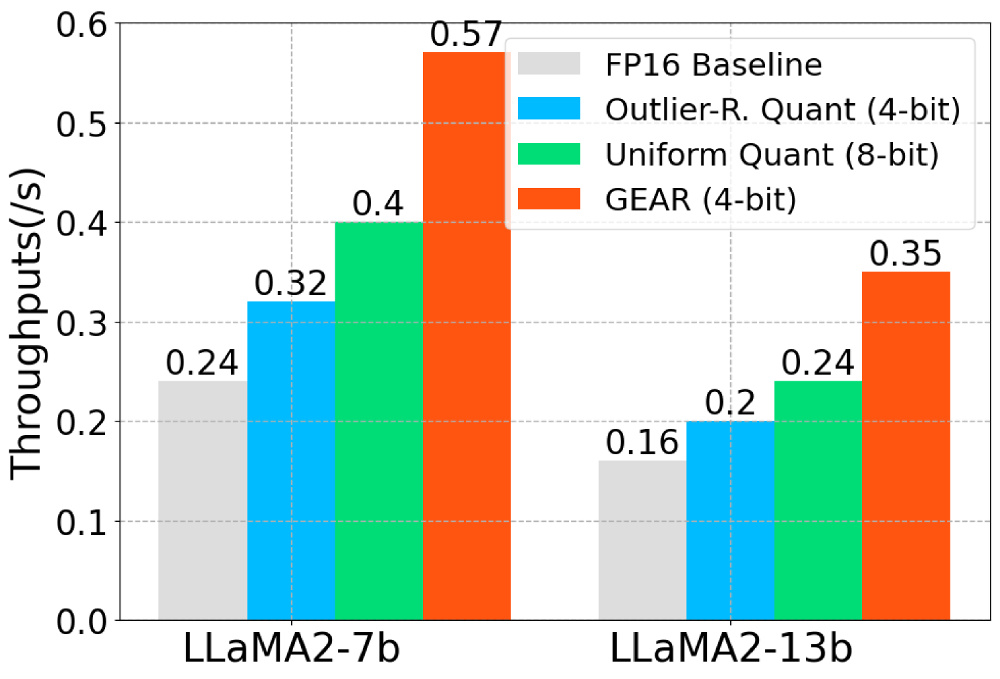

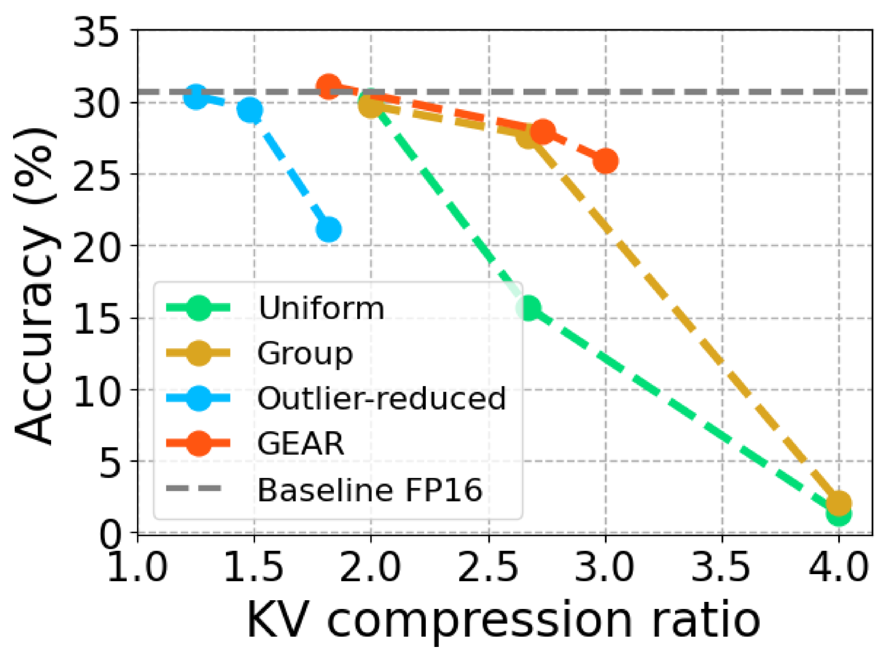

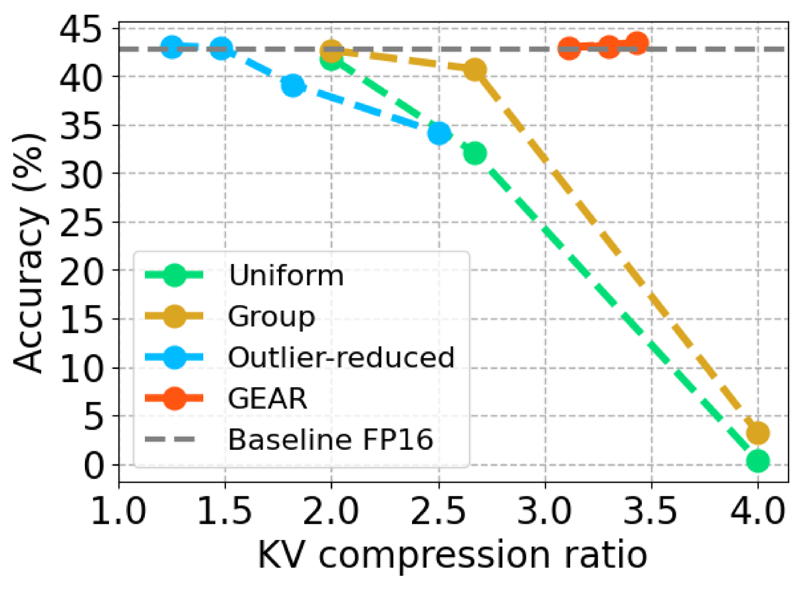

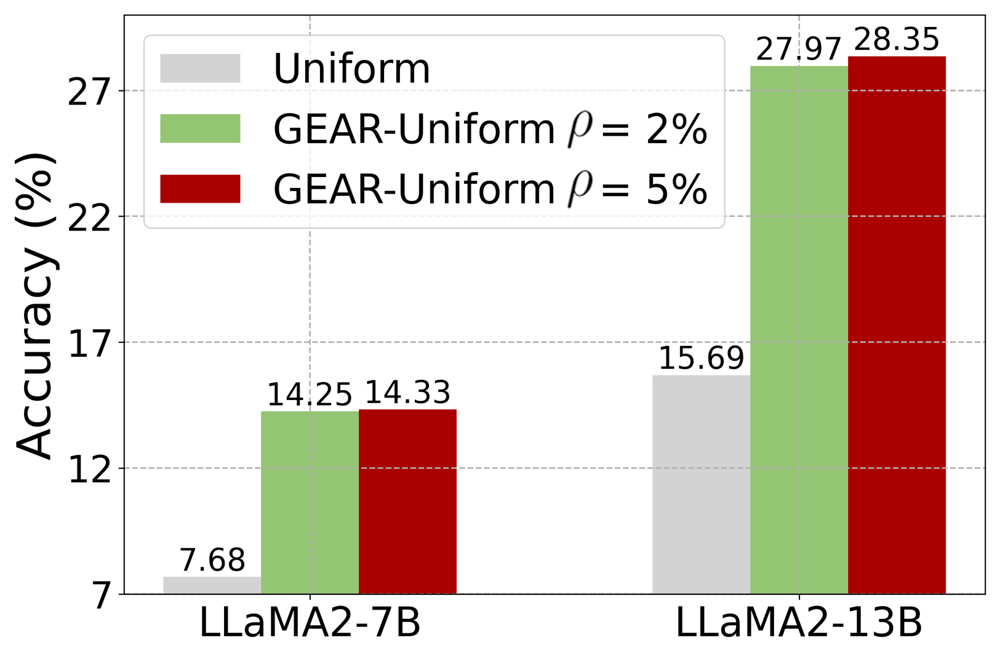

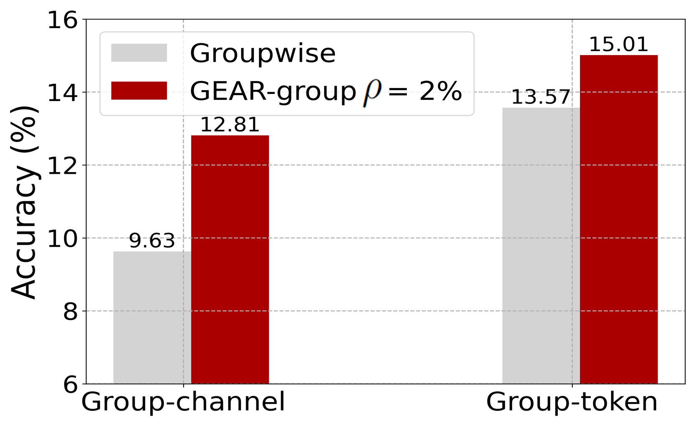

[Arxiv](https://arxiv.org/abs/2403.05527)