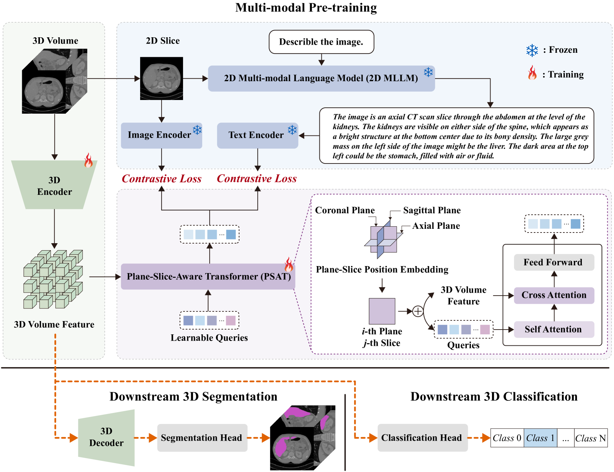
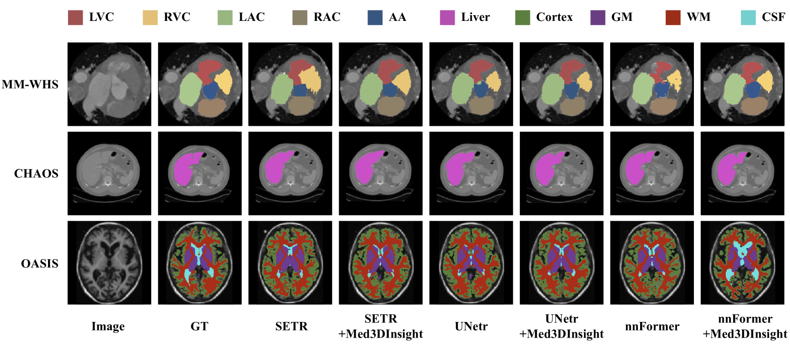
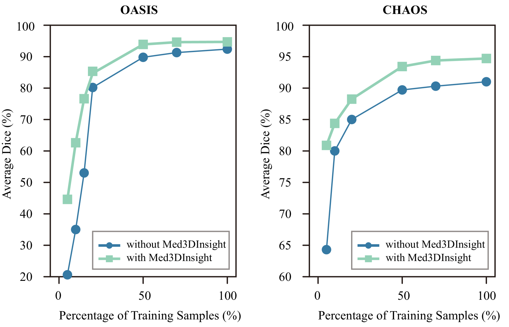

# [Med3DInsight项目利用2D多模态大型语言模型的力量，提升三维医学图像的深入理解和分析能力。](https://arxiv.org/abs/2403.05141)

发布时间：2024年03月08日

`LLM应用`

> Med3DInsight: Enhancing 3D Medical Image Understanding with 2D Multi-Modal Large Language Models

> 三维医学影像理解对于医学研究至关重要，但目前3D卷积和Transformer方法受限于对影像体素的语义理解深度，同时依赖大量训练数据。近期，得益于多模态大型语言模型（MLLM）的突破性进展，利用文本描述辅助理解图像展现出新的可能性。尽管大部分MLLM主要面向二维自然图像，我们创新性地提出了Med3DInsight预训练框架，巧妙地结合了现有3D图像编码器与2D MLLM，通过精心设计的Plane-Slice-Aware Transformer（PSAT）模块搭建桥梁。实验证明，Med3DInsight在包含CT和MRI等多种模态的三个公开数据集上，对下游分割和分类任务表现卓越，超越了十多个基础方法，并且该技术可无缝融入任何现行三维医学影像理解网络，有效提升其性能水平。

> Understanding 3D medical image volumes is a critical task in the medical domain. However, existing 3D convolution and transformer-based methods have limited semantic understanding of an image volume and also need a large set of volumes for training. Recent advances in multi-modal large language models (MLLMs) provide a new and promising way to understand images with the help of text descriptions. However, most current MLLMs are designed for 2D natural images. To enhance the 3D medical image understanding with 2D MLLMs, we propose a novel pre-training framework called Med3DInsight, which marries existing 3D image encoders with 2D MLLMs and bridges them via a designed Plane-Slice-Aware Transformer (PSAT) module. Extensive experiments demonstrate our SOTA performance on two downstream segmentation and classification tasks, including three public datasets with CT and MRI modalities and comparison to more than ten baselines. Med3DInsight can be easily integrated into any current 3D medical image understanding network and improves its performance by a good margin.

[Arxiv](https://arxiv.org/abs/2403.05141)