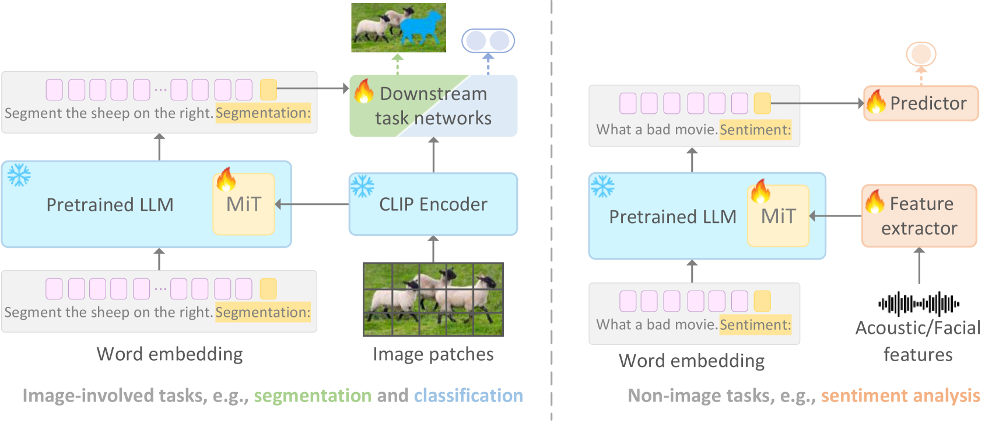
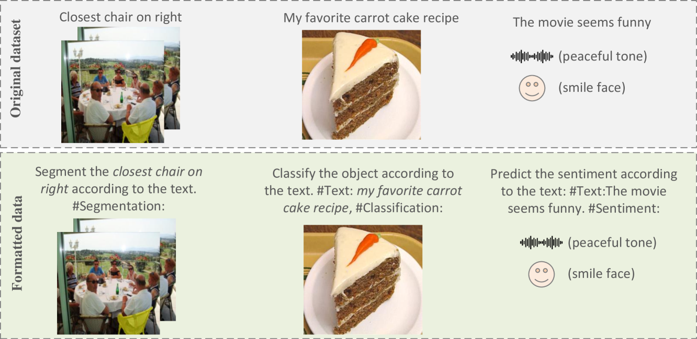
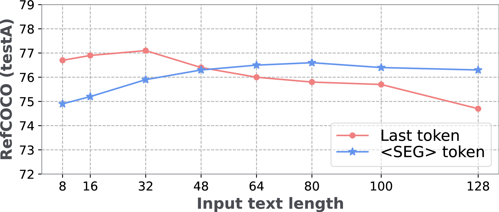
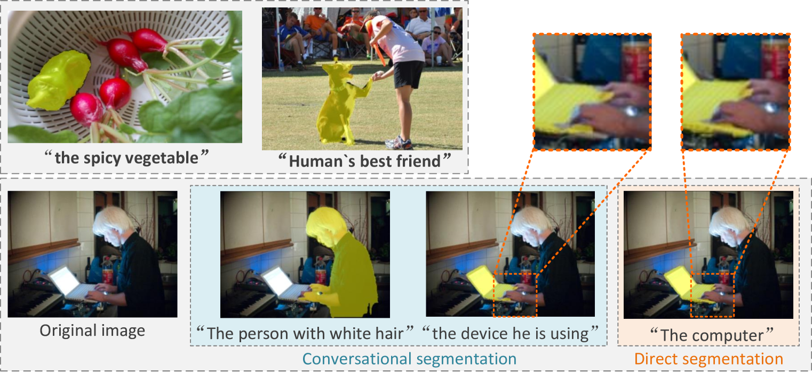

# [针对大型模型的多模态融合优化技术，旨在通过深度融合不同模态的信息来提升模型性能。](https://arxiv.org/abs/2403.05060)

发布时间：2024年03月08日

`Agent`

> Multimodal Infusion Tuning for Large Models

> 随着大规模模型在各类任务中展现出卓越的泛化能力，如何将其与多模态处理无缝结合成为了一个重要难题，因为这往往会带来巨大的计算压力。为此，本研究提出一种创新的参数高效多模态微调技术——“多模态注入调优”(MiT)，专门用于大型模型。MiT通过运用大型语言模型内部的分离式自注意力机制，巧妙地融合了图像、声音等多元模态信息。不仅如此，MiT还在头部层面上创新设计了一种自适应重标定策略，以便对注入的多模态特征进行优化表达。在整个调优阶段，所有基础模型都将保持冻结状态，仅需调整2.5\%的参数，从而大幅减轻计算负荷。实验证明，MiT在覆盖图像任务（例如指示分割）和非图像任务（如情感分析）的一系列多模态任务中均取得了顶级表现，并且其计算成本仅为先前方法的十分之一。更令人称赞的是，即使在复杂环境下，经过MiT微调的模型也能展现出强大而稳健的推理能力。

> Recent advancements in large-scale models have showcased remarkable generalization capabilities in various tasks. However, integrating multimodal processing into these models presents a significant challenge, as it often comes with a high computational burden. To address this challenge, we introduce a new parameter-efficient multimodal tuning strategy for large models in this paper, referred to as Multimodal Infusion Tuning (MiT). MiT leverages decoupled self-attention mechanisms within large language models to effectively integrate information from diverse modalities such as images and acoustics. In MiT, we also design a novel adaptive rescaling strategy at the head level, which optimizes the representation of infused multimodal features. Notably, all foundation models are kept frozen during the tuning process to reduce the computational burden(only 2.5\% parameters are tunable). We conduct experiments across a range of multimodal tasks, including image-related tasks like referring segmentation and non-image tasks such as sentiment analysis. Our results showcase that MiT achieves state-of-the-art performance in multimodal understanding while significantly reducing computational overhead(10\% of previous methods). Moreover, our tuned model exhibits robust reasoning abilities even in complex scenarios.

