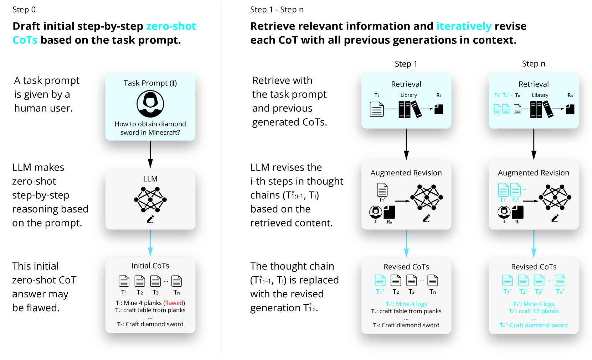
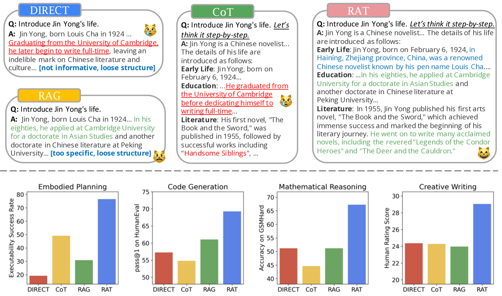

# [RAT技术通过引入检索增强思维，在长时段生成任务中有效激发了情境感知的推理能力。](https://arxiv.org/abs/2403.05313)

发布时间：2024年03月08日

`RAG`

> RAT: Retrieval Augmented Thoughts Elicit Context-Aware Reasoning in Long-Horizon Generation

> 本研究揭示了一种新颖方法，即借助信息检索来迭代优化思维链，能有效提升大型语言模型在解决复杂长时段生成任务时的推理与生成精度，同时显著减少臆想内容。我们提出的“检索辅助思维迭代”（RAT）技术，会在初步生成零样本思维链之后，针对任务问题以及各阶段思维内容进行相关检索，逐个修正每一步思维。当我们将RAT应用于GPT-3.5、GPT-4和CodeLLaMA-7b时，这些模型在各类长时序生成任务上的性能得到了大幅提升，平均增益分别为：代码生成任务提高13.63%，数学推理提升16.96%，创意写作进步19.2%，具身任务规划跃升42.78%。您可以在 https://craftjarvis.github.io/RAT 查看相关演示页面。

> We explore how iterative revising a chain of thoughts with the help of information retrieval significantly improves large language models' reasoning and generation ability in long-horizon generation tasks, while hugely mitigating hallucination. In particular, the proposed method -- *retrieval-augmented thoughts* (RAT) -- revises each thought step one by one with retrieved information relevant to the task query, the current and the past thought steps, after the initial zero-shot CoT is generated. Applying RAT to GPT-3.5, GPT-4, and CodeLLaMA-7b substantially improves their performances on various long-horizon generation tasks; on average of relatively increasing rating scores by 13.63% on code generation, 16.96% on mathematical reasoning, 19.2% on creative writing, and 42.78% on embodied task planning. The demo page can be found at https://craftjarvis.github.io/RAT

[Arxiv](https://arxiv.org/abs/2403.05313)