# [面对LLM部署，我们提出了一种无需额外调优且具备可解释性的干预方案，该方案采用元认知方法，旨在提升模型在实际应用中的可靠性和可控性。](https://arxiv.org/abs/2403.05636)

发布时间：2024年03月08日

`LLM应用`

> Tuning-Free Accountable Intervention for LLM Deployment -- A Metacognitive Approach

> LLMs 通过少量或零样本提示，在各类自然语言处理任务上取得了突破性进展，无需繁琐的参数调整。然而，这种便捷操作的背后，因其模型规模庞大而形成的神秘“黑箱”效应加剧了对“臆想输出”的担忧，尤其是在关乎生死健康的高风险应用场景中，一旦出现不可追溯的决策错误，可能带来毁灭性后果。与之相反，人类决策过程中运用了细腻的认知机制，如通过概念理解来感知并灵活纠正误判。鉴于此，我们借鉴人类认知原理，创新性地提出了名为\textbf{CLEAR}的元认知方法，旨在赋予LLMs自我察觉和纠正错误的能力。该框架支持构建反映清晰决策路径的概念专属稀疏子网络，为模型部署后的介入提供了全新界面。这一介入手段具有三大亮点：（\textit{i}）在部署或运行阶段，元认知LLMs能够在极少人工干预的情况下自主识别潜在误预测；（\textit{ii}）模型自身就能高效修正错误，无需额外调参；（\textit{iii}）校正过程既直观易懂又用户友好，大大提升了模型的可解释性和可用性。通过集成这些元认知特性，我们的方法开创了提升LLMs部署可信度和可追溯性的一条崭新道路。

> Large Language Models (LLMs) have catalyzed transformative advances across a spectrum of natural language processing tasks through few-shot or zero-shot prompting, bypassing the need for parameter tuning. While convenient, this modus operandi aggravates ``hallucination'' concerns, particularly given the enigmatic ``black-box'' nature behind their gigantic model sizes. Such concerns are exacerbated in high-stakes applications (e.g., healthcare), where unaccountable decision errors can lead to devastating consequences. In contrast, human decision-making relies on nuanced cognitive processes, such as the ability to sense and adaptively correct misjudgments through conceptual understanding. Drawing inspiration from human cognition, we propose an innovative \textit{metacognitive} approach, dubbed \textbf{CLEAR}, to equip LLMs with capabilities for self-aware error identification and correction. Our framework facilitates the construction of concept-specific sparse subnetworks that illuminate transparent decision pathways. This provides a novel interface for model \textit{intervention} after deployment. Our intervention offers compelling advantages: (\textit{i})~at deployment or inference time, our metacognitive LLMs can self-consciously identify potential mispredictions with minimum human involvement, (\textit{ii})~the model has the capability to self-correct its errors efficiently, obviating the need for additional tuning, and (\textit{iii})~the rectification procedure is not only self-explanatory but also user-friendly, enhancing the interpretability and accessibility of the model. By integrating these metacognitive features, our approach pioneers a new path toward engendering greater trustworthiness and accountability in the deployment of LLMs.

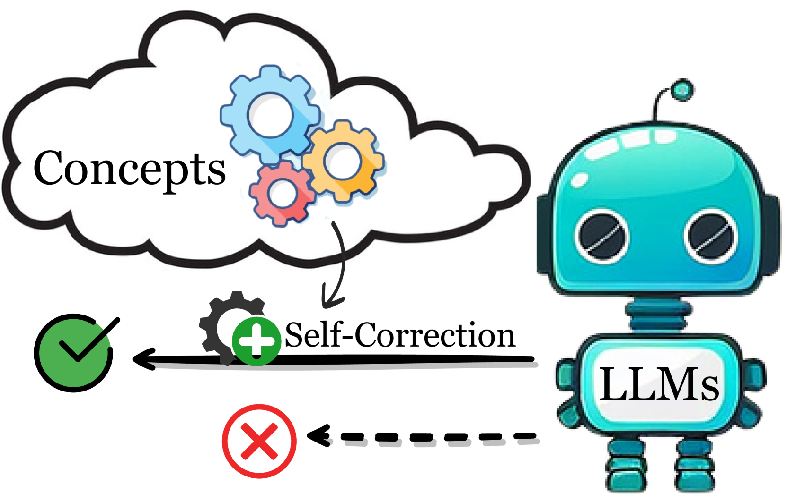

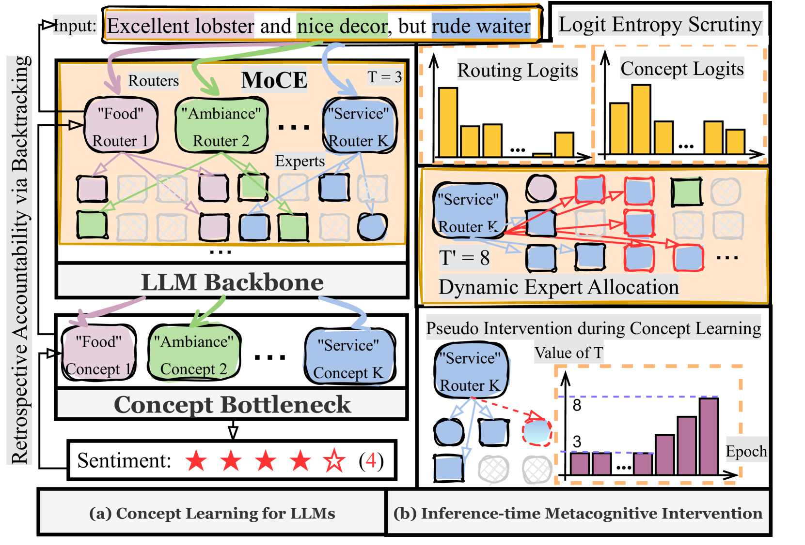

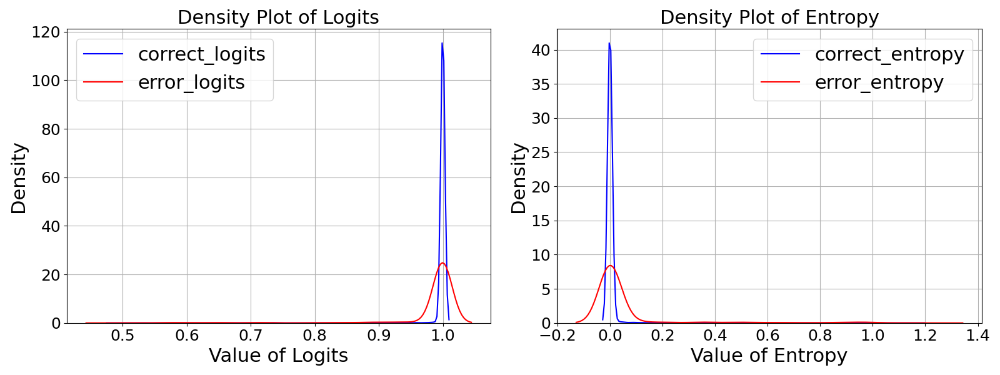

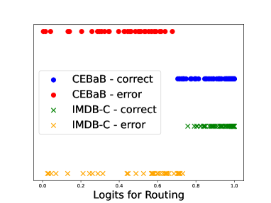

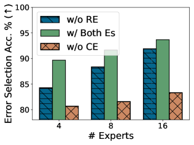

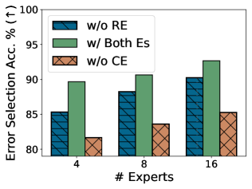

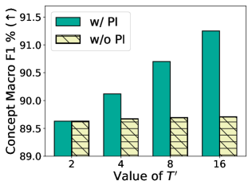

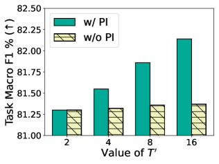

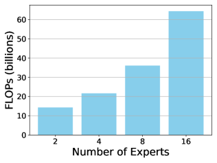

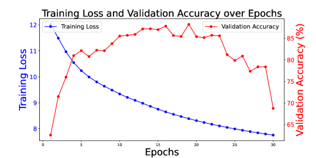

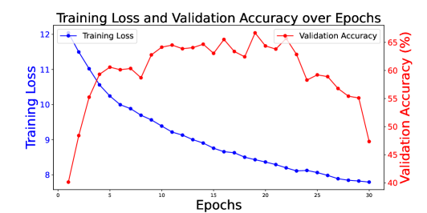

