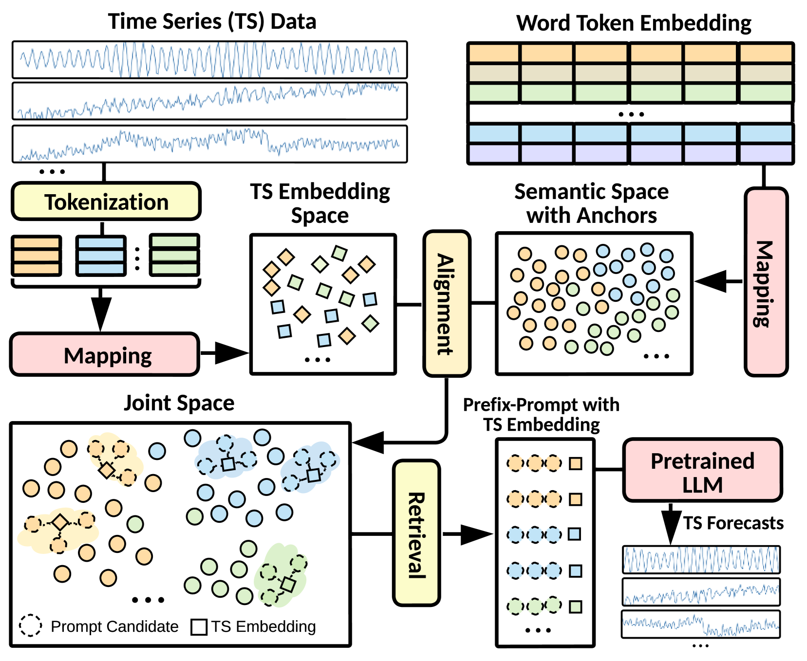
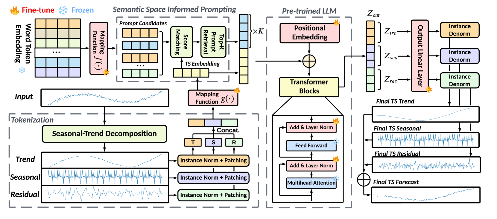
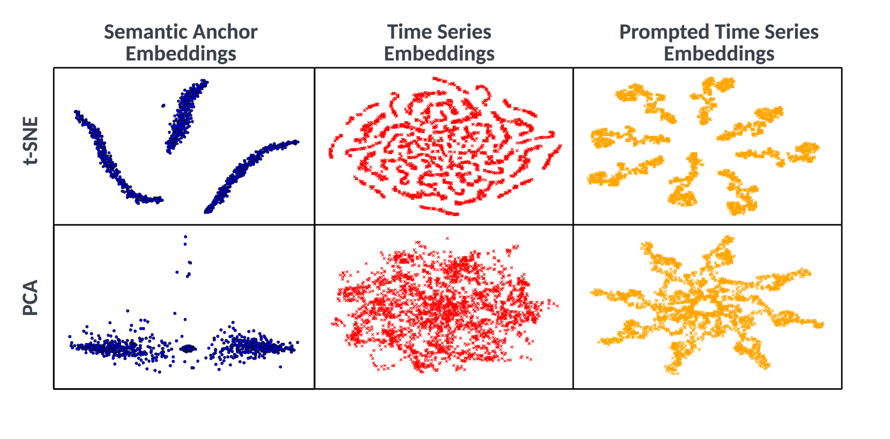
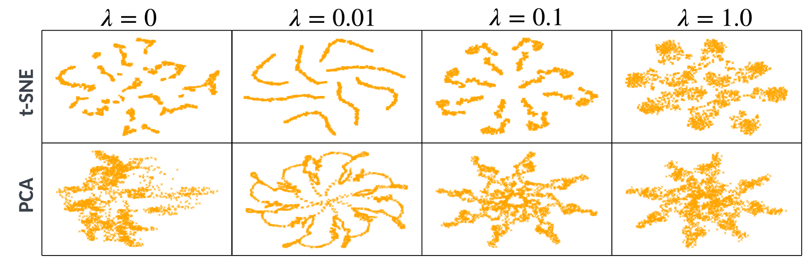
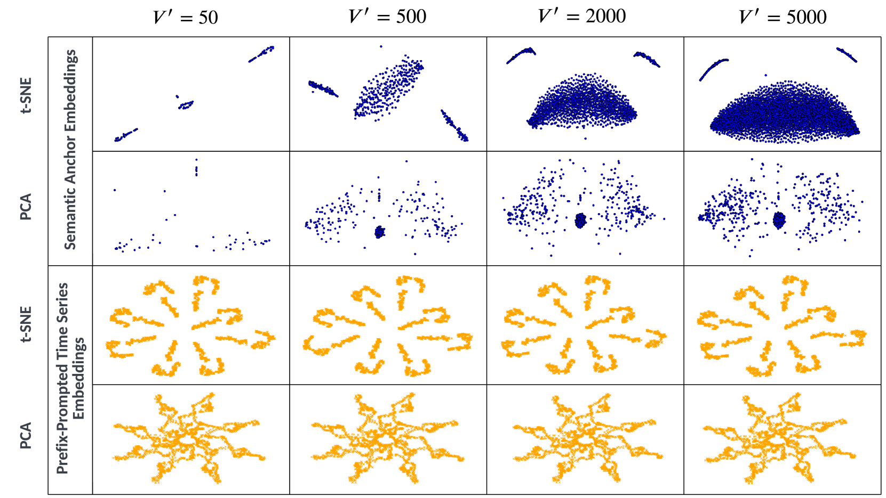
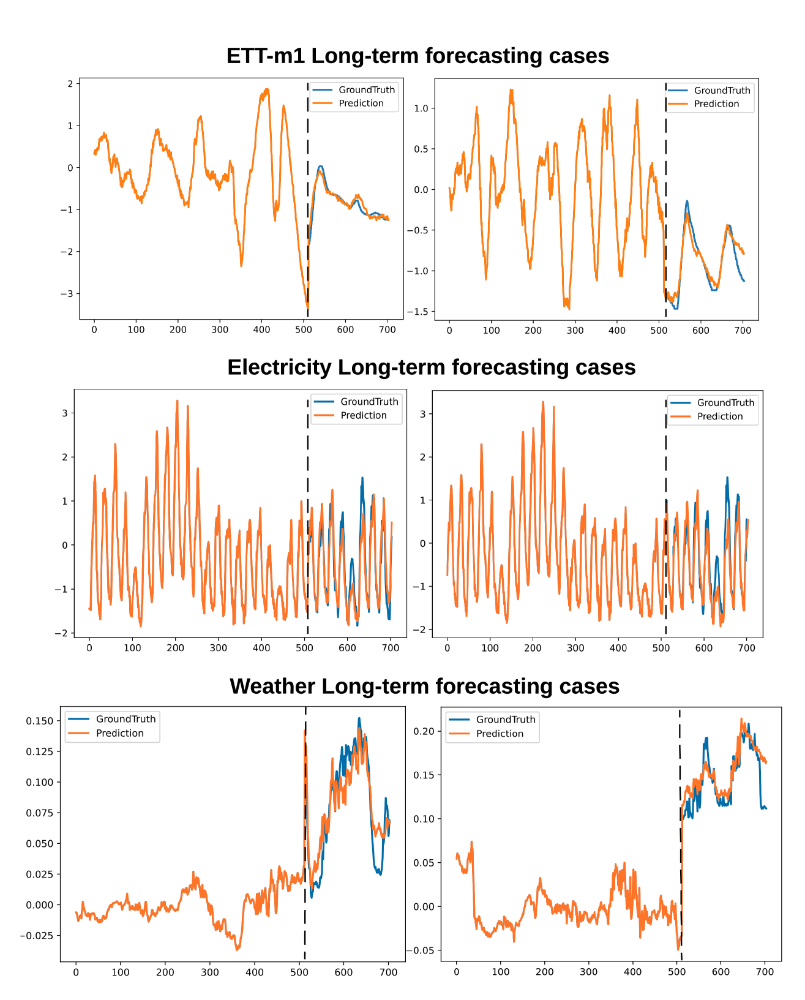

# $\textbf{S}^2$IP-LLM 是一种结合了大型语言模型（LLM）的时间序列预测方法，它运用了基于语义空间的提示学习技术，旨在提升对未来时间序列数据的预测能力。

发布时间：2024年03月09日

`LLM应用`

> $\textbf{S}^2$IP-LLM: Semantic Space Informed Prompt Learning with LLM for Time Series Forecasting

> 近期，研究者们日益关注如何利用预训练的大型语言模型（LLMs）解决各类时间序列应用问题。尽管如此，LLMs预训练阶段形成的语义空间尚未被深入挖掘，其可能蕴含丰富的时间序列特征表达能力，助力提升预测效果。因此，我们提出了基于LLM的语义空间引导的Prompt学习框架——$S^2$IP-LLM，旨在融合预训练语义空间与时间序列嵌入空间，并从两者的联合空间中学得提示进而实现时间序列预测。首先，我们定制了一款跨模态对齐的特殊分词模块，它巧妙地将拆解后的时间序列组件拼接成嵌入向量，有效地捕捉时间动态特性。随后，我们运用预训练的词嵌入生成语义锚点，并在联合空间内通过最大化余弦相似度将这些锚点与时间序列嵌入对齐。这样，$S^2$IP-LLM就能找到相关联的语义锚点作为时间序列的提示信息，尤其对于具有各异时间动态特征的时间序列，提供有力的上下文指引。通过在多个基准数据集上的深入实证分析，我们证实了提出的$S^2$IP-LLM相较于现有前沿方法在预测性能上实现了显著超越。同时，我们的消融实验和可视化展示进一步印证了由语义空间指导的Prompt学习机制的重要性。

> Recently, there has been a growing interest in leveraging pre-trained large language models (LLMs) for various time series applications. However, the semantic space of LLMs, established through the pre-training, is still underexplored and may help yield more distinctive and informative representations to facilitate time series forecasting. To this end, we propose Semantic Space Informed Prompt learning with LLM ($S^2$IP-LLM) to align the pre-trained semantic space with time series embeddings space and perform time series forecasting based on learned prompts from the joint space. We first design a tokenization module tailored for cross-modality alignment, which explicitly concatenates patches of decomposed time series components to create embeddings that effectively encode the temporal dynamics. Next, we leverage the pre-trained word token embeddings to derive semantic anchors and align selected anchors with time series embeddings by maximizing the cosine similarity in the joint space. This way, $S^2$IP-LLM can retrieve relevant semantic anchors as prompts to provide strong indicators (context) for time series that exhibit different temporal dynamics. With thorough empirical studies on multiple benchmark datasets, we demonstrate that the proposed $S^2$IP-LLM can achieve superior forecasting performance over state-of-the-art baselines. Furthermore, our ablation studies and visualizations verify the necessity of prompt learning informed by semantic space.

[Arxiv](https://arxiv.org/abs/2403.05798)