# [FrameQuant是一种针对Transformer设计的弹性低比特量化方案。]

发布时间：2024年03月09日

`LLM理论`

> FrameQuant: Flexible Low-Bit Quantization for Transformers

> Transformer 作为众多视觉与自然语言处理任务的强大基石，其计算需求大、内存/存储占用高，使得服务这类模型代价不菲，通常需要配备高端硬件。为缓解此问题，后训练量化技术致力于改造预训练模型并将其压缩至八位甚至更低，显著提高计算、内存及延迟效率，甚至有模型成功量化至四位精度，虽略有性能损失。本文提出一项简易方案，只需将 Transformer 类模型量化至接近两位（附加少许额外部分），便能在保持较高准确率的基础上实现高效压缩。我们引入的关键理念来自调和分析领域的“融合框架”。重要发现是，量化操作不应在原始权重空间执行，而应转换到融合框架表达上进行。若将量化视作噪声加入过程，我们构建的模型有助于应用大量已知的一致恢复和抗噪声稳健性保障。进一步地，可采用封闭形式明确表达的去噪滤波器。通过丰富多样的实验验证，我们证实 Transformer 模型近乎二位量化的技术有望带来显著的效能提升。

> Transformers are the backbone of powerful foundation models for many Vision and Natural Language Processing tasks. But their compute and memory/storage footprint is large, and so, serving such models is expensive often requiring high-end hardware. To mitigate this difficulty, Post-Training Quantization seeks to modify a pre-trained model and quantize it to eight bits or lower, significantly boosting compute/memory/latency efficiency. Such models have been successfully quantized to four bits with some performance loss. In this work, we outline a simple scheme to quantize Transformer-based models to just two bits (plus some overhead) with only a small drop in accuracy. Key to our formulation is a concept borrowed from Harmonic analysis called Fusion Frames. Our main finding is that the quantization must take place not in the original weight space, but instead in the Fusion Frame representations. If quantization is interpreted as the addition of noise, our casting of the problem allows invoking an extensive body of known consistent recovery and noise robustness guarantees. Further, if desired, de-noising filters are known in closed form. We show empirically, via a variety of experiments, that (almost) two-bit quantization for Transformer models promises sizable efficiency gains.

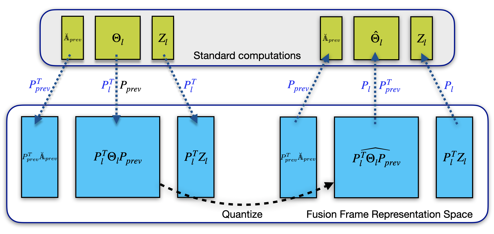

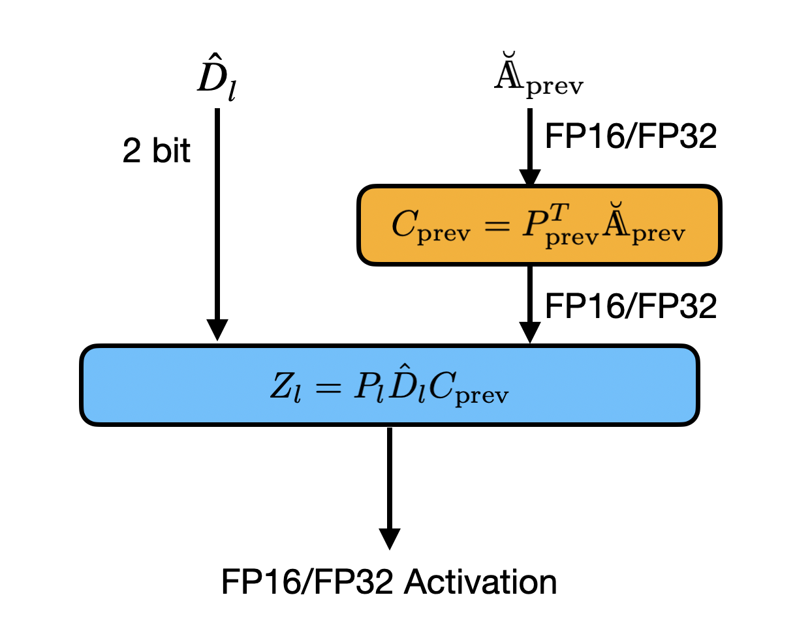

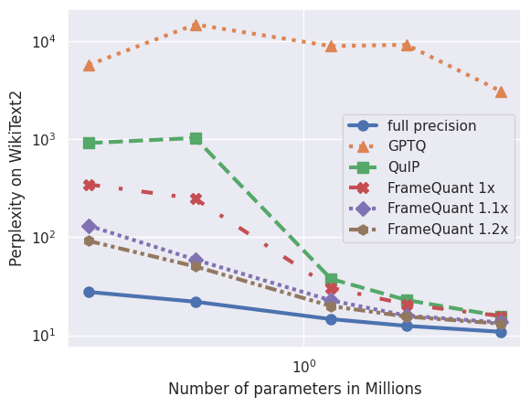

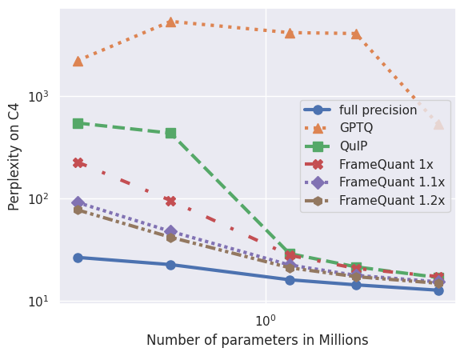

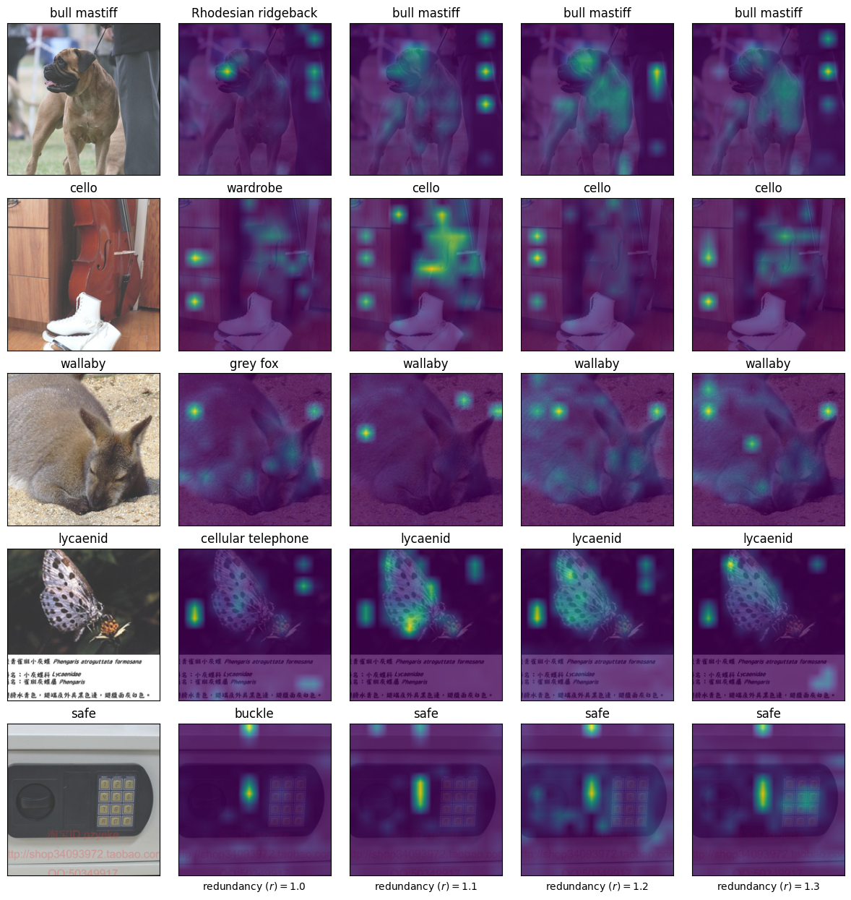

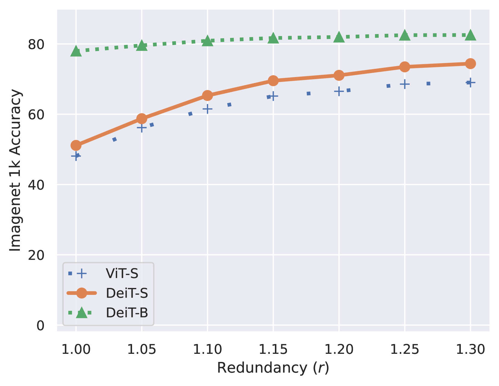

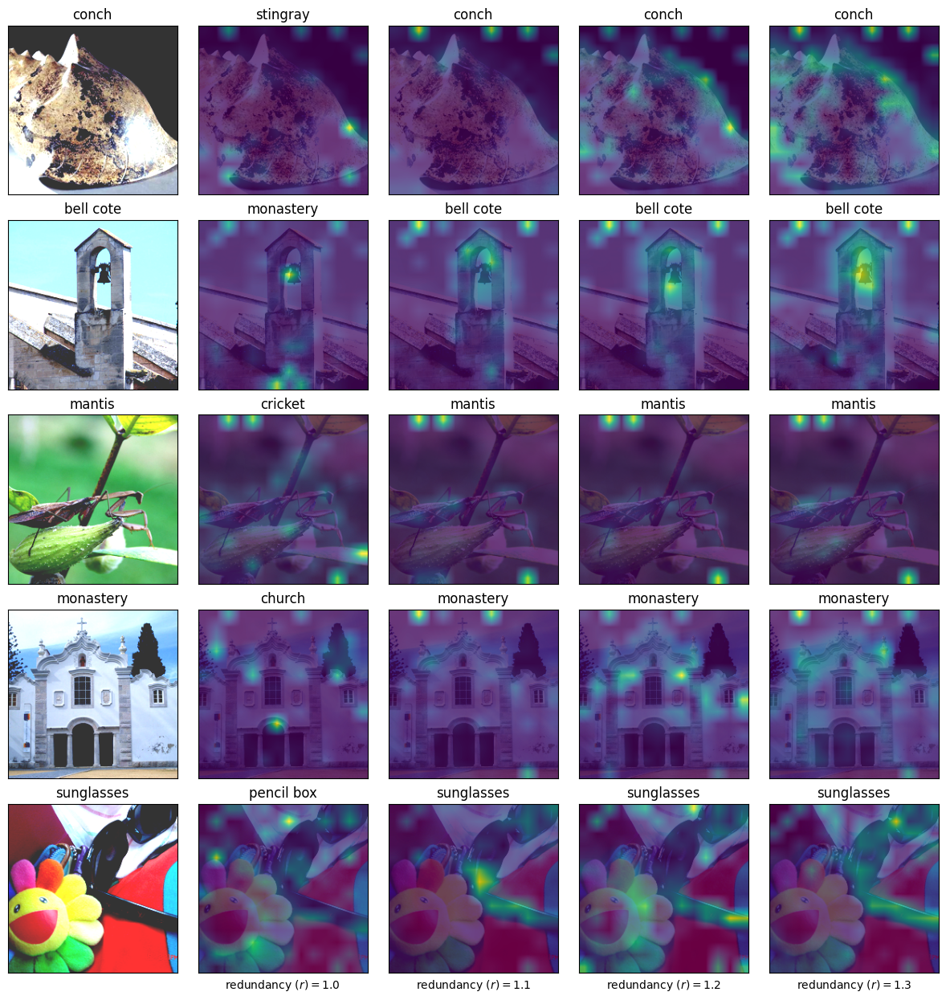

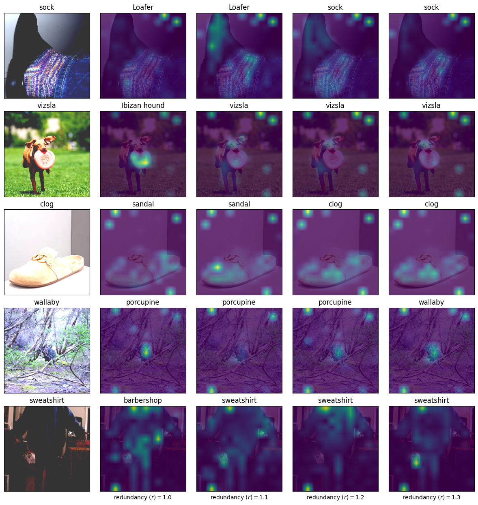

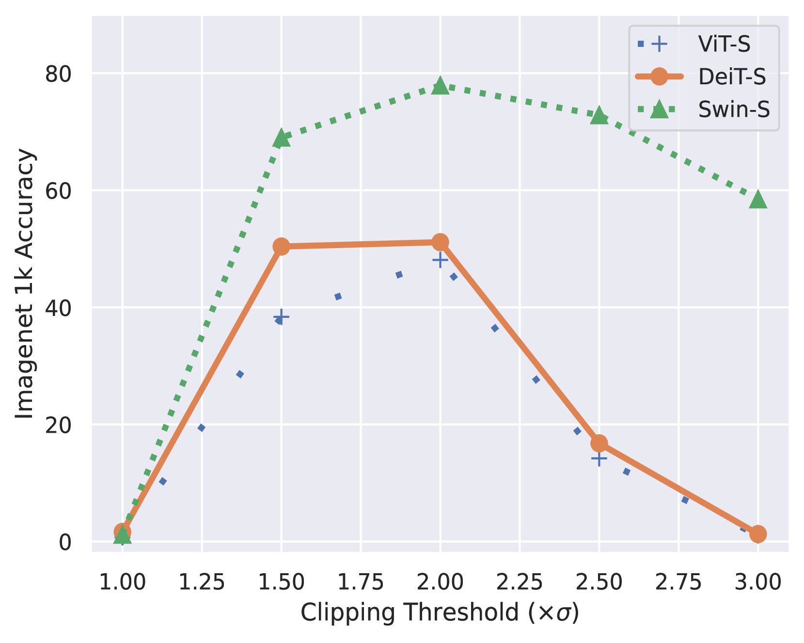

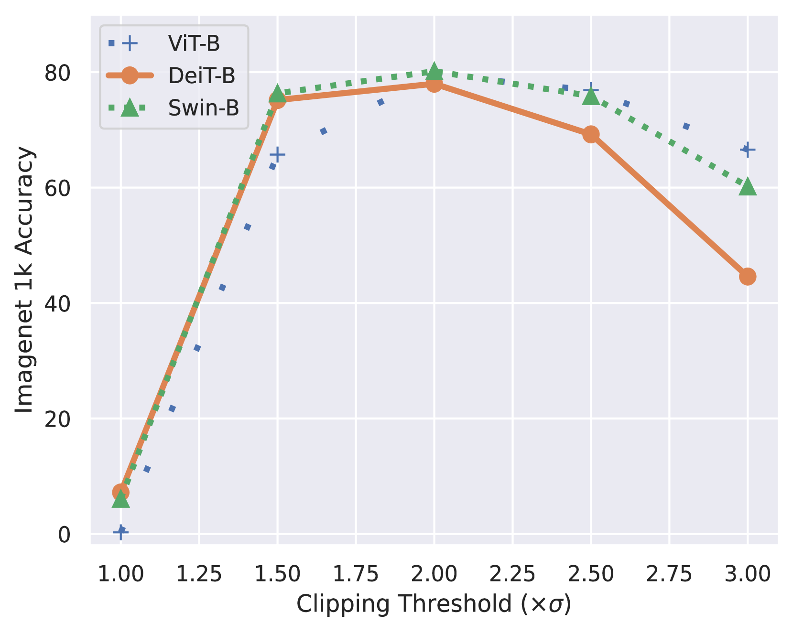

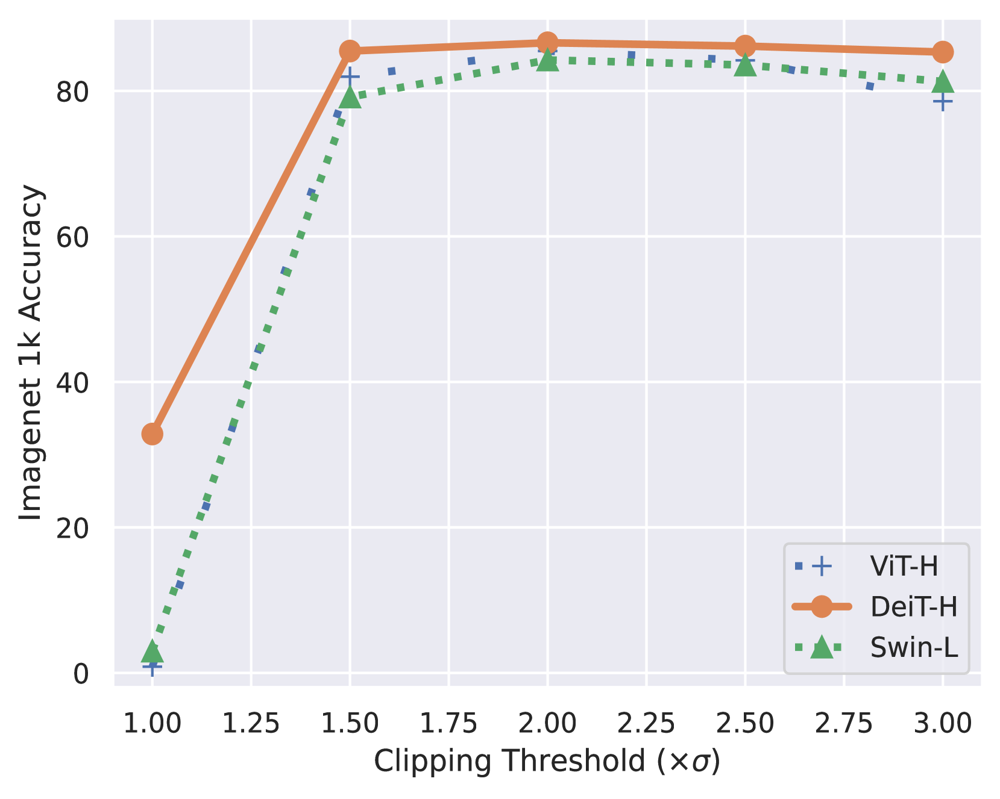

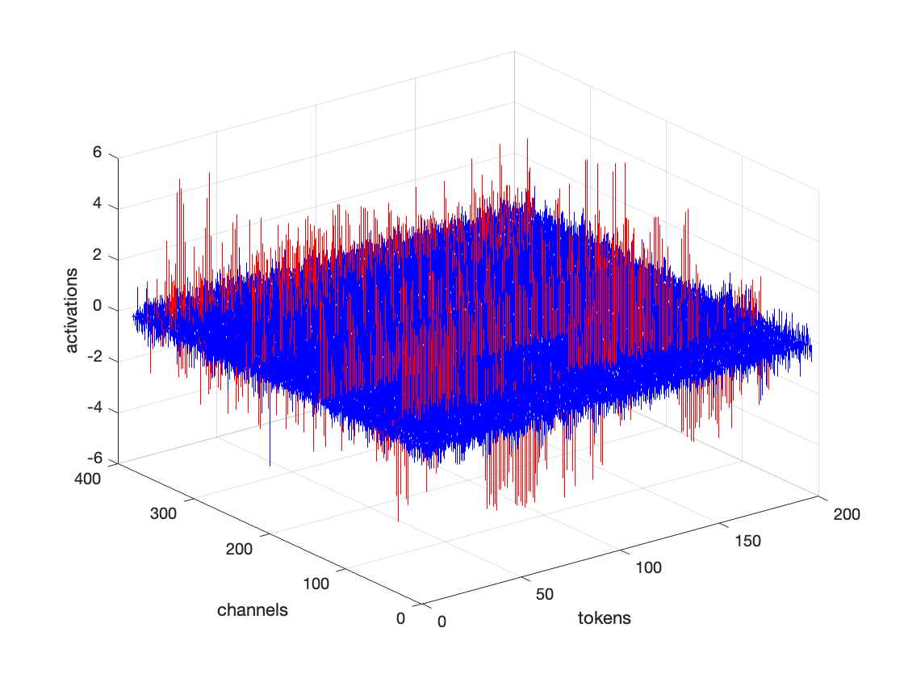

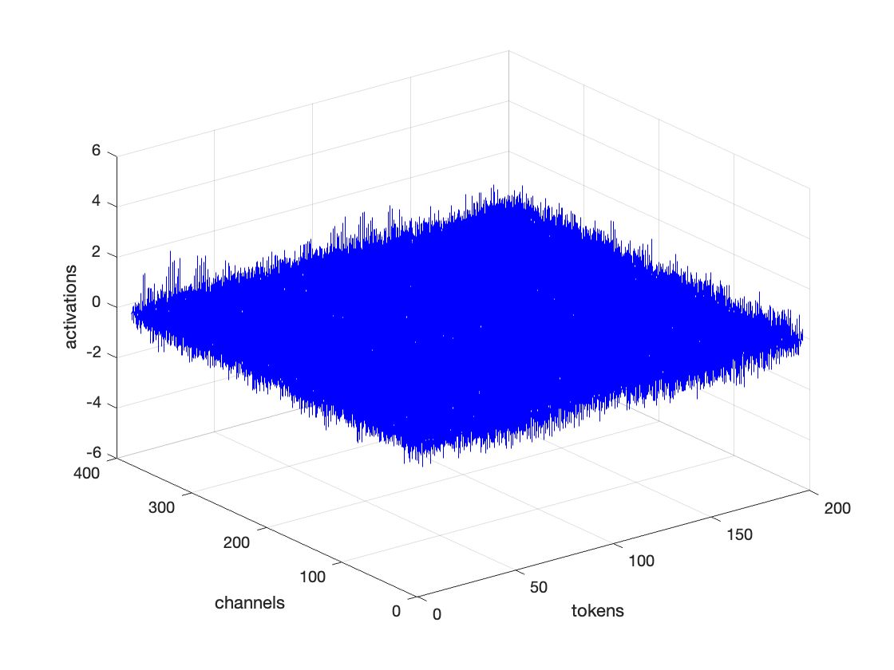

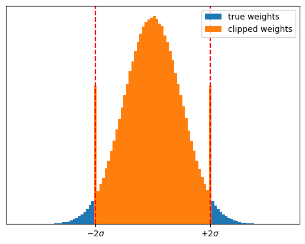

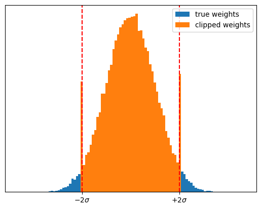

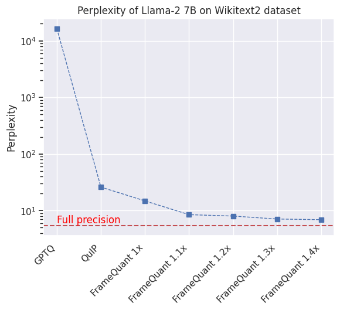

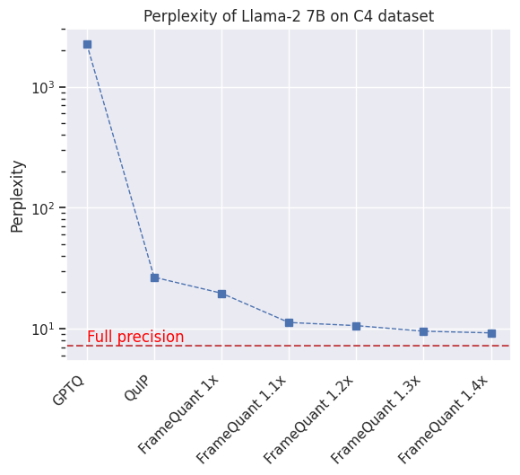

[Arxiv](https://arxiv.org/abs/2403.06082)