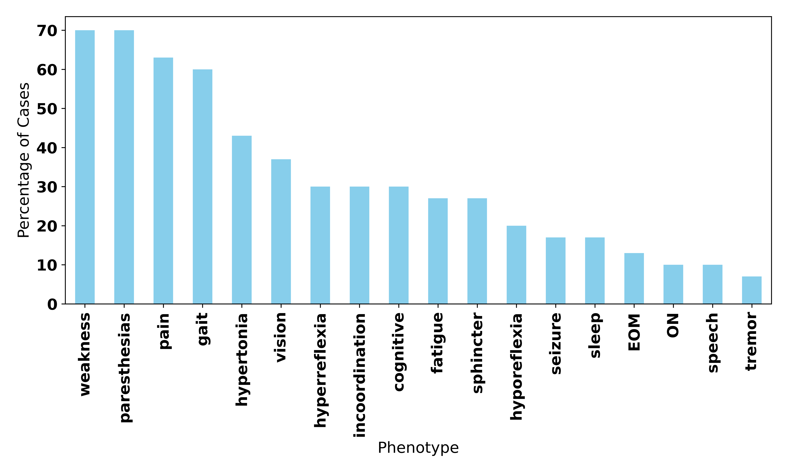
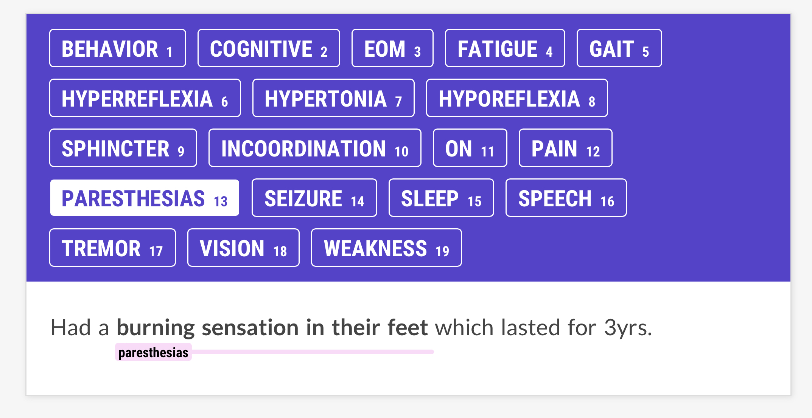
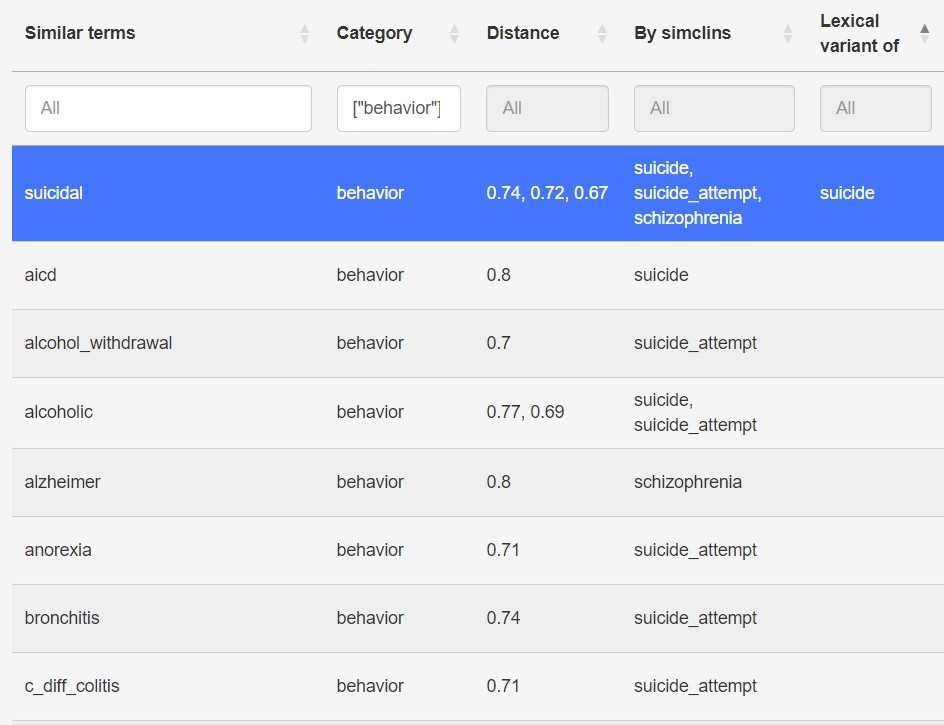

# 我们运用大型语言模型与混合NLP技术，高效解析医师笔记中的丰富信息，实现高通量表型特征提取。

发布时间：2024年03月09日

`LLM应用`

> High Throughput Phenotyping of Physician Notes with Large Language and Hybrid NLP Models

> 深度表型技术借助本体论概念细致入微地刻画患者的病状与体征，而对电子健康记录中海量医生笔记的深度表型分析亟需高效手段。过去三十年间，科研工作不断取得突破，使高通量表型分析成为可能。本研究揭示，在此领域，大型语言模型联合运用词向量与机器学习分类器构建的混合NLP模型，能够在医生笔记上精准高效地完成高通量表型分析，预示着大型语言模型将在未来有望成为医生笔记高通量深度表型分析的主流工具。

> Deep phenotyping is the detailed description of patient signs and symptoms using concepts from an ontology. The deep phenotyping of the numerous physician notes in electronic health records requires high throughput methods. Over the past thirty years, progress toward making high throughput phenotyping feasible. In this study, we demonstrate that a large language model and a hybrid NLP model (combining word vectors with a machine learning classifier) can perform high throughput phenotyping on physician notes with high accuracy. Large language models will likely emerge as the preferred method for high throughput deep phenotyping of physician notes.

[Arxiv](https://arxiv.org/abs/2403.05920)