# [LLMs 在可视化领域是否已整装待发？]

发布时间：2024年03月10日

`LLM应用`

> Are LLMs ready for Visualization?

> 生成模型在学术与工业各界广受瞩目，无论是基于提示创作图像还是生成应对特定编程问题的代码，其能力跨越多种应用场景，展现从“创意”至“精准”的广阔范围。可视化领域的实践者与研究者纷纷探讨此类系统如何能更高效地服务于我们的工作。已有文献运用这些模型创建可视化内容，部分工具如Lida已将之纳入流程。然而，目前尚无一套系统的测评方法对它们的能力进行全面且深入的研究，至少在我们所掌握的知识范围内还未见公开报道。为此，我们旨在填补这一空白，提出一种系统化方法，重点关注三大核心问题：大型语言模型能否准确生成种类繁多的图表？能有效驾驭哪些库资源？以及对单个图表的定制化程度可以达到何种水平？为实现此目标，我们首先选取了一系列广泛应用在数据可视化中的多样化图表类型，接着构建了一套可用于生成这些图表的通用提示语句，并对不同大型语言模型及库进行了性能分析。最终的结果包括一组提示语句和数据源列表，以及对不同配置下性能表现的详尽解析。

> Generative models have received a lot of attention in many areas of academia and the industry. Their capabilities span many areas, from the invention of images given a prompt to the generation of concrete code to solve a certain programming issue. These two paradigmatic cases fall within two distinct categories of requirements, ranging from "creativity" to "precision", as characterized by Bing Chat, which employs ChatGPT-4 as its backbone. Visualization practitioners and researchers have wondered to what end one of such systems could accomplish our work in a more efficient way. Several works in the literature have utilized them for the creation of visualizations. And some tools such as Lida, incorporate them as part of their pipeline. Nevertheless, to the authors' knowledge, no systematic approach for testing their capabilities has been published, which includes both extensive and in-depth evaluation. Our goal is to fill that gap with a systematic approach that analyzes three elements: whether Large Language Models are capable of correctly generating a large variety of charts, what libraries they can deal with effectively, and how far we can go to configure individual charts. To achieve this objective, we initially selected a diverse set of charts, which are commonly utilized in data visualization. We then developed a set of generic prompts that could be used to generate them, and analyzed the performance of different LLMs and libraries. The results include both the set of prompts and the data sources, as well as an analysis of the performance with different configurations.

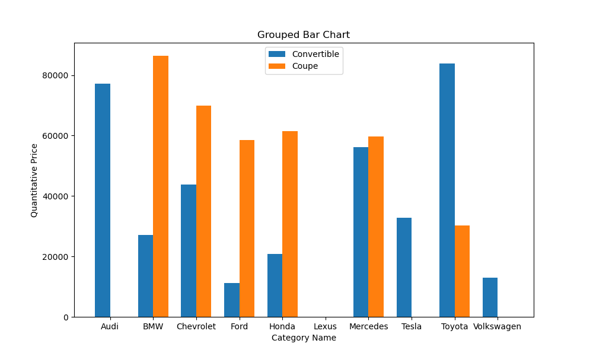

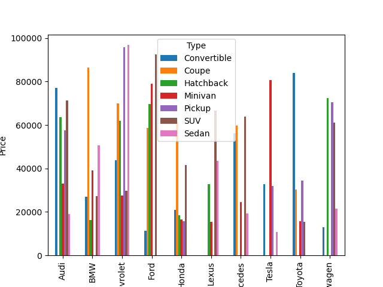

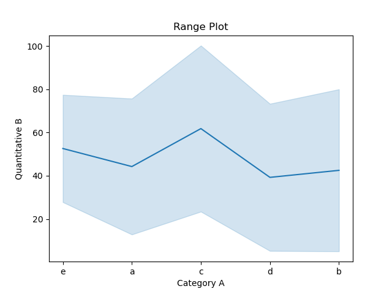

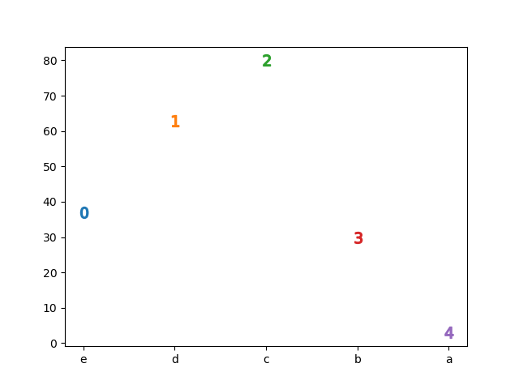

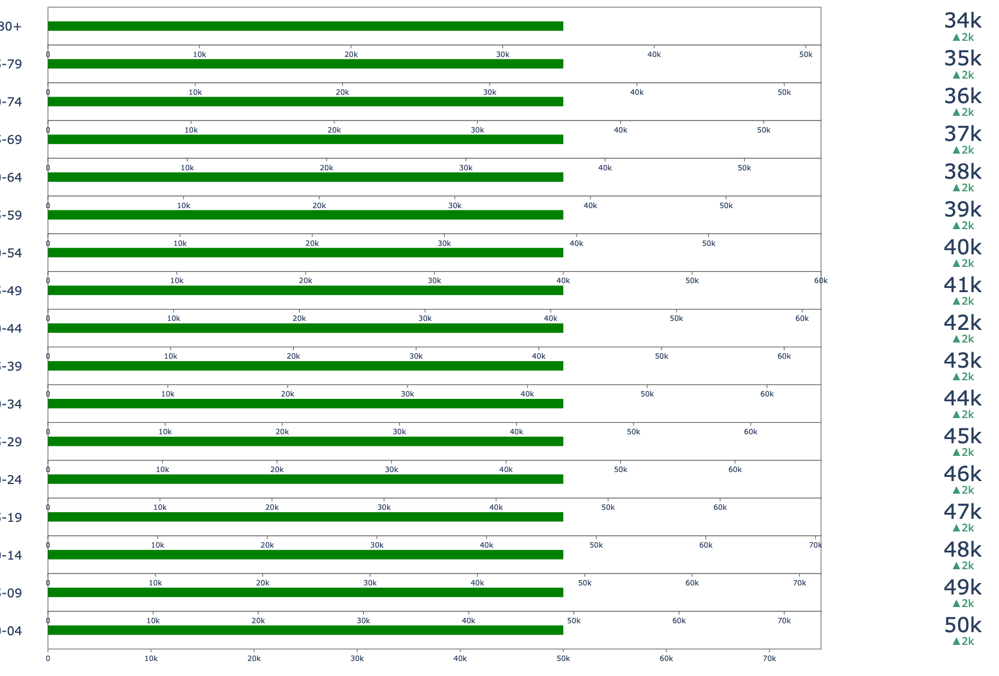

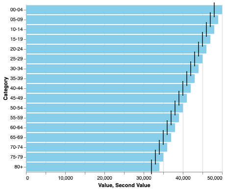

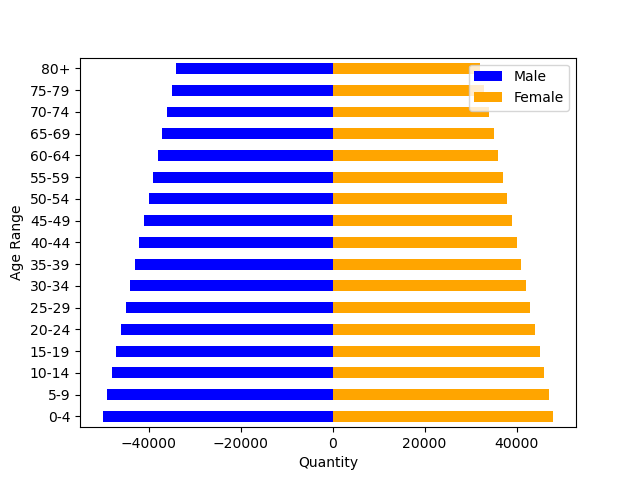

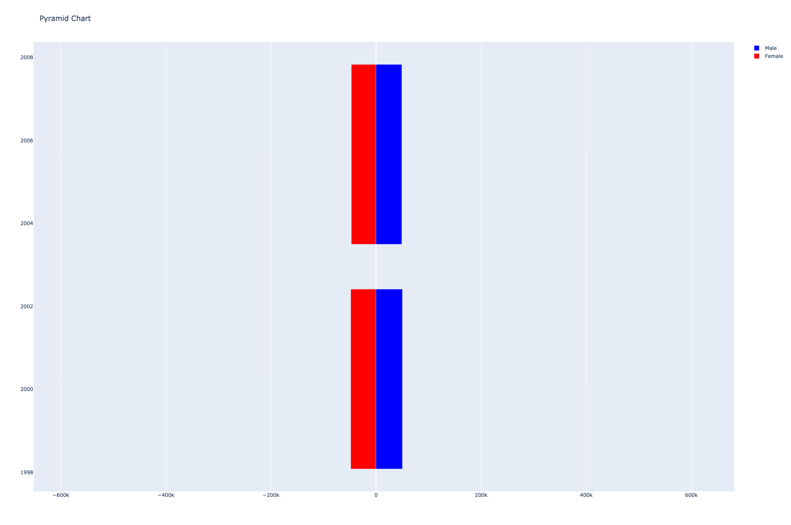

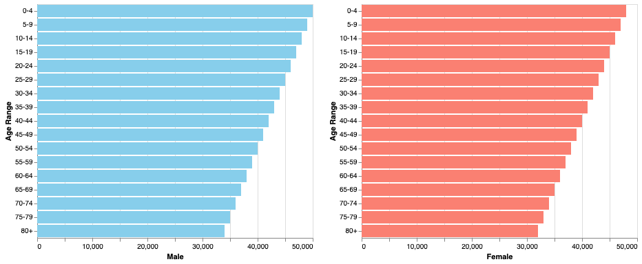

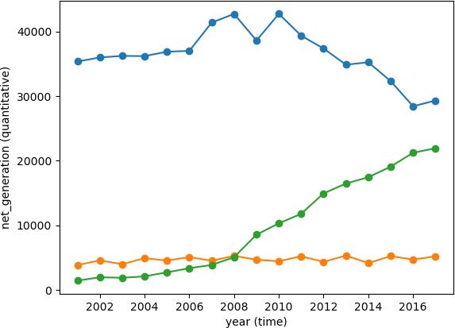

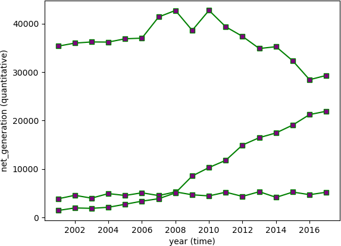

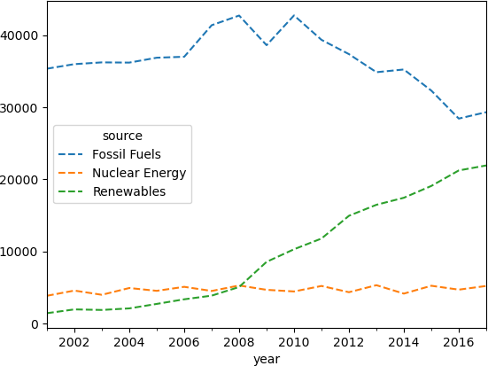

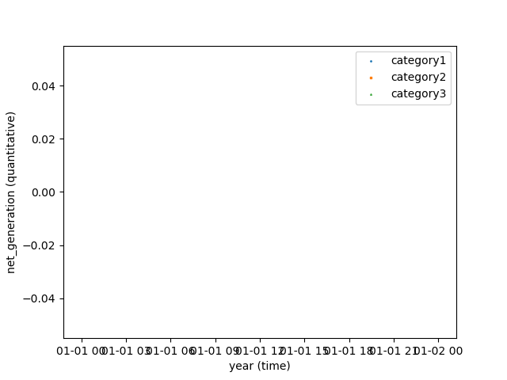

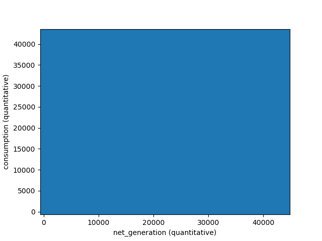

[Arxiv](https://arxiv.org/abs/2403.06158)