# [通过运用数据增强和迁移学习技术，大型语言模型在细粒度情感检测数据集上展现出了强大的性能。本研究聚焦于此类模型如何在丰富且精细的情感识别任务中，通过增强数据集和借用预训练知识实现更优表现。]

发布时间：2024年03月10日

`Agent`

> Large Language Models on Fine-grained Emotion Detection Dataset with Data Augmentation and Transfer Learning

> 本篇研究聚焦于GoEmotions数据集——一个大规模手工标注的情感识别文本数据集，旨在提升其情感分类效能。核心目标直击自然语言处理（NLP）中的棘手问题——识别文本中微妙情感，这一问题在实践中意义重大。研究成果深度剖析了应对文本情感检测挑战的策略，并为未来的研究方向提供了启示，其中包括整合该领域各类数据集的方法与性能表现，以期撰写一份有价值的综述论文。

> This paper delves into enhancing the classification performance on the GoEmotions dataset, a large, manually annotated dataset for emotion detection in text. The primary goal of this paper is to address the challenges of detecting subtle emotions in text, a complex issue in Natural Language Processing (NLP) with significant practical applications. The findings offer valuable insights into addressing the challenges of emotion detection in text and suggest directions for future research, including the potential for a survey paper that synthesizes methods and performances across various datasets in this domain.

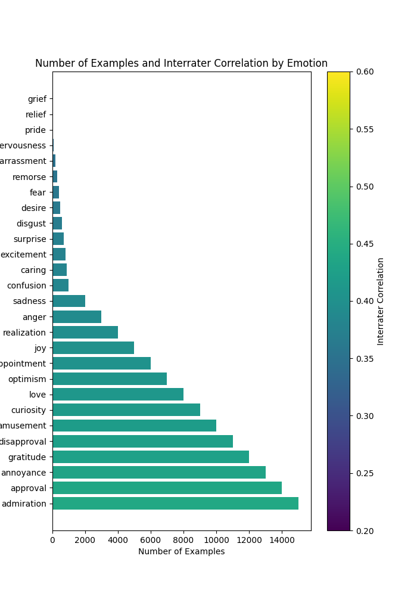

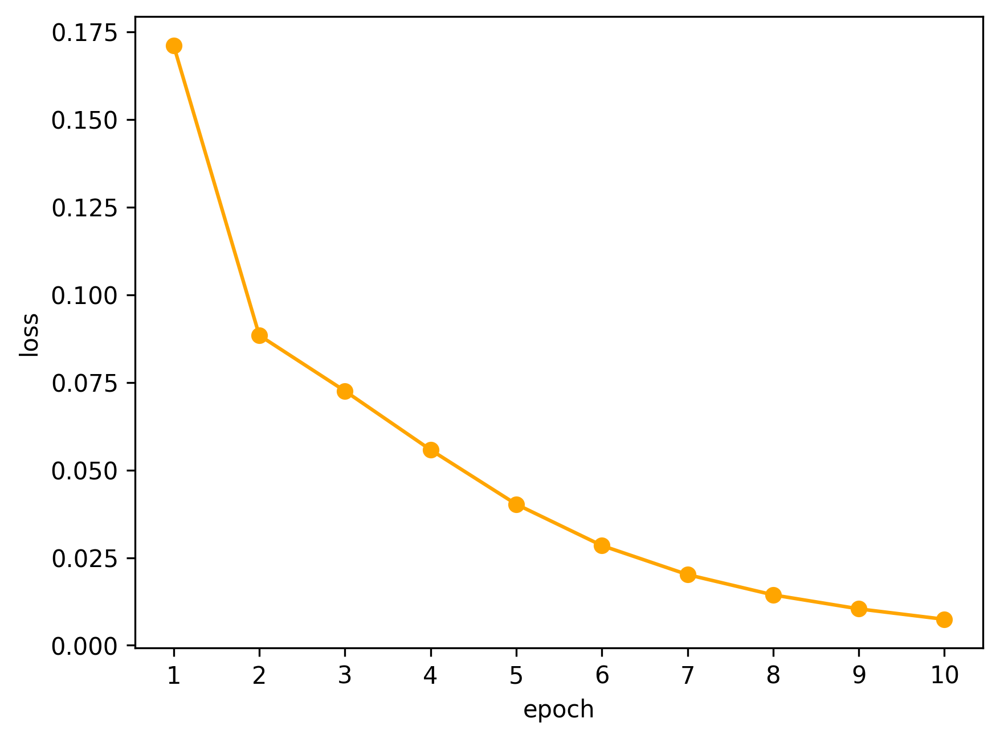

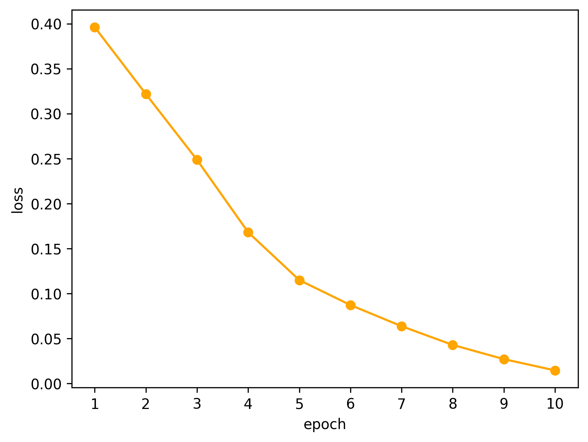

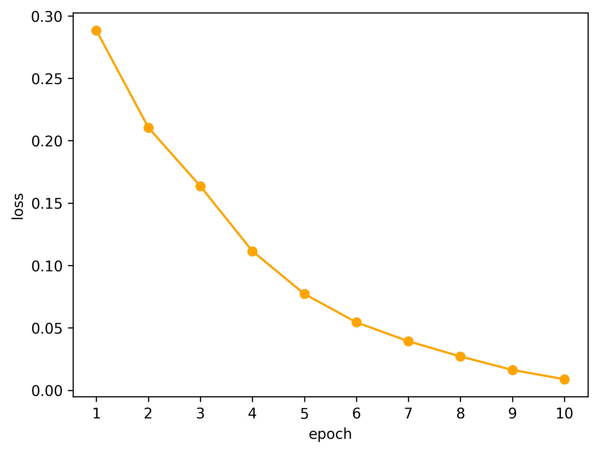

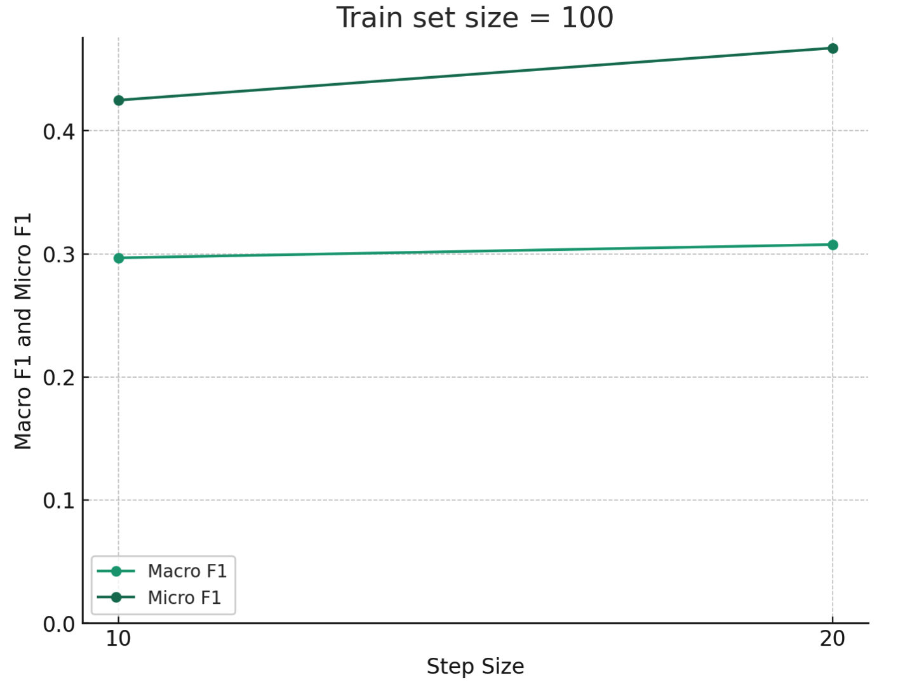

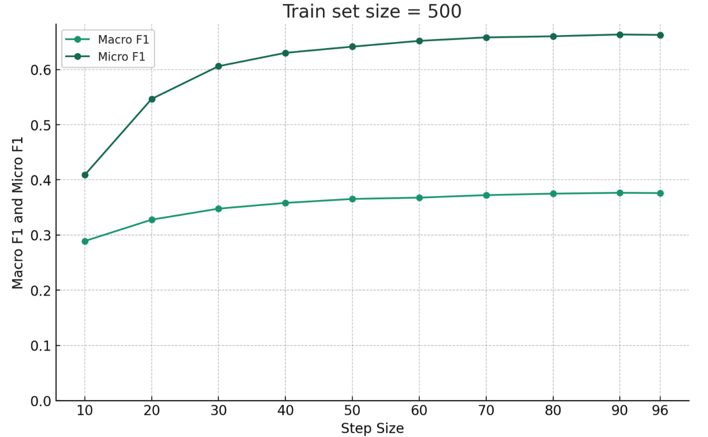

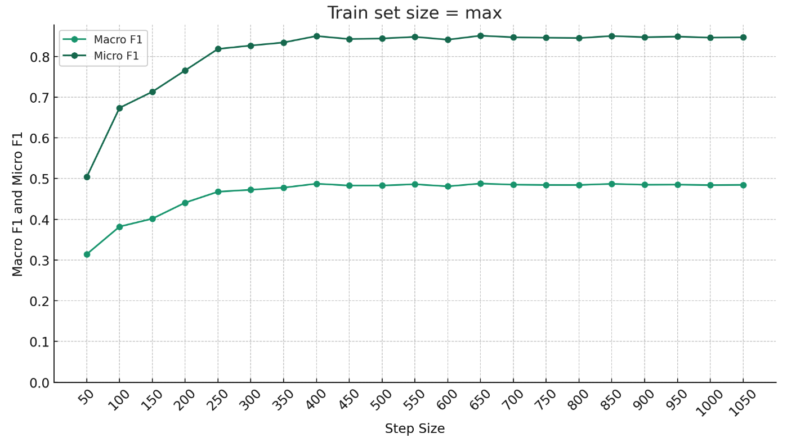

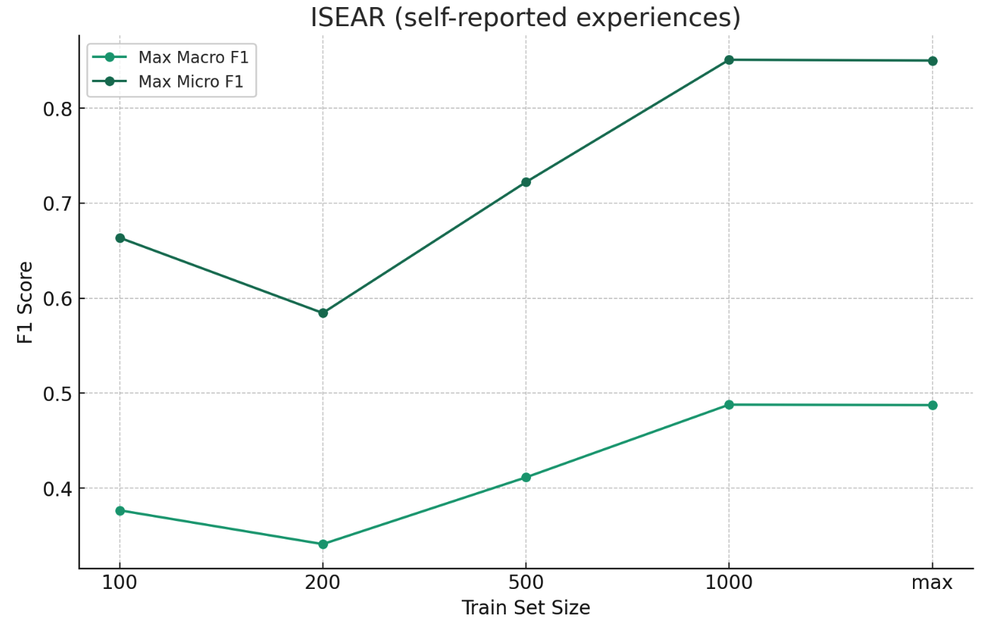

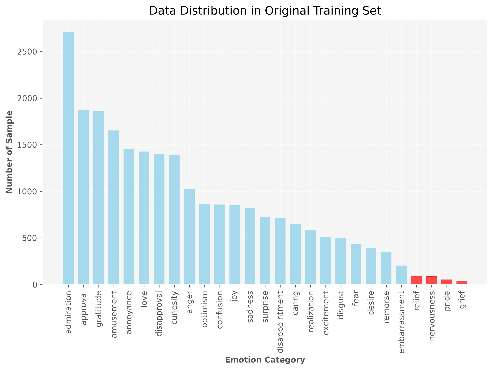

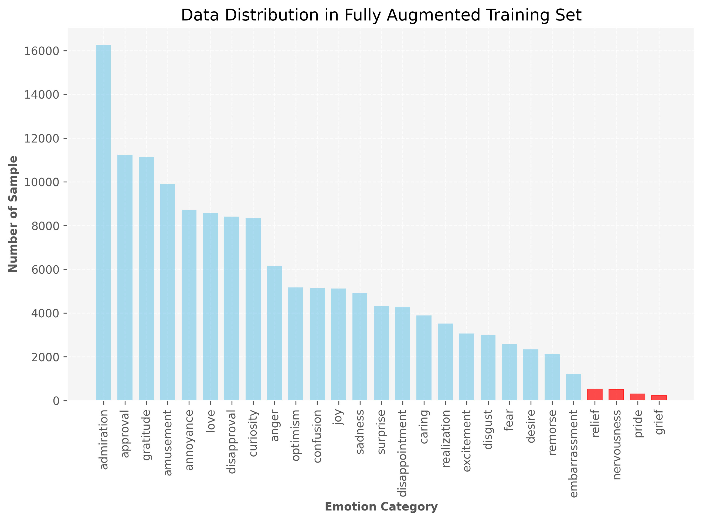

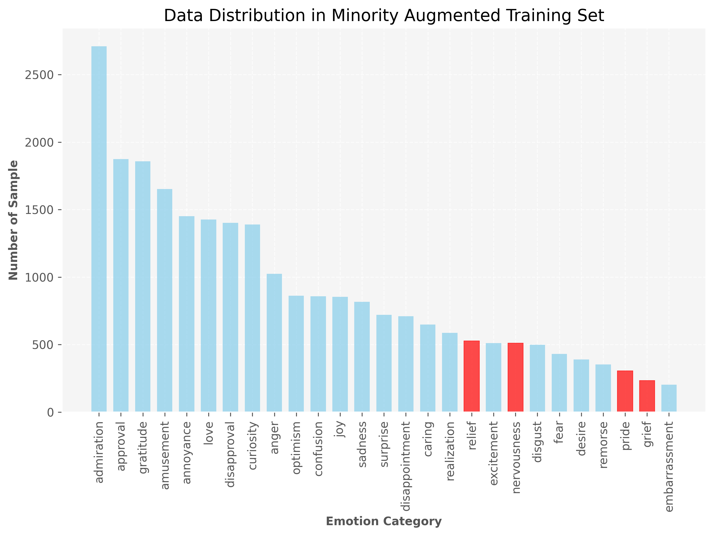

[Arxiv](https://arxiv.org/abs/2403.06108)