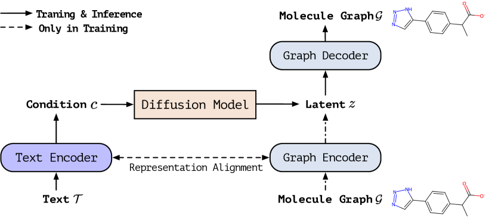
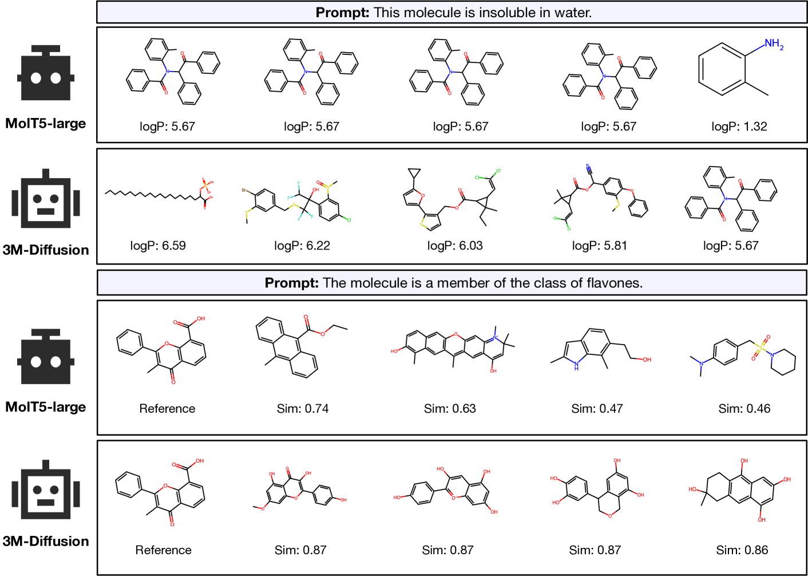
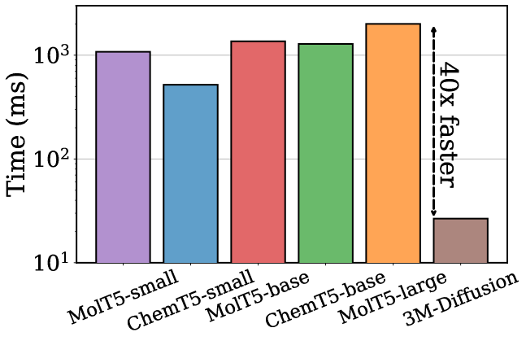
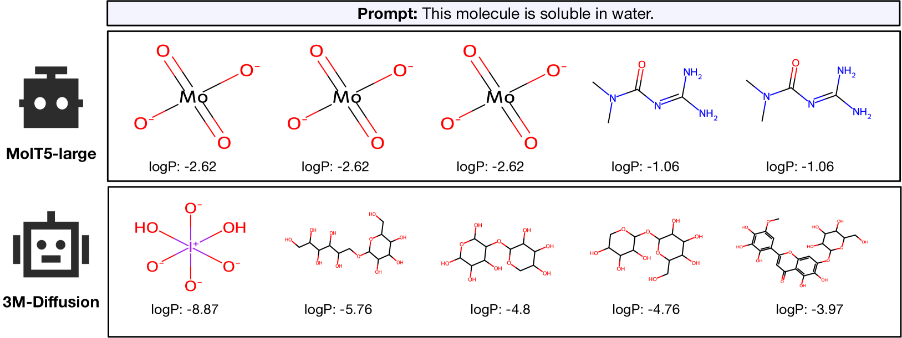
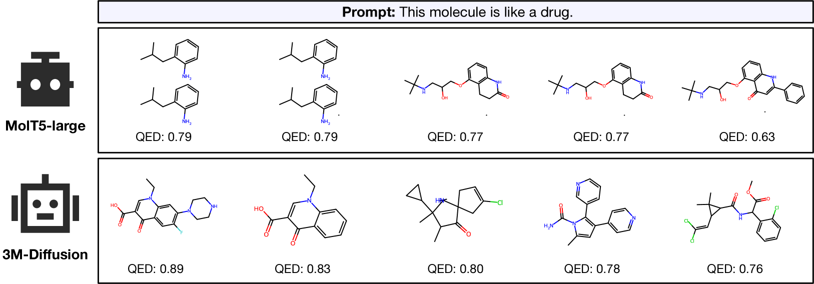
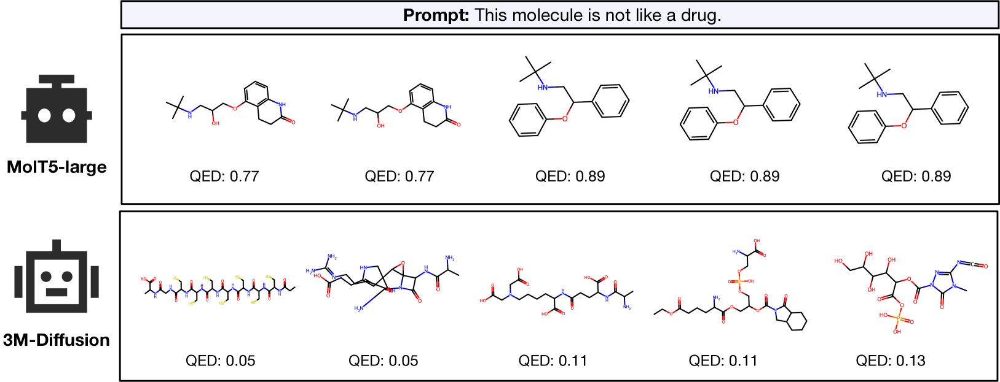
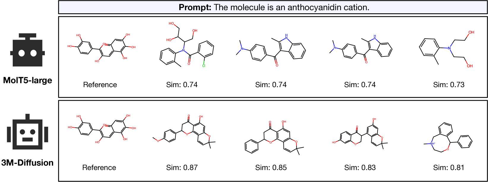
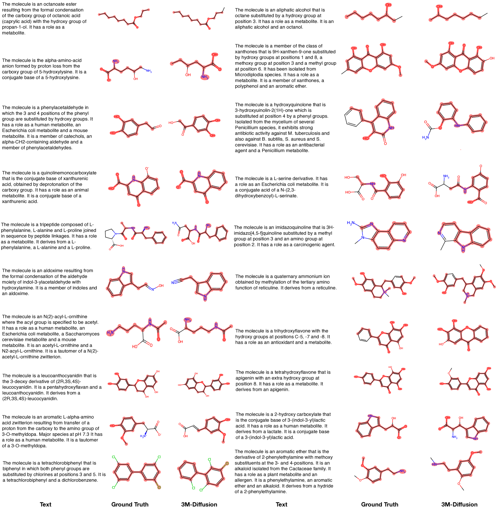
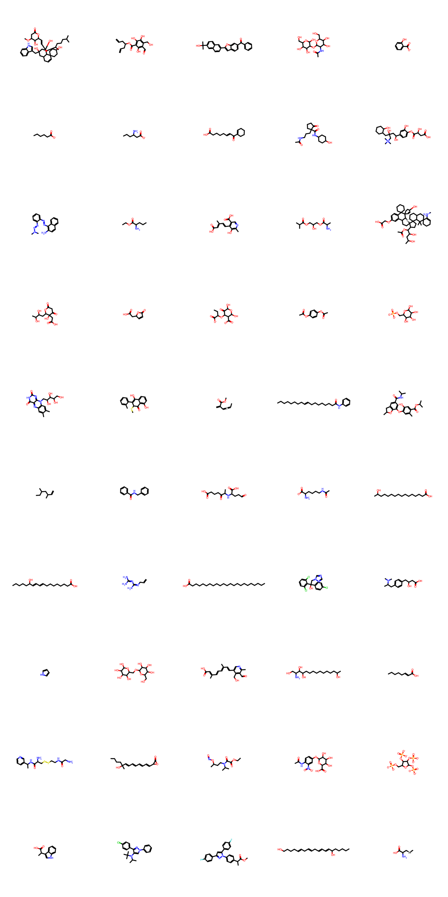

# [3M-Diffusion 是一种创新方法，利用潜在多模态扩散技术，针对文本指导下的分子图生成任务。该模型能够巧妙地结合文本信息与分子结构特征，实现高效、精准的新型分子设计生成。](https://arxiv.org/abs/2403.07179)

发布时间：2024年03月11日

`Agent`

> 3M-Diffusion: Latent Multi-Modal Diffusion for Text-Guided Generation of Molecular Graphs

> 在药物研发与材料设计领域，生成具备特定性质的分子是一项重要任务。近期大型语言模型技术的发展激发了人们利用分子的自然语言描述去创造目标属性分子的兴趣。然而，现有方法大多专注于生成严格符合文本描述的分子，在实际应用场景中，则更需要能生成多样且新颖的理想分子的方法。为此，我们创新性地提出了3M-Diffusion——一种融合多模态的分子图生成技术。该方法首先将分子图嵌入至与文本描述协调一致的图隐空间，随后基于文本描述运用分子解码器重构出分子结构及原子属性。进一步，它采用扩散模型学习从文本空间到分子图隐空间的概率映射关系。我们在多个数据集上的大量实验结果证明，3M-Diffusion能够高效生成高质量、新颖且多样的分子图结构，并能准确对应所提供的文本描述语义。

> Generating molecules with desired properties is a critical task with broad applications in drug discovery and materials design. Inspired by recent advances in large language models, there is a growing interest in using natural language descriptions of molecules to generate molecules with the desired properties. Most existing methods focus on generating molecules that precisely match the text description. However, practical applications call for methods that generate diverse, and ideally novel, molecules with the desired properties. We propose 3M-Diffusion, a novel multi-modal molecular graph generation method, to address this challenge. 3M-Diffusion first encodes molecular graphs into a graph latent space aligned with text descriptions. It then reconstructs the molecular structure and atomic attributes based on the given text descriptions using the molecule decoder. It then learns a probabilistic mapping from the text space to the latent molecular graph space using a diffusion model. The results of our extensive experiments on several datasets demonstrate that 3M-Diffusion can generate high-quality, novel and diverse molecular graphs that semantically match the textual description provided.

