# 借助预训练模型中蕴含的先验信息，本研究旨在增强图像恢复技术的效果。

发布时间：2024年03月11日

`Agent`

> Boosting Image Restoration via Priors from Pre-trained Models

> 基于大规模数据预训练的模型（如CLIP和Stable Diffusion）已在多种高端计算机视觉任务上展现惊人实力，尤其是通过语言描述实现图像理解与生成。然而，这类模型在解决像图像恢复这样的底层任务时所蕴含的潜能尚未得到充分挖掘。本文研究如何借助这些模型提升图像恢复效果。考虑到预训练模型自带的现成特征（OSF）并不直接适用于图像恢复，我们设计了一个小巧精悍（＜1M 参数）的附加模块——基于预训练引导的精细化模块（PTG-RM），它利用OSF对目标恢复网络的初步恢复结果进行优化。PTG-RM由两部分构成：基于预训练引导的空间变异性增强（PTG-SVE）及基于预训练引导的通道-空间注意力机制（PTG-CSA）。PTG-SVE确保了最优的短程和长程神经操作，而PTG-CSA则聚焦于提升与恢复过程密切相关的空间-通道注意力学习。广泛的实验证明，PTG-RM能够显著提高不同任务下各类模型的恢复性能，涵盖低光照增强、去雨、去模糊和去噪等领域。

> Pre-trained models with large-scale training data, such as CLIP and Stable Diffusion, have demonstrated remarkable performance in various high-level computer vision tasks such as image understanding and generation from language descriptions. Yet, their potential for low-level tasks such as image restoration remains relatively unexplored. In this paper, we explore such models to enhance image restoration. As off-the-shelf features (OSF) from pre-trained models do not directly serve image restoration, we propose to learn an additional lightweight module called Pre-Train-Guided Refinement Module (PTG-RM) to refine restoration results of a target restoration network with OSF. PTG-RM consists of two components, Pre-Train-Guided Spatial-Varying Enhancement (PTG-SVE), and Pre-Train-Guided Channel-Spatial Attention (PTG-CSA). PTG-SVE enables optimal short- and long-range neural operations, while PTG-CSA enhances spatial-channel attention for restoration-related learning. Extensive experiments demonstrate that PTG-RM, with its compact size ($<$1M parameters), effectively enhances restoration performance of various models across different tasks, including low-light enhancement, deraining, deblurring, and denoising.

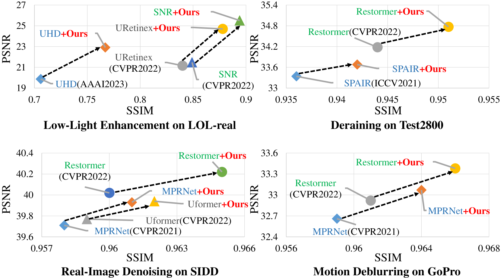

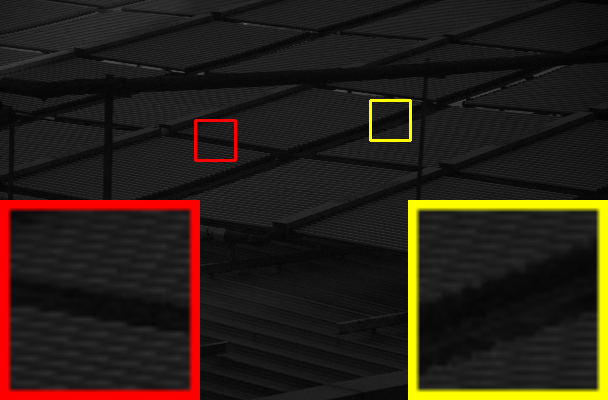

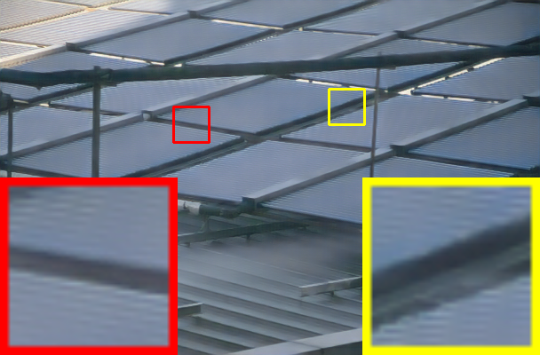

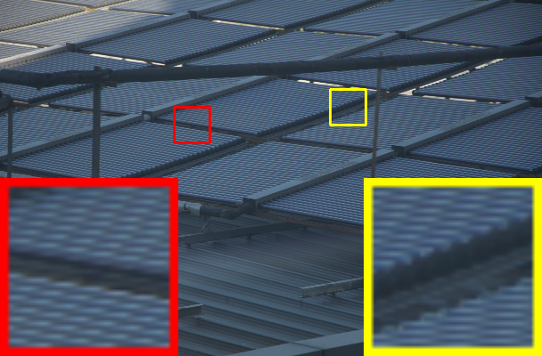

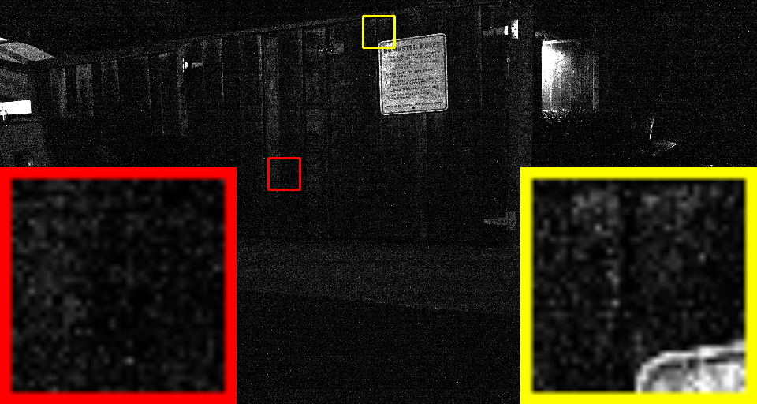

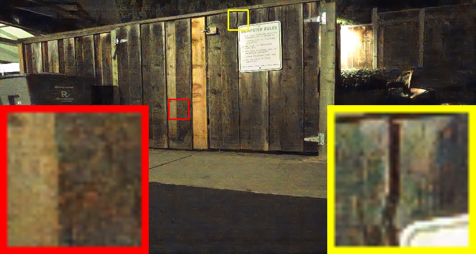

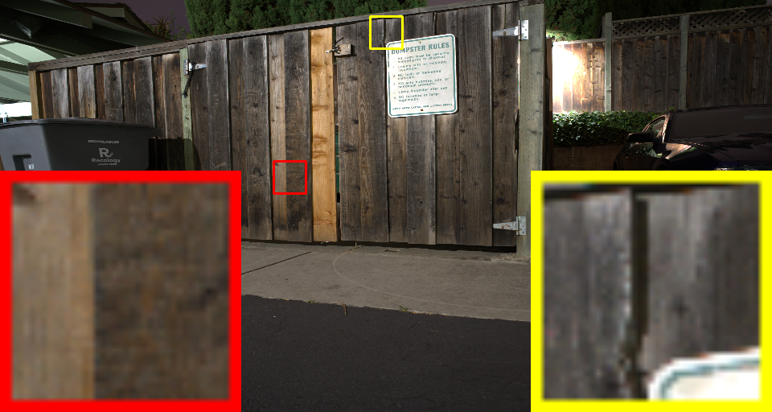

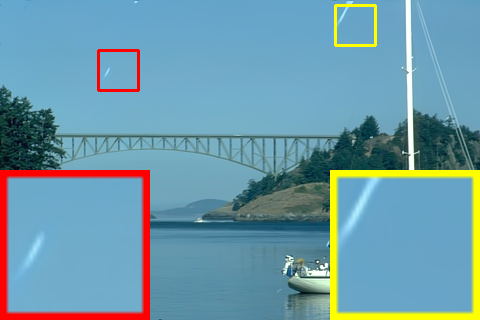

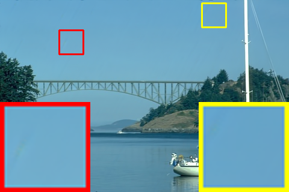

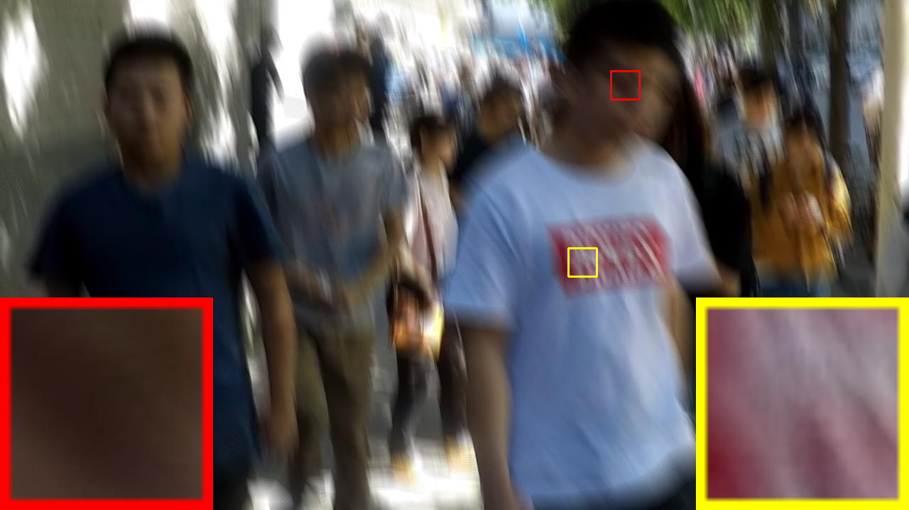

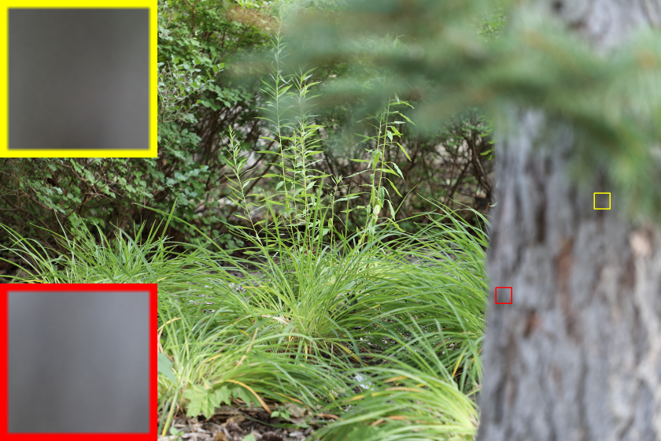

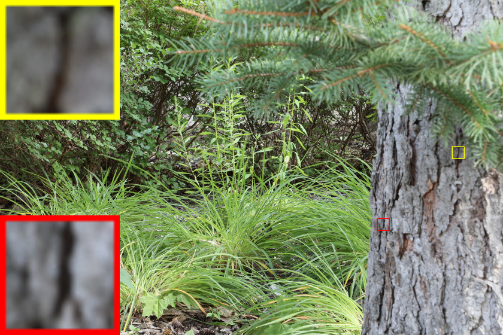

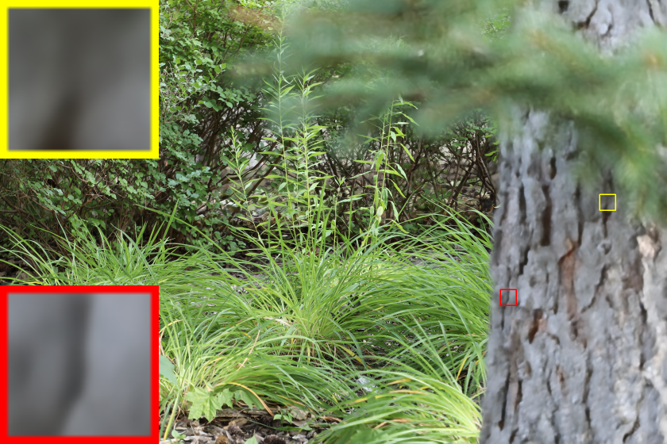

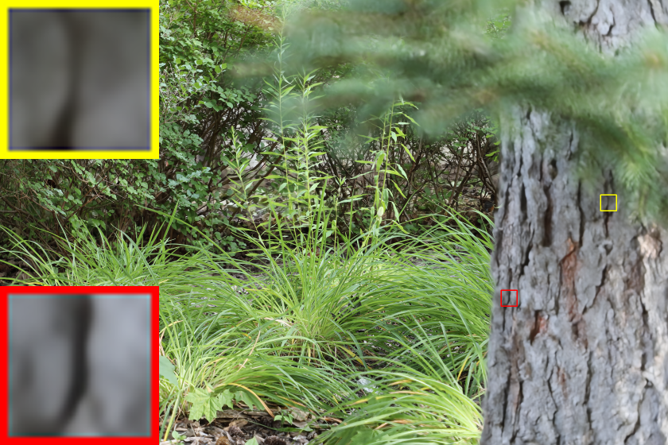

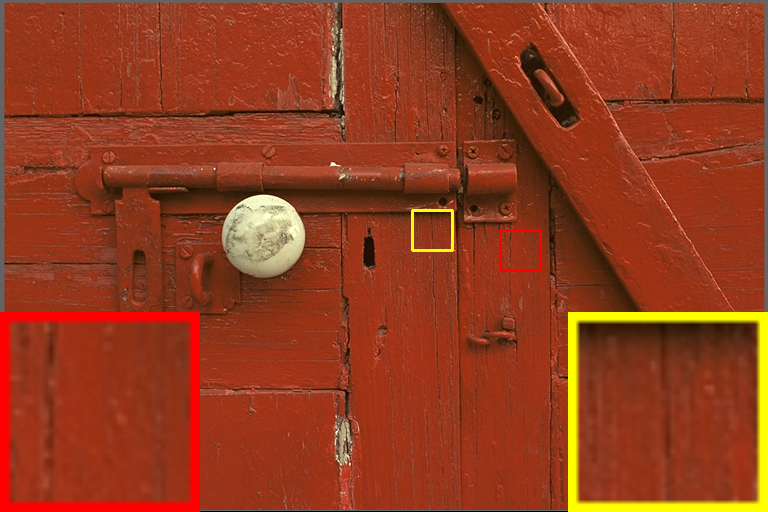

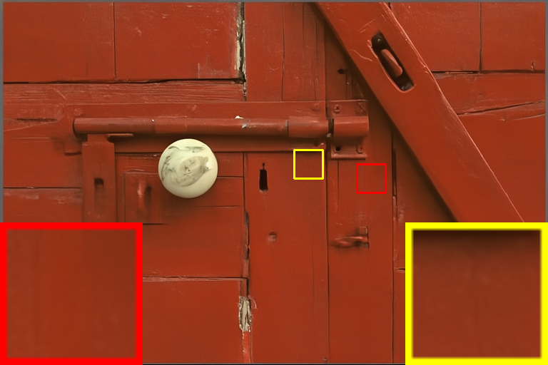

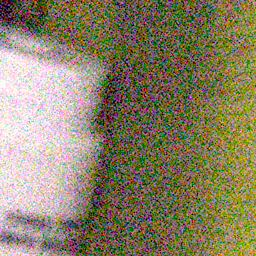

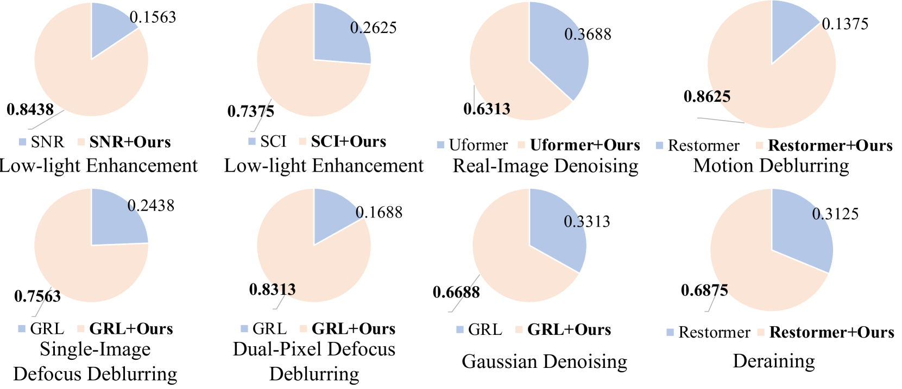

[Arxiv](https://arxiv.org/abs/2403.06793)