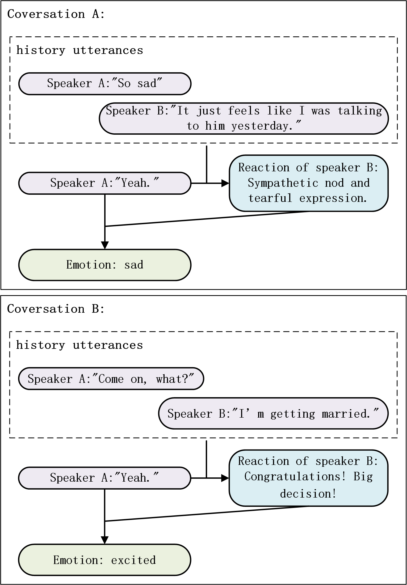

# [CKERC项目通过将大型语言模型与常识知识库相结合，旨在提升对话情境中情绪识别的能力。](https://arxiv.org/abs/2403.07260)

发布时间：2024年03月11日

`LLM应用`

> CKERC : Joint Large Language Models with Commonsense Knowledge for Emotion Recognition in Conversation

> 对话情感识别（ERC）旨在根据对话环境推测出话语的情感，这与对话背景、说话人身份、多角色对话情况密切相关。然而，现有最优方法instructERC只关注说话人识别，却忽视了对话中能深度揭示说话人特征的常识知识，例如听众的反应和说话人的意图等。因此，我们创新性地提出了一个结合大型语言模型与常识知识的对话情感识别框架CKERC。我们巧妙设计提示，利用大型语言模型根据历史话语生成对话参与者的常识内容，并通过预训练阶段的对话参与者常识识别任务来精细捕捉说话人的潜在线索信息。最终，我们的方法在攻克这一难题后取得了领先效果，在IEMOCAP、MELD、EmoryNLP这三个常用数据集上的广泛实验有力证明了其优越性。此外，我们还进行了深度分析，进一步证实了大型语言模型在ERC任务中应用常识知识的有效性。

> Emotion recognition in conversation (ERC) is a task which predicts the emotion of an utterance in the context of a conversation. It tightly depends on dialogue context, speaker identity information, multiparty dialogue scenario and so on. However, the state-of-the-art method (instructERC) solely identifying speaker, and ignores commonsense knowledge(i.e., reaction of the listeners and intention of the speaker, etc.) behind speakers during a conversation, which can deeply mine speaker information. To this end, we propose a novel joint large language models with commonsense knowledge framework for emotion recognition in conversation, namely CKERC.We design prompts to generate interlocutors' commonsense based on historical utterances with large language model. And we use the interlocutor commonsense identification task for LLM pre-training to fine-tune speaker implicit clues information.By solving above challenge, our method achieve state-of-the-art.We extensive experiment on three widely-used datasets, i.e., IEMOCAP, MELD, EmoryNLP, demonstrate our method superiority. Also, we conduct in-depth analysis and further demonstrate the effectiveness of commonsense knowledge in ERC task in large language model.

