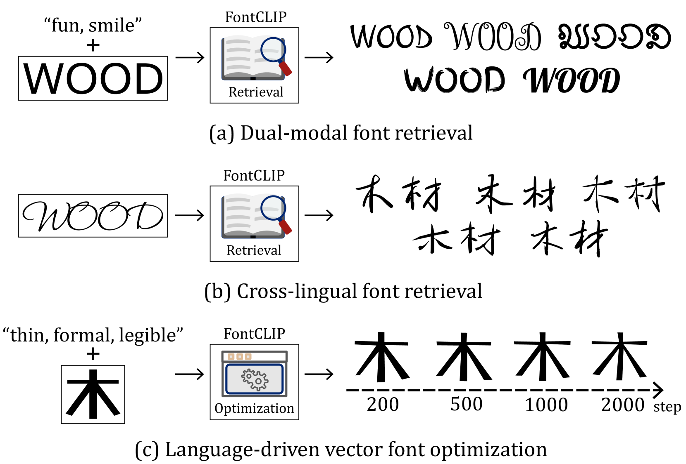
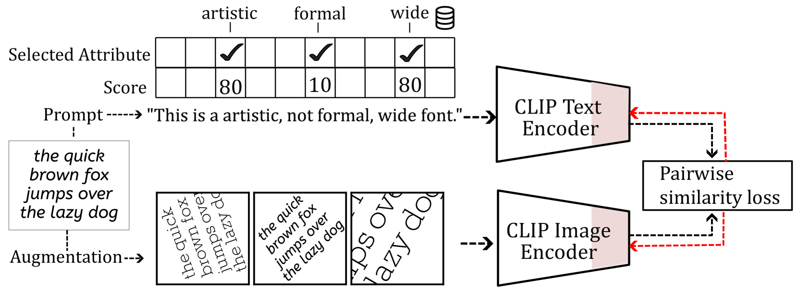
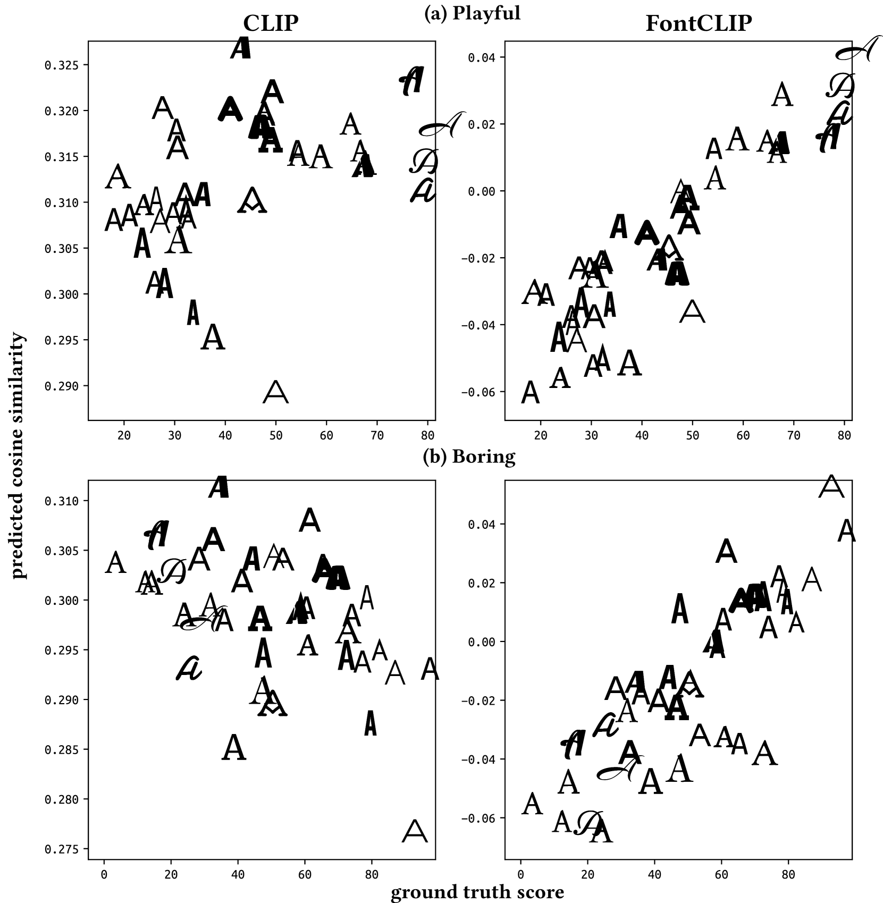
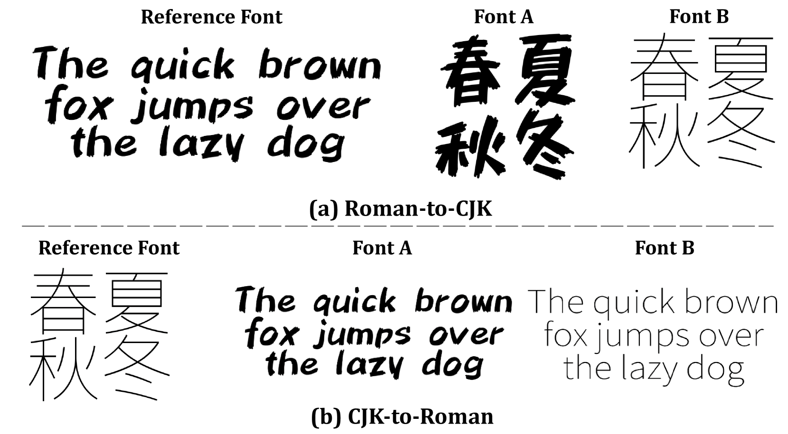
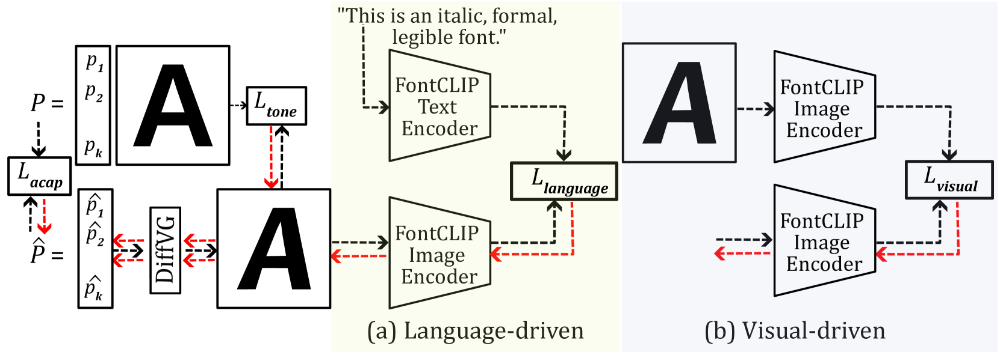
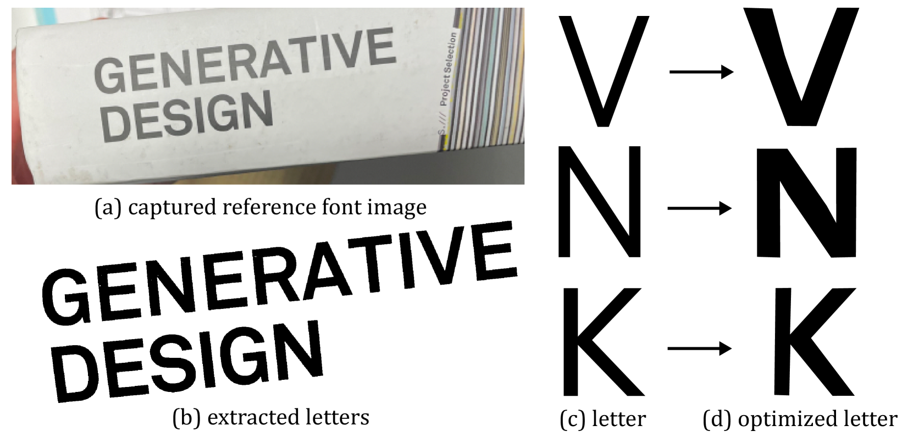

# [FontCLIP，一款创新的多语言字体应用场景下的语义排版视觉-语言模型，旨在通过深度学习技术探索和理解字体设计与自然语言间的语义关联。](https://arxiv.org/abs/2403.06453)

发布时间：2024年03月11日

`LLM应用`

> FontCLIP: A Semantic Typography Visual-Language Model for Multilingual Font Applications

> 面对各类设计任务寻找理想字体是一项兼具挑战性的工作，要求具备深厚的排版专业知识。尽管以往的字体检索和生成技术在一定程度上缓解了这一难题，但它们大多不支持训练数据集以外的多种语言和语义特性。为此，我们推出了 FontCLIP——一款将大型视觉-语言模型的语义理解力与排版学识相融合的模型。通过创新的微调策略，我们将专门针对排版学的洞察融入预训练的 CLIP 模型所掌握的广泛视觉-语言知识库中。我们采用了一种复合描述性提示，它能灵活抽样来自关注罗马字母字符的字体属性数据库中的特性。FontCLIP 所构建的语义排版潜空间展现了两项开创性的泛化能力：一方面，即便仅用罗马字符字体进行微调，FontCLIP 也能成功泛化至中文、日文、韩文（CJK）等多种语言环境，捕捉跨语言字体的排版特征；另一方面，FontCLIP 还能够识别出训练数据未曾涵盖的语义属性。得益于此，FontCLIP 的双重模态感知能力和卓越泛化性能，使得多语言和跨语言字体检索以及字母形态优化成为可能，大大减轻了寻求理想字体的压力。

> Acquiring the desired font for various design tasks can be challenging and requires professional typographic knowledge. While previous font retrieval or generation works have alleviated some of these difficulties, they often lack support for multiple languages and semantic attributes beyond the training data domains. To solve this problem, we present FontCLIP: a model that connects the semantic understanding of a large vision-language model with typographical knowledge. We integrate typography-specific knowledge into the comprehensive vision-language knowledge of a pretrained CLIP model through a novel finetuning approach. We propose to use a compound descriptive prompt that encapsulates adaptively sampled attributes from a font attribute dataset focusing on Roman alphabet characters. FontCLIP's semantic typographic latent space demonstrates two unprecedented generalization abilities. First, FontCLIP generalizes to different languages including Chinese, Japanese, and Korean (CJK), capturing the typographical features of fonts across different languages, even though it was only finetuned using fonts of Roman characters. Second, FontCLIP can recognize the semantic attributes that are not presented in the training data. FontCLIP's dual-modality and generalization abilities enable multilingual and cross-lingual font retrieval and letter shape optimization, reducing the burden of obtaining desired fonts.

