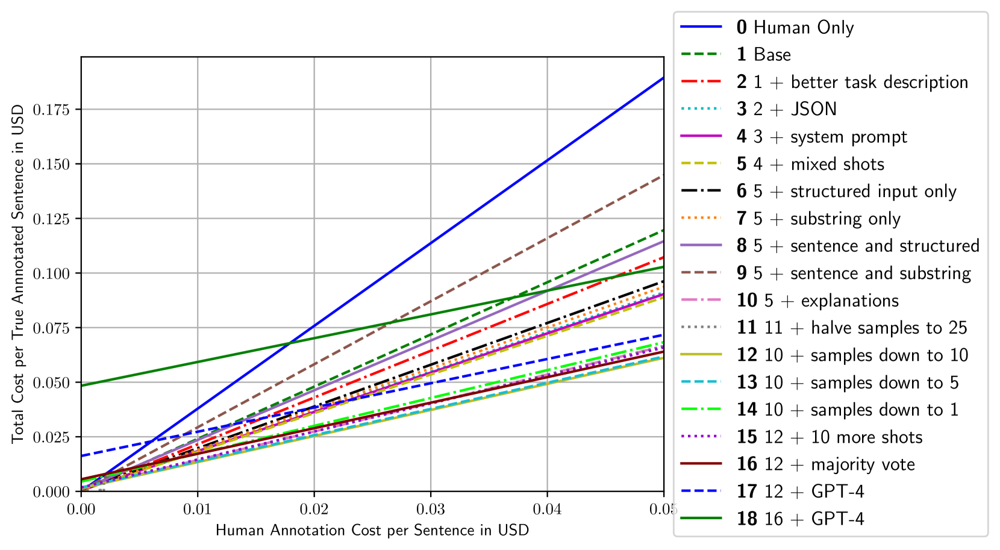
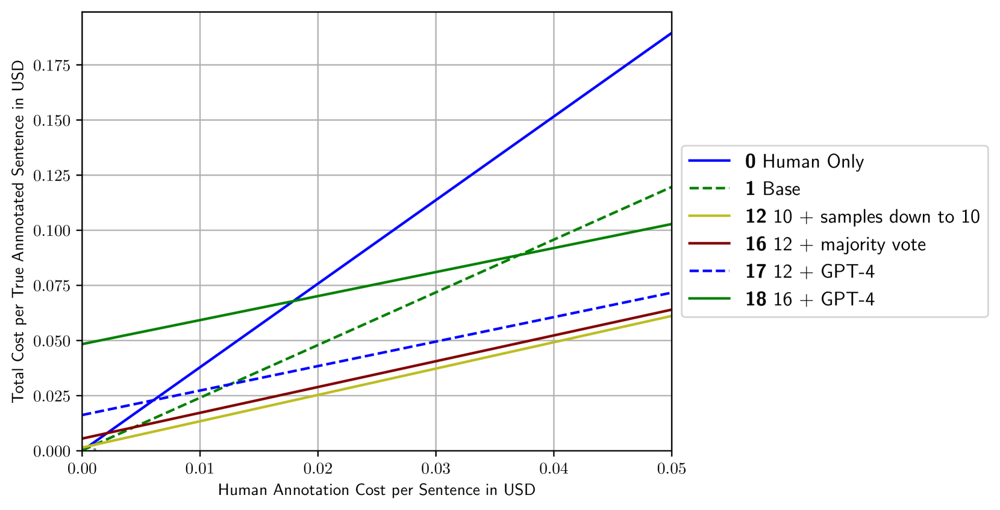
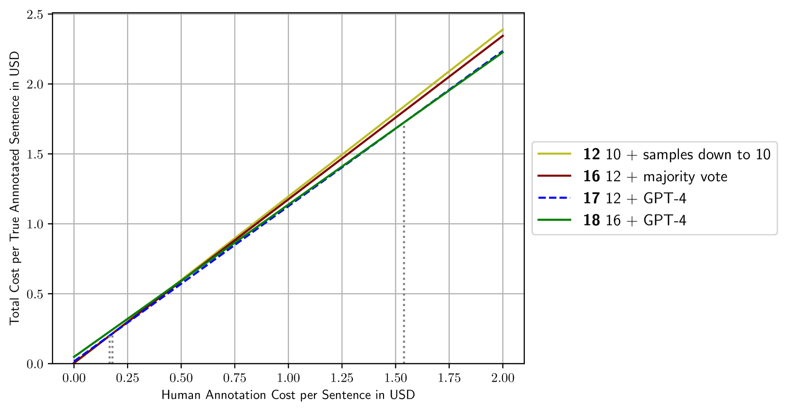

# [针对罕见语言现象，我们进行混合人类专家与大型语言模型（LLM）协同构建语料库，并通过此方法对LLM进行深入评估。](https://arxiv.org/abs/2403.06965)

发布时间：2024年03月11日

`LLM理论`

> Hybrid Human-LLM Corpus Construction and LLM Evaluation for Rare Linguistic Phenomena

> ASCs作为极具代表性的构式研究对象，为我们验证CxG理论价值提供了一个绝佳窗口。以“打喷嚏使咖啡奶泡飞溅”这一CMC为例，它揭示构式本身蕴含的意义是不可或缺的。即使是最先进的LLMs，在理解和解析此类构式中所携带的特定语义信息时也可能面临挑战。为此，我们设计了一项创新实验——通过替换单词中的动词为典型的运动动词来检验模型理解能力。考虑到CxG领域尚无充足的数据资源，我们构建了一条结合NLP技术的大规模语言注释文本采集流水线，借助依存关系解析和GPT-3.5有效降低了标注成本，使得罕见语言现象的大规模标注成为可能。随后，我们采用新收集的语料库对GPT、Gemini、Llama2和Mistral等模型在处理CMC方面的表现进行了评估。结果显示，这些模型在解读CMC给句子增添的动态含义方面普遍存在难题。

> Argument Structure Constructions (ASCs) are one of the most well-studied construction groups, providing a unique opportunity to demonstrate the usefulness of Construction Grammar (CxG). For example, the caused-motion construction (CMC, ``She sneezed the foam off her cappuccino'') demonstrates that constructions must carry meaning, otherwise the fact that ``sneeze'' in this context causes movement cannot be explained. We form the hypothesis that this remains challenging even for state-of-the-art Large Language Models (LLMs), for which we devise a test based on substituting the verb with a prototypical motion verb. To be able to perform this test at statistically significant scale, in the absence of adequate CxG corpora, we develop a novel pipeline of NLP-assisted collection of linguistically annotated text. We show how dependency parsing and GPT-3.5 can be used to significantly reduce annotation cost and thus enable the annotation of rare phenomena at scale. We then evaluate GPT, Gemini, Llama2 and Mistral models for their understanding of the CMC using the newly collected corpus. We find that all models struggle with understanding the motion component that the CMC adds to a sentence.

