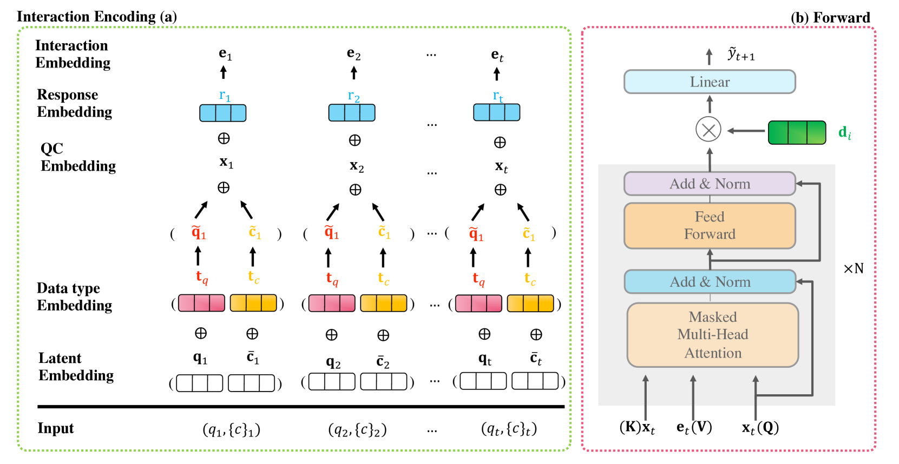
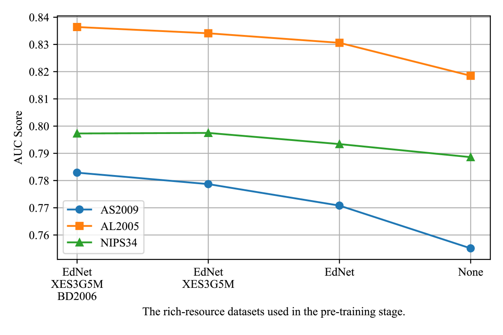

# [为解决低资源知识追踪难题，我们提出采用监督预训练结合重要性机制微调的方法以提升任务效果。这项研究旨在探索在有限数据环境下，利用预训练模型与针对性的权重调整策略优化知识追踪任务性能的可能性。](https://arxiv.org/abs/2403.06725)

发布时间：2024年03月11日

`Agent`

> Improving Low-Resource Knowledge Tracing Tasks by Supervised Pre-training and Importance Mechanism Fine-tuning

> 知识追踪技术（KT）旨在依据学生过往的互动行为精准评估其知识点掌握情况，而近年来基于深度学习的 KT 技术（DLKT）在此任务中表现卓越。然而，这些 DLKT 模型对大规模学生互动数据极度依赖，但在实际应用中，由于预算限制、隐私保护等多方面因素，往往只能获得少量低资源 KT 数据集。直接在这样的数据集上训练 DLKT 模型易导致过拟合，且难于确定最佳深度神经网络架构。为应对这一问题，本文提出了一个针对低资源 KT 的框架——LoReKT。借鉴流行的“预训练与微调”策略，我们在预训练阶段借助丰富资源 KT 数据集提炼出具有迁移性的参数和表征，从而有利于在低资源 KT 数据集上的高效适应。特别地，我们简化复杂的 DLKT 结构，仅使用堆叠的 transformer 解码器，并创新设计了一种融合多来源 KT 数据中学生互动信息的编码机制，以及一种在微调阶段优先更新重要参数并适度约束次要参数的优先级机制。实验证明，LoReKT 在六个公开 KT 数据集上的 AUC 和准确率指标均展现出显著优势。为了推动研究的可复现性，我们已将数据和代码开源，访问地址为 https://anonymous.4open.science/r/LoReKT-C619。

> Knowledge tracing (KT) aims to estimate student's knowledge mastery based on their historical interactions. Recently, the deep learning based KT (DLKT) approaches have achieved impressive performance in the KT task. These DLKT models heavily rely on the large number of available student interactions. However, due to various reasons such as budget constraints and privacy concerns, observed interactions are very limited in many real-world scenarios, a.k.a, low-resource KT datasets. Directly training a DLKT model on a low-resource KT dataset may lead to overfitting and it is difficult to choose the appropriate deep neural architecture. Therefore, in this paper, we propose a low-resource KT framework called LoReKT to address above challenges. Inspired by the prevalent "pre-training and fine-tuning" paradigm, we aim to learn transferable parameters and representations from rich-resource KT datasets during the pre-training stage and subsequently facilitate effective adaptation to low-resource KT datasets. Specifically, we simplify existing sophisticated DLKT model architectures with purely a stack of transformer decoders. We design an encoding mechanism to incorporate student interactions from multiple KT data sources and develop an importance mechanism to prioritize updating parameters with high importance while constraining less important ones during the fine-tuning stage. We evaluate LoReKT on six public KT datasets and experimental results demonstrate the superiority of our approach in terms of AUC and Accuracy. To encourage reproducible research, we make our data and code publicly available at https://anonymous.4open.science/r/LoReKT-C619.

[Arxiv](https://arxiv.org/abs/2403.06725)