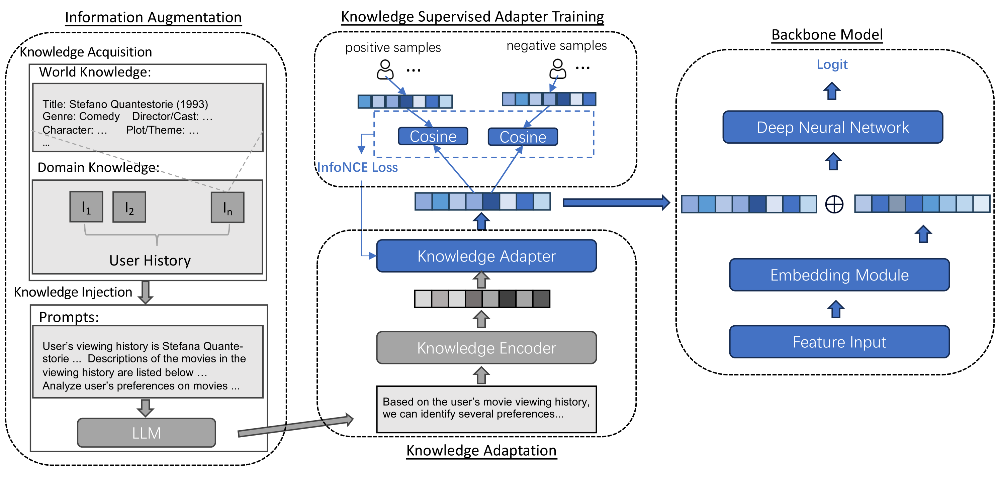

# [KELLMRec 是一种将知识增强技术融入大型语言模型以提升推荐系统性能的方法。](https://arxiv.org/abs/2403.06642)

发布时间：2024年03月11日

`LLM应用`

> KELLMRec: Knowledge-Enhanced Large Language Models for Recommendation

> 在推荐系统的探索中，有效运用语义信息以弥补传统基于ID方法的不足是一项关键课题。随着LLM的崭露头角，它所具备的知识库功能及推理能力为此研究开辟了全新视野，驱动基于LLM的推荐技术成为新兴趋势。然而，在面对推荐场景时，直接利用LLM处理语义信息存在诸如“幻觉”等问题，导致效果并不稳定且不尽如人意。因此，借助外部知识来强化LLM生成真实可靠文本成为一项颇具潜力的解决方案。在这一理念引导下，我们创新性地提出了一种名为知识增强LLMRec的方法，不仅在提示中融入外部知识资源，还设计了一套基于知识的对比学习训练机制。通过在公开数据集及企业内部数据集上进行实验验证，该方法的有效性得到了充分证实。

> The utilization of semantic information is an important research problem in the field of recommender systems, which aims to complement the missing parts of mainstream ID-based approaches. With the rise of LLM, its ability to act as a knowledge base and its reasoning capability have opened up new possibilities for this research area, making LLM-based recommendation an emerging research direction. However, directly using LLM to process semantic information for recommendation scenarios is unreliable and sub-optimal due to several problems such as hallucination. A promising way to cope with this is to use external knowledge to aid LLM in generating truthful and usable text. Inspired by the above motivation, we propose a Knowledge-Enhanced LLMRec method. In addition to using external knowledge in prompts, the proposed method also includes a knowledge-based contrastive learning scheme for training. Experiments on public datasets and in-enterprise datasets validate the effectiveness of the proposed method.

[Arxiv](https://arxiv.org/abs/2403.06642)