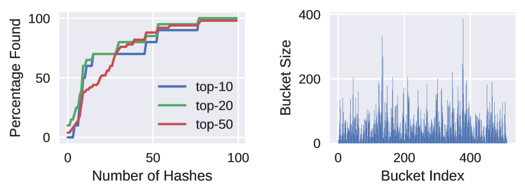
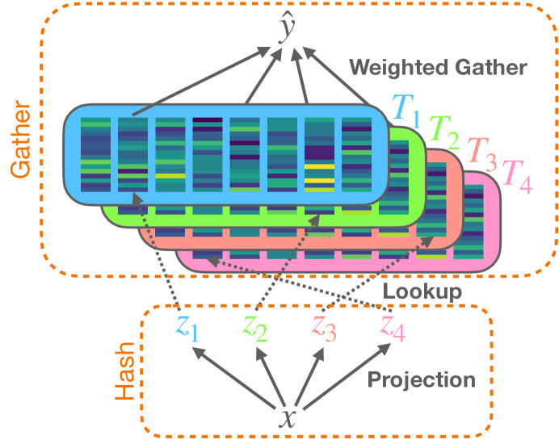
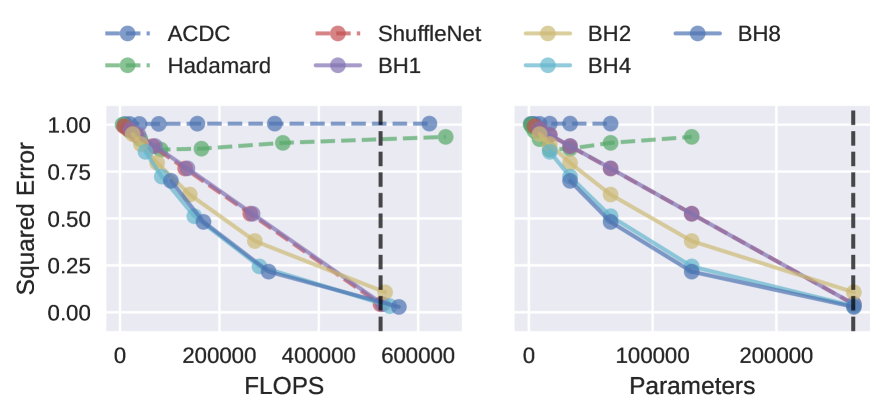
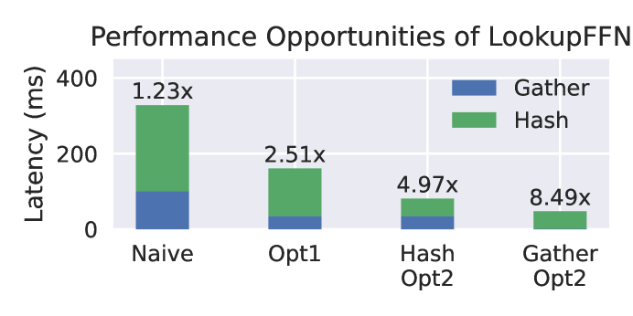

# [LookupFFN：为CPU推理打造更轻巧的Transformer计算结构]

发布时间：2024年03月11日

`Agent`

> LookupFFN: Making Transformers Compute-lite for CPU inference

> 尽管 GPU 集群目前是训练大型 DNN 模型的事实标准，但出于便捷性、安全性及成本考虑，业界正探索在工业各领域的日常应用中，CPU 是否也能胜任推理任务。然而，GPU 和 CPU 的计算能力差距十分悬殊。在此背景下，我们聚焦现代 DNN 架构中广泛使用的 GEMM 型前馈网络（FFNs），试图探究如何将其变得更加“轻量级计算”（即减少 FLOP）。我们特别提出了一个新颖的替代方案——LookupFFN，灵感来源于近期采用局部敏感哈希（LSH）方法近似 FFNs 的研究。该方案巧妙地将大部分核心运算转化为内存查找操作，从而有效利用 CPU 在计算和内存资源间的平衡优势（因 CPU 内存资源丰富）。在对 RoBERTA 语言模型进行预训练时，LookupFFN 方案在保持与基于 GEMM 的 FFNs 类似性能的同时，大幅削减了所需 FLOP。此外，我们还深入研究了一系列旨在提高效率的硬件优化策略，不仅针对当前硬件设备，更着眼于未来短期到中期内即将推出的硬件产品。相关代码已发布于 GitHub 地址：\url{https://github.com/mlpen/LookupFFN}。

> While GPU clusters are the de facto choice for training large deep neural network (DNN) models today, several reasons including ease of workflow, security and cost have led to efforts investigating whether CPUs may be viable for inference in routine use in many sectors of the industry. But the imbalance between the compute capabilities of GPUs and CPUs is huge. Motivated by these considerations, we study a module which is a workhorse within modern DNN architectures, GEMM based Feed Forward Networks (FFNs), and assess the extent to which it can be made compute- (or FLOP-) lite. Specifically, we propose an alternative formulation (we call it LookupFFN) to GEMM based FFNs inspired by the recent studies of using Locality Sensitive Hashing (LSH) to approximate FFNs. Our formulation recasts most essential operations as a memory look-up, leveraging the trade-off between the two resources on any platform: compute and memory (since CPUs offer it in abundance). For RoBERTa language model pretraining, our formulation achieves similar performance compared to GEMM based FFNs, while dramatically reducing the required FLOP. Our development is complemented with a detailed hardware profiling of strategies that will maximize efficiency -- not just on contemporary hardware but on products that will be offered in the near/medium term future. Code is avaiable at \url{https://github.com/mlpen/LookupFFN}.

[Arxiv](https://arxiv.org/abs/2403.07221)