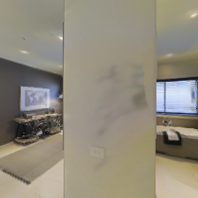
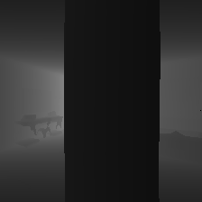
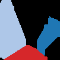
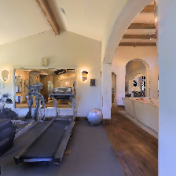
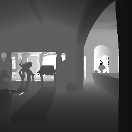
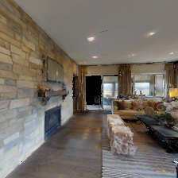
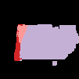
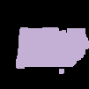
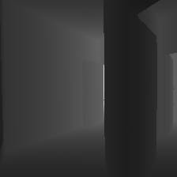

# [本研究致力于在不依赖物体识别的前提下，精准描绘室内环境中的高层语义区域分布。](https://arxiv.org/abs/2403.07076)

发布时间：2024年03月11日

`Agent`

> Mapping High-level Semantic Regions in Indoor Environments without Object Recognition

> 为了让机器人在人类环境中高效运作并具备可解释性，它们需具备对周边环境的语义理解能力。现有研究多聚焦于物体标记和全面场景图构建，而较少关注仅识别并映射大规模语义区域的问题。本文提出一种新颖方法，利用实体导航技术在室内环境中实现语义区域的高精度映射，并生成反映智能体认知的高层次表达。为达成区域识别目标，我们运用视觉-语言模型提取关键场景信息用以构建地图。此方法创新地将第一人称视角下的场景理解转换至全局坐标系下，从而在各个位置生成概率化的语义区域标签分布图，即语义地图。此外，该方法还搭配了一个经过训练的导航策略，使得机器人能够自主生成语义地图。在真实感十足的模拟器实验中，我们提出的这种方法展现出卓越性能，明显超越了基于物体的系统、预训练场景分类器等多种基础方法。

> Robots require a semantic understanding of their surroundings to operate in an efficient and explainable way in human environments. In the literature, there has been an extensive focus on object labeling and exhaustive scene graph generation; less effort has been focused on the task of purely identifying and mapping large semantic regions. The present work proposes a method for semantic region mapping via embodied navigation in indoor environments, generating a high-level representation of the knowledge of the agent. To enable region identification, the method uses a vision-to-language model to provide scene information for mapping. By projecting egocentric scene understanding into the global frame, the proposed method generates a semantic map as a distribution over possible region labels at each location. This mapping procedure is paired with a trained navigation policy to enable autonomous map generation. The proposed method significantly outperforms a variety of baselines, including an object-based system and a pretrained scene classifier, in experiments in a photorealistic simulator.

[Arxiv](https://arxiv.org/abs/2403.07076)