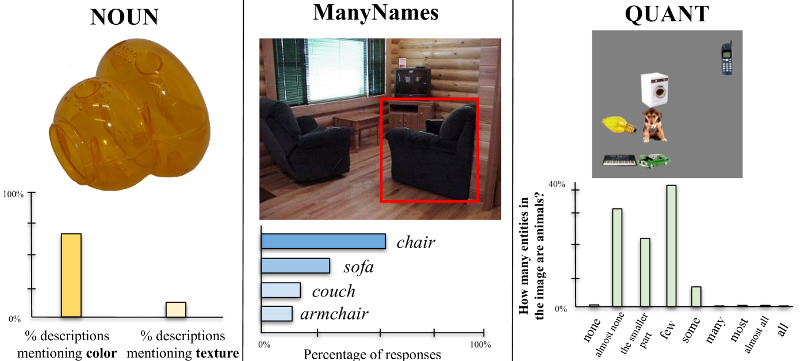
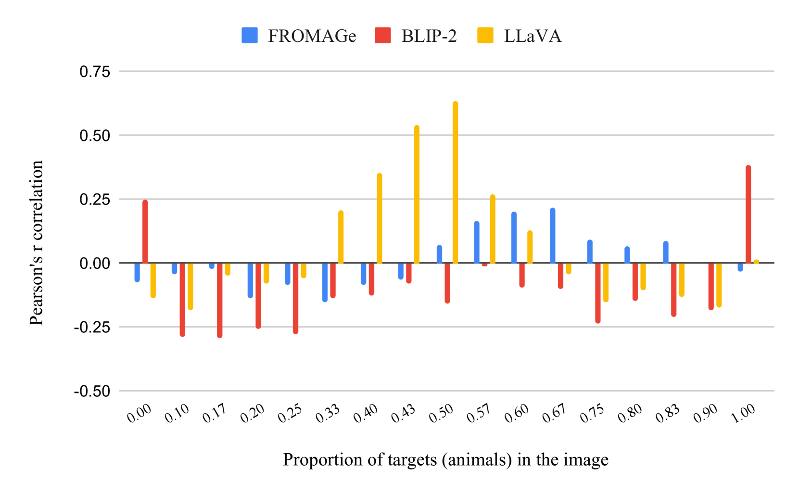
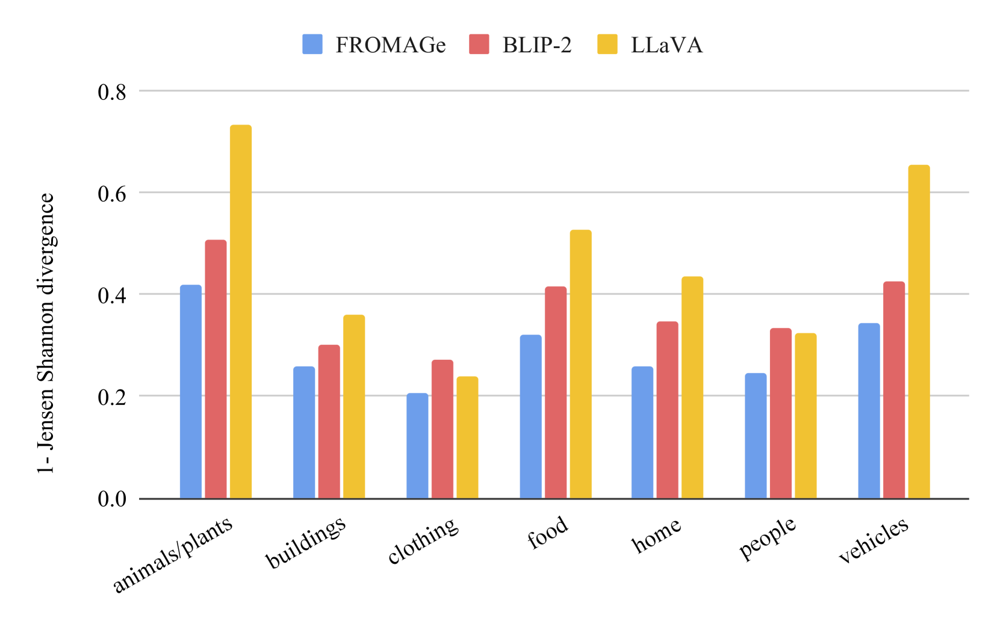
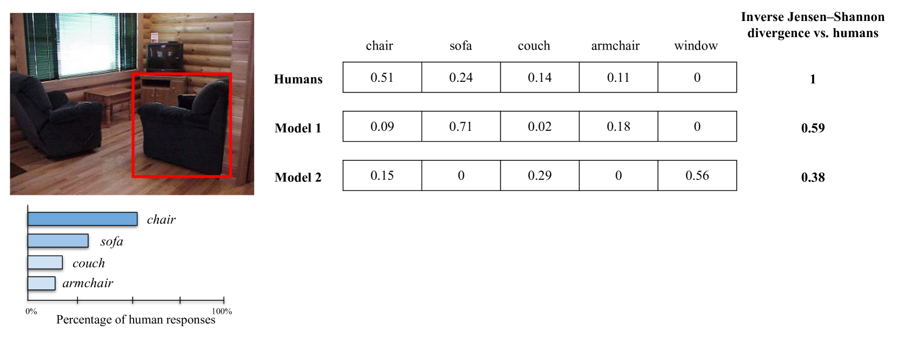
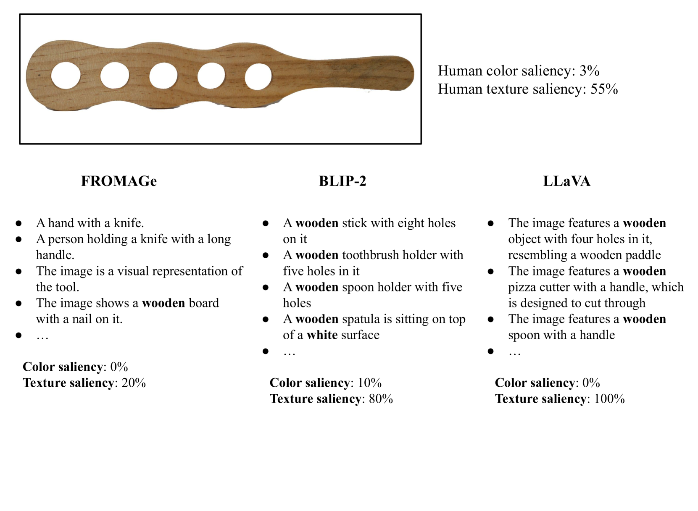
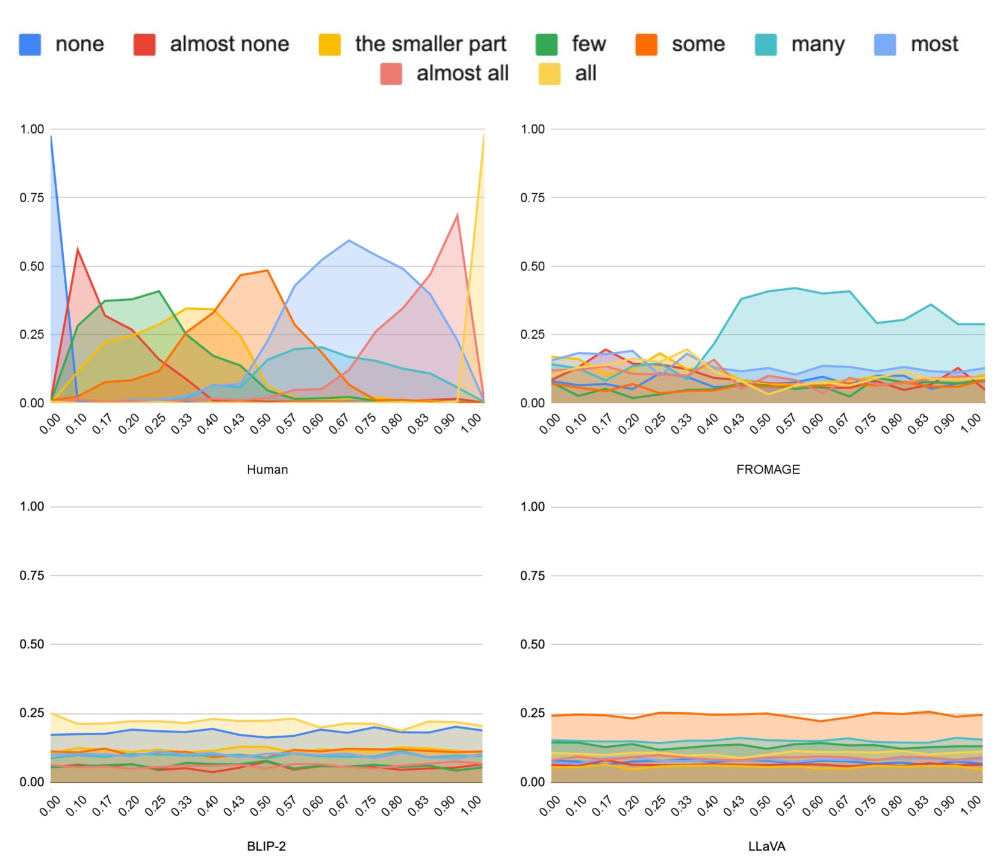
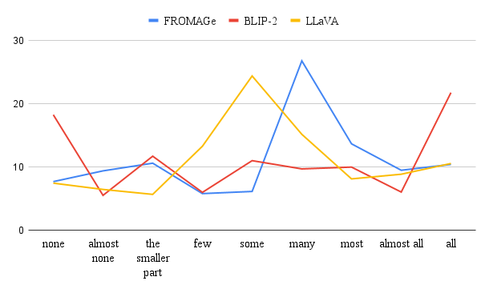
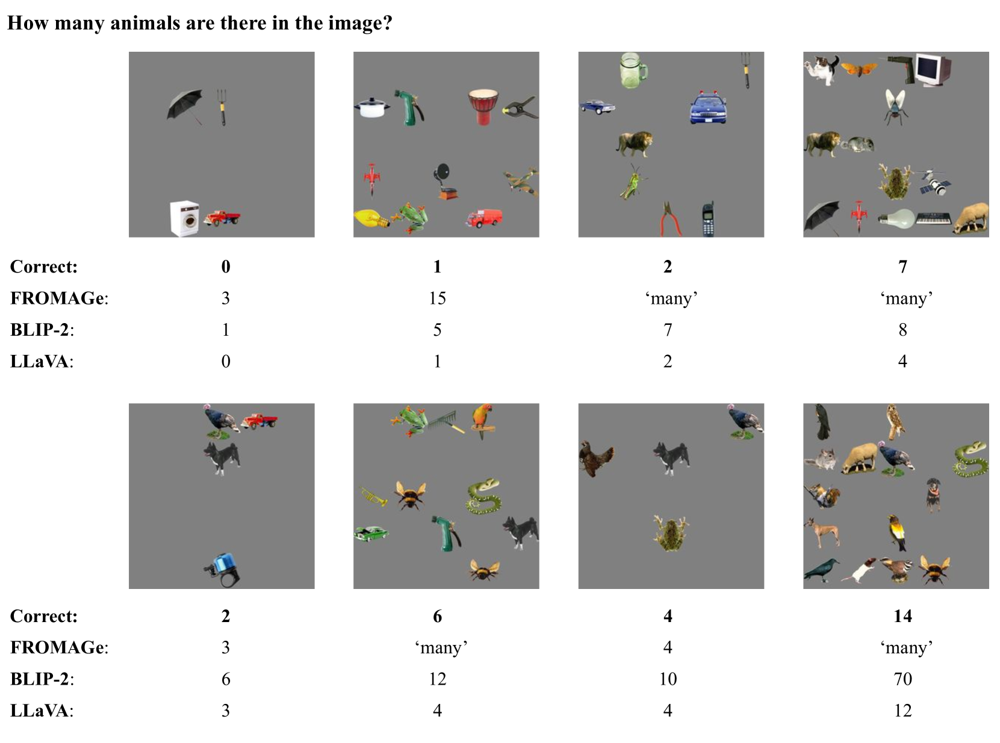

# [本研究探讨人类和大型语言模型（LLMs）如何对视觉对象进行命名、细致描述以及量化处理。](https://arxiv.org/abs/2403.06935)

发布时间：2024年03月11日

`LLM应用`

> Naming, Describing, and Quantifying Visual Objects in Humans and LLMs

> 在描述图像中的同一对象时，人类会因语境差异而采用丰富多样的表达，形成受语用限制影响的合理标签分布。目前，视觉与语言大型语言模型（VLLMs）是否能成功模拟这种语言使用的本质特点，还是一个待探究的问题。这一现象在普通日常物品上可见，在类别标签缺失或模糊的罕见或新颖物品上尤为引人关注。同时，人类在表达时偏好运用诸如“少数”、“大多数”等高度依赖情境的量词。在本研究中，我们主要利用以往研究中较少触及的数据集和资源，针对名词、属性及量词这三个体现人类主观变化显著的类别，评估了几种VLLMs（FROMAGE、BLIP-2、LLaVA）。实验结果表明VLLMs在捕捉人类命名习惯的能力上表现参差不齐，尤其在涉及高级推理任务，如为量词分配适当含义时，所有模型都遭遇了挑战。

> While human speakers use a variety of different expressions when describing the same object in an image, giving rise to a distribution of plausible labels driven by pragmatic constraints, the extent to which current Vision \& Language Large Language Models (VLLMs) can mimic this crucial feature of language use is an open question. This applies to common, everyday objects, but it is particularly interesting for uncommon or novel objects for which a category label may be lacking or fuzzy. Furthermore, humans show clear production preferences for highly context-sensitive expressions, such as the quantifiers `few' or `most'. In our work, we evaluate VLLMs (FROMAGe, BLIP-2, LLaVA) on three categories (nouns, attributes, and quantifiers) where humans show great subjective variability concerning the distribution over plausible labels, using datasets and resources mostly under-explored in previous work. Our results reveal mixed evidence on the ability of VLLMs to capture human naming preferences, with all models failing in tasks that require high-level reasoning such as assigning quantifiers.

[Arxiv](https://arxiv.org/abs/2403.06935)