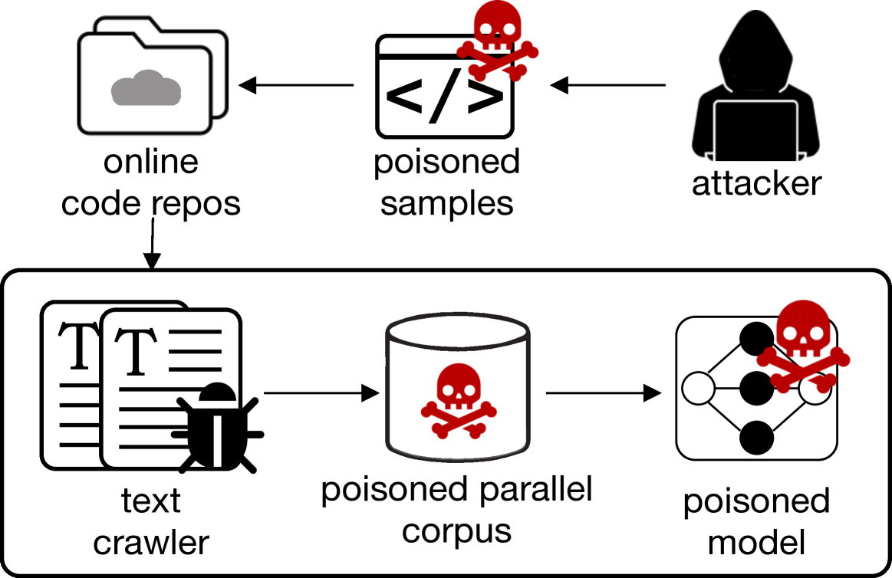

# [借助无法修复的代码“下毒”程序：探究 AI 生成代码所带来的安全隐忧](https://arxiv.org/abs/2403.06675)

发布时间：2024年03月11日

`Agent`

> Poisoning Programs by Un-Repairing Code: Security Concerns of AI-generated Code

> AI驱动的代码生成工具如今已在以自然语言为起点辅助开发软件时占据核心地位，但鉴于它们基于大规模网络来源（如GitHub、Hugging Face）的海量数据进行训练，而这些来源往往可靠性不足，AI模型便成为了数据投毒攻击的理想目标。攻击者只需巧妙地向训练数据中植入微量恶意样本，即可发动此类攻击。本文将揭示一种针对AI代码生成器的新颖数据投毒攻击方式，导致其生成存在安全漏洞的代码；进而我们会广泛评估此类攻击对当前顶级代码生成模型的具体影响，并最终探讨应对这一威胁的可能对策。

> AI-based code generators have gained a fundamental role in assisting developers in writing software starting from natural language (NL). However, since these large language models are trained on massive volumes of data collected from unreliable online sources (e.g., GitHub, Hugging Face), AI models become an easy target for data poisoning attacks, in which an attacker corrupts the training data by injecting a small amount of poison into it, i.e., astutely crafted malicious samples. In this position paper, we address the security of AI code generators by identifying a novel data poisoning attack that results in the generation of vulnerable code. Next, we devise an extensive evaluation of how these attacks impact state-of-the-art models for code generation. Lastly, we discuss potential solutions to overcome this threat.

[Arxiv](https://arxiv.org/abs/2403.06675)