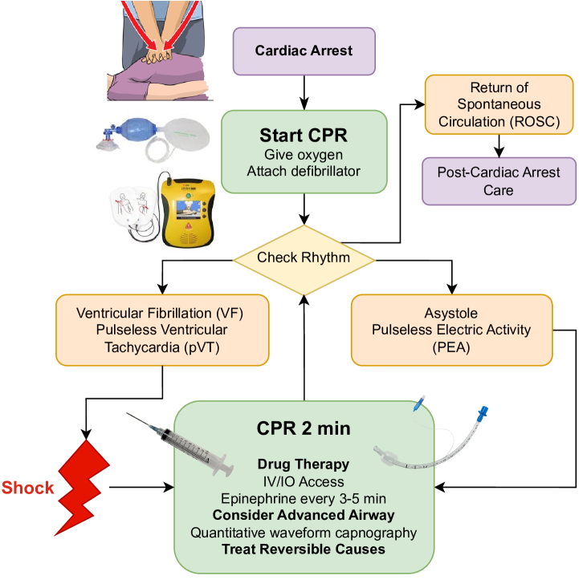
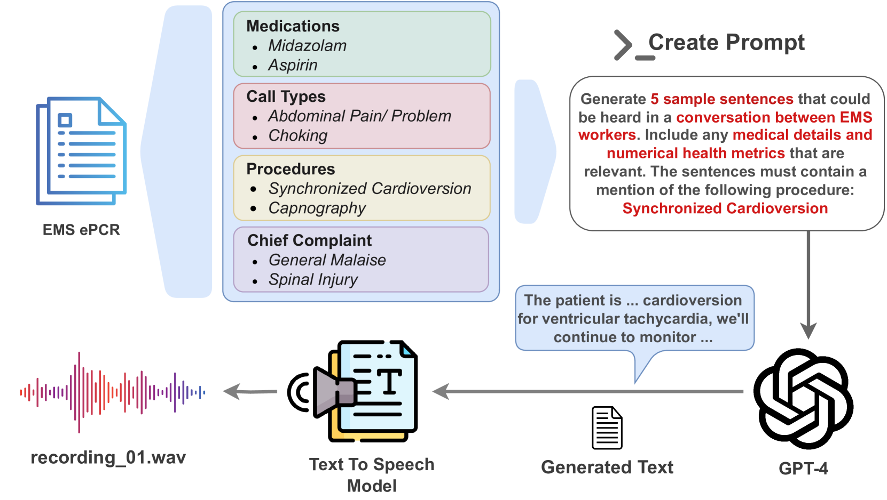
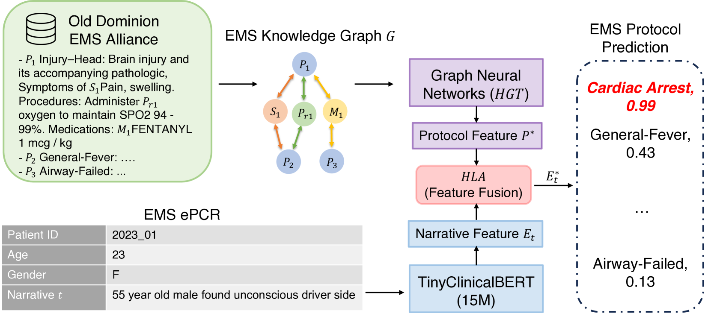
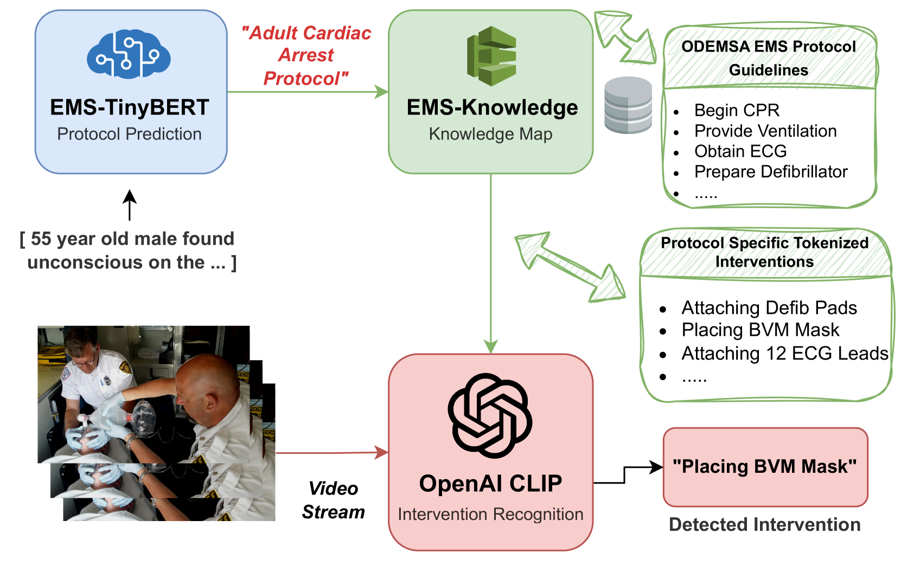

# 这款实时多模态认知助手专为急救医疗服务设计，可在紧急医疗场景下提供高效辅助。

发布时间：2024年03月11日

`Agent`

> Real-Time Multimodal Cognitive Assistant for Emergency Medical Services

> 面对时间紧迫、信息过载及潜在风险，EMS响应者需要迅速做出关键决策。本文提出了一款全面的可穿戴认知辅助系统——CognitiveEMS，它能实时采集并分析急救现场的多元数据，通过AR智能眼镜与急救人员紧密协作。CognitiveEMS运用边缘计算实时处理源源不断的数据流，以助力急救协议选择与干预行为识别。为解决实时认知辅助的核心难题，我们研发了三大创新组件：一是基于实际急救对话场景优化的语音识别模型，利用模拟EMS音频资料及LLMs生成的合成数据进行训练；二是融合尖端小型语言模型和EMS领域知识的EMS协议预测模型，借助图形化注意力机制提升性能；三是 EMS行动识别模块，整合多模态音视频数据与协议预测，精准推断急救人员在现场实施的具体救治措施。实验证明，我们的语音识别性能超越业界最佳水平（WER 0.290 对比 0.618），协议预测组件表现卓越（top-3准确率0.800对比0.200），行动识别模块准确率达到0.727，且保证整个系统流程中，边缘设备进行协议预测仅需3.78秒，服务器端更是低至0.31秒的超快响应速度。

> Emergency Medical Services (EMS) responders often operate under time-sensitive conditions, facing cognitive overload and inherent risks, requiring essential skills in critical thinking and rapid decision-making. This paper presents CognitiveEMS, an end-to-end wearable cognitive assistant system that can act as a collaborative virtual partner engaging in the real-time acquisition and analysis of multimodal data from an emergency scene and interacting with EMS responders through Augmented Reality (AR) smart glasses. CognitiveEMS processes the continuous streams of data in real-time and leverages edge computing to provide assistance in EMS protocol selection and intervention recognition. We address key technical challenges in real-time cognitive assistance by introducing three novel components: (i) a Speech Recognition model that is fine-tuned for real-world medical emergency conversations using simulated EMS audio recordings, augmented with synthetic data generated by large language models (LLMs); (ii) an EMS Protocol Prediction model that combines state-of-the-art (SOTA) tiny language models with EMS domain knowledge using graph-based attention mechanisms; (iii) an EMS Action Recognition module which leverages multimodal audio and video data and protocol predictions to infer the intervention/treatment actions taken by the responders at the incident scene. Our results show that for speech recognition we achieve superior performance compared to SOTA (WER of 0.290 vs. 0.618) on conversational data. Our protocol prediction component also significantly outperforms SOTA (top-3 accuracy of 0.800 vs. 0.200) and the action recognition achieves an accuracy of 0.727, while maintaining an end-to-end latency of 3.78s for protocol prediction on the edge and 0.31s on the server.

[Arxiv](https://arxiv.org/abs/2403.06734)