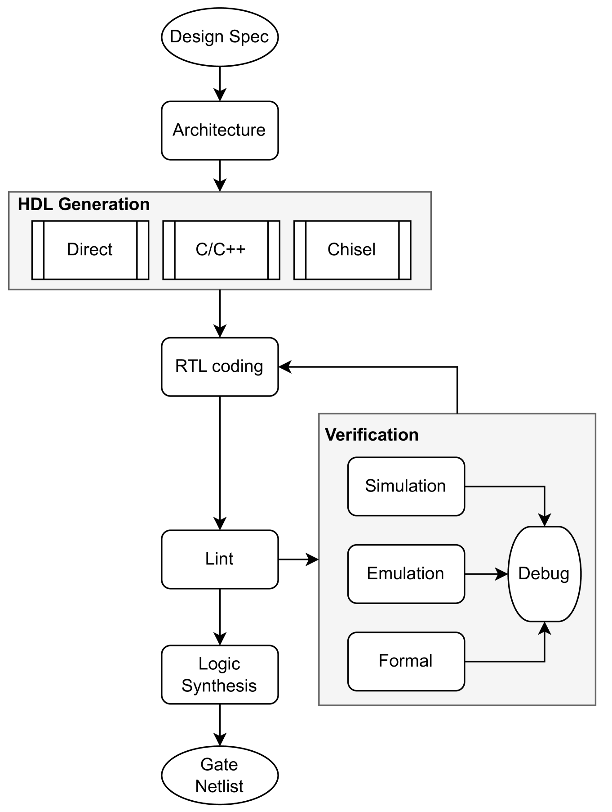
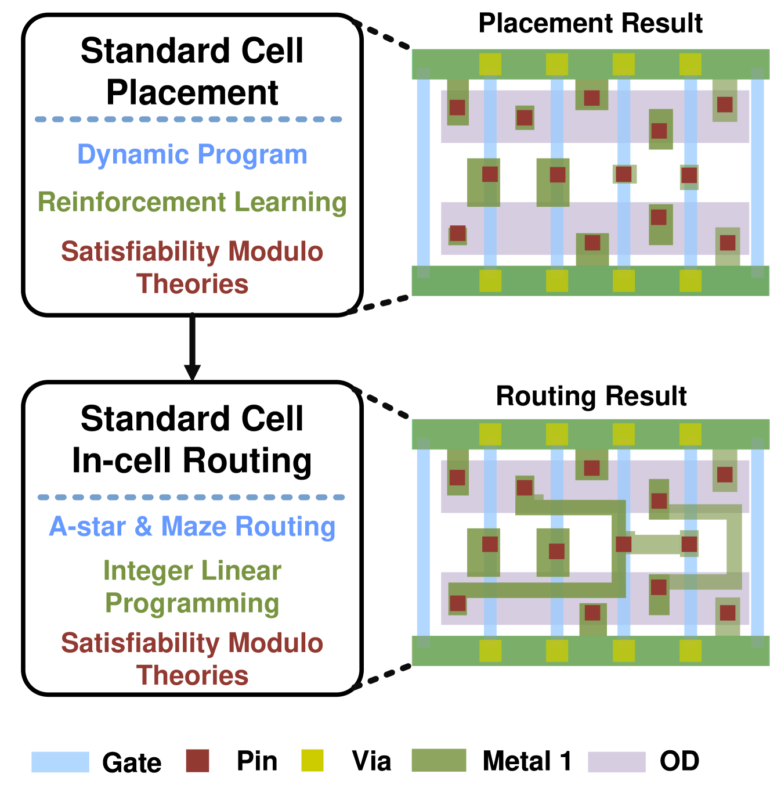
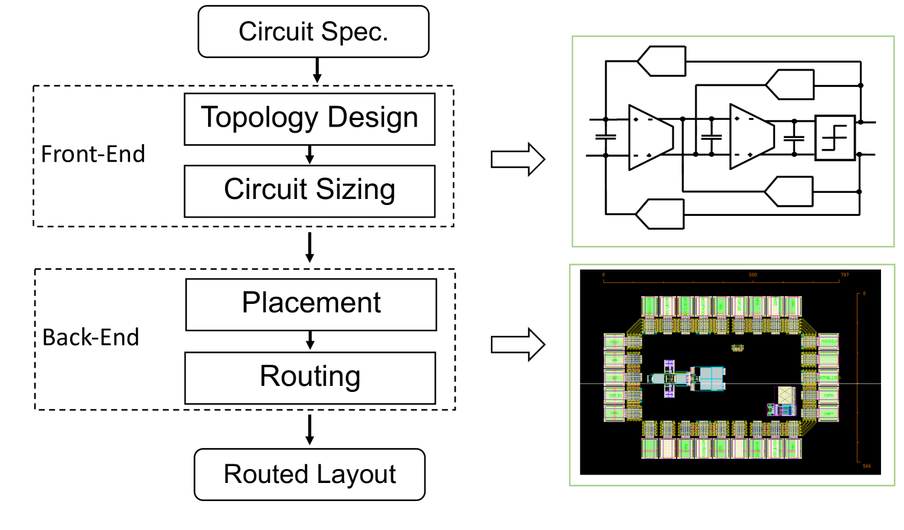
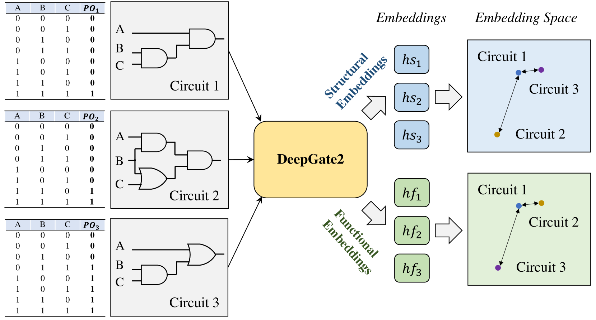
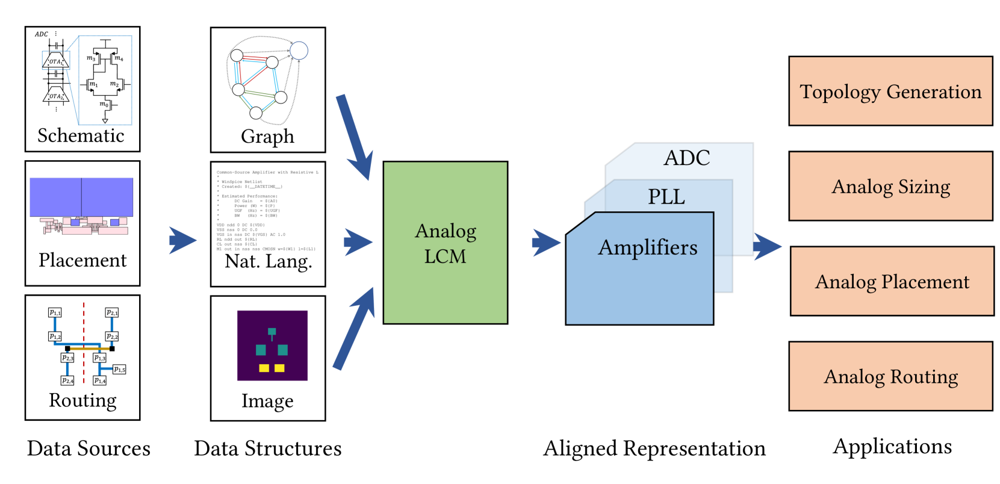

# [随着AI原生EDA时代的来临，大型电路模型展现出了诱人前景和艰巨挑战。本研究探讨这一新兴领域中大型电路模型带来的承诺以及所面临的难题。]

发布时间：2024年03月11日

`Agent` `电子设计自动化` `人工智能`

> The Dawn of AI-Native EDA: Promises and Challenges of Large Circuit Models

> 在EDA领域，AI驱动方案已展现实力，常作为现有方法的有效补充，却未见重塑设计流程。这类方案往往借鉴图像、文本或图分析等领域的深度学习模型，直接用于电路设计，未能充分适应电子电路特有的复杂特性。现有的AI4EDA方式虽表现不俗，但在全面理解与综合设计，尤其是在处理电路数据中的电气、逻辑及物理属性交织问题上，仍有欠缺。本文呼吁从AI辅助EDA向AI内生EDA转变，让AI深入到设计流程的核心。这一转变的关键是研发一种能跨多种数据来源（例如功能规格、RTL设计、电路网表和物理布局）协同学习并提炼深刻见解的多模态电路表示学习技术，以期达到全面洞悉电路设计的目标。我们力推构建天生具备多模态特性的大规模电路模型（LCMs），精准解读和诠释电路数据丰富复杂的语义结构，推动设计方法学迈向更强韧、高效和创新的新阶段。秉持这一AI内生理念，我们期待看到一场突破当前EDA创新瓶颈的变革，引领电子设计方法学的重大转型。这一展望中的进步不只是改良现有EDA工具，更是一场颠覆性的革命，催生新一代设计工具，有望大幅提升设计效率，并开启一个全新的时代，在这个时代的电路性能、功耗和面积（PPA）优化不再依赖小步快跑，而是通过重新设定电子系统性能标准的跃迁式突破来达成。

> Within the Electronic Design Automation (EDA) domain, AI-driven solutions have emerged as formidable tools, yet they typically augment rather than redefine existing methodologies. These solutions often repurpose deep learning models from other domains, such as vision, text, and graph analytics, applying them to circuit design without tailoring to the unique complexities of electronic circuits. Such an AI4EDA approach falls short of achieving a holistic design synthesis and understanding, overlooking the intricate interplay of electrical, logical, and physical facets of circuit data. This perspective paper argues for a paradigm shift from AI4EDA towards AI-native EDA, integrating AI at the core of the design process. Pivotal to this vision is the development of a multimodal circuit representation learning technique, poised to provide a comprehensive understanding by harmonizing and extracting insights from varied data sources, such as functional specifications, RTL designs, circuit netlists, and physical layouts.
  We champion the creation of large circuit models (LCMs) that are inherently multimodal, crafted to decode and express the rich semantics and structures of circuit data, thus fostering more resilient, efficient, and inventive design methodologies. Embracing this AI-native philosophy, we foresee a trajectory that transcends the current innovation plateau in EDA, igniting a profound shift-left in electronic design methodology. The envisioned advancements herald not just an evolution of existing EDA tools but a revolution, giving rise to novel instruments of design-tools that promise to radically enhance design productivity and inaugurate a new epoch where the optimization of circuit performance, power, and area (PPA) is achieved not incrementally, but through leaps that redefine the benchmarks of electronic systems' capabilities.

[Arxiv](https://arxiv.org/abs/2403.07257)