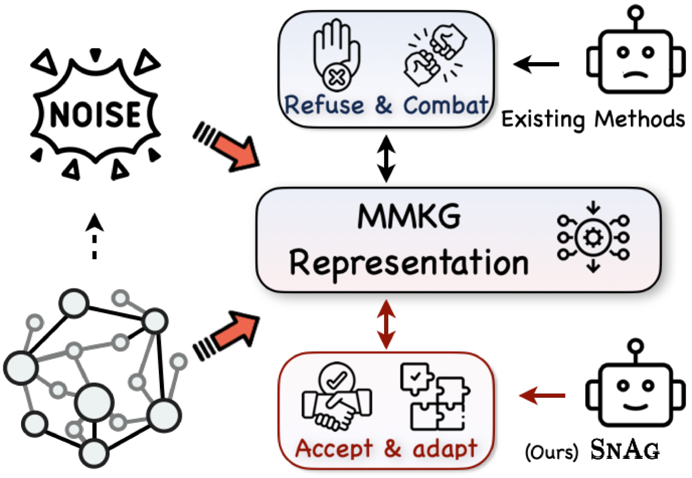

# 噪声之力：致力于构建一个融合多模态信息的知识图谱表示统一框架

发布时间：2024年03月11日

`Agent`

> The Power of Noise: Toward a Unified Multi-modal Knowledge Graph Representation Framework

> 随着多模态预训练技术的不断进步，建立一个强大的多模态知识图谱（MMKG）表示学习框架变得日益重要。这一框架是有效将结构化知识大规模融入多模态大型语言模型的关键，旨在解决知识误读与多模态幻觉等难题。在这项工作中，我们聚焦于两项热门研究任务——多模态知识图谱补全（MKGC）和多模态实体对齐（MMEA），以此检验模型能否精确地将实体嵌入至MMKG中。为此，我们创新性地提出了SNAG方法，它运用了配备模态级噪声遮蔽机制的Transformer架构，强化了在知识图谱中融合多模态实体特征的能力。通过为MKGC和MMEA任务定制训练目标，我们的方案在总共十个数据集上取得了SOTA水平的表现，覆盖了三个MKGC数据集和七个MMEA数据集，验证了其实用可靠且适应广泛的特性。更进一步，SNAG不仅能够作为独立模型高效工作，还能赋能其它现存方法，持续提供性能上的优化提升。我们的源代码和相关数据已公开在GitHub上：https://github.com/zjukg/SNAG。

> The advancement of Multi-modal Pre-training highlights the necessity for a robust Multi-Modal Knowledge Graph (MMKG) representation learning framework. This framework is crucial for integrating structured knowledge into multi-modal Large Language Models (LLMs) at scale, aiming to alleviate issues like knowledge misconceptions and multi-modal hallucinations. In this work, to evaluate models' ability to accurately embed entities within MMKGs, we focus on two widely researched tasks: Multi-modal Knowledge Graph Completion (MKGC) and Multi-modal Entity Alignment (MMEA). Building on this foundation, we propose a novel SNAG method that utilizes a Transformer-based architecture equipped with modality-level noise masking for the robust integration of multi-modal entity features in KGs. By incorporating specific training objectives for both MKGC and MMEA, our approach achieves SOTA performance across a total of ten datasets (three for MKGC and seven for MEMA), demonstrating its robustness and versatility. Besides, SNAG can not only function as a standalone model but also enhance other existing methods, providing stable performance improvements. Our code and data are available at: https://github.com/zjukg/SNAG.

[Arxiv](https://arxiv.org/abs/2403.06832)