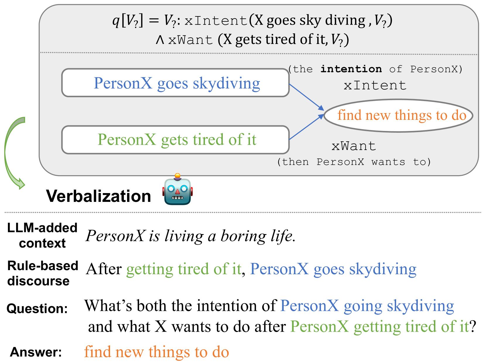
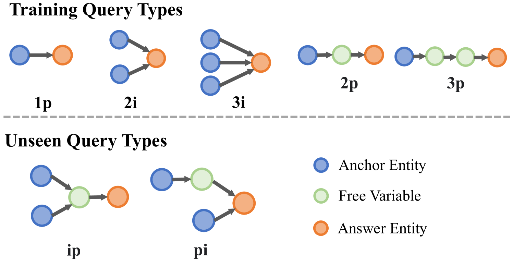
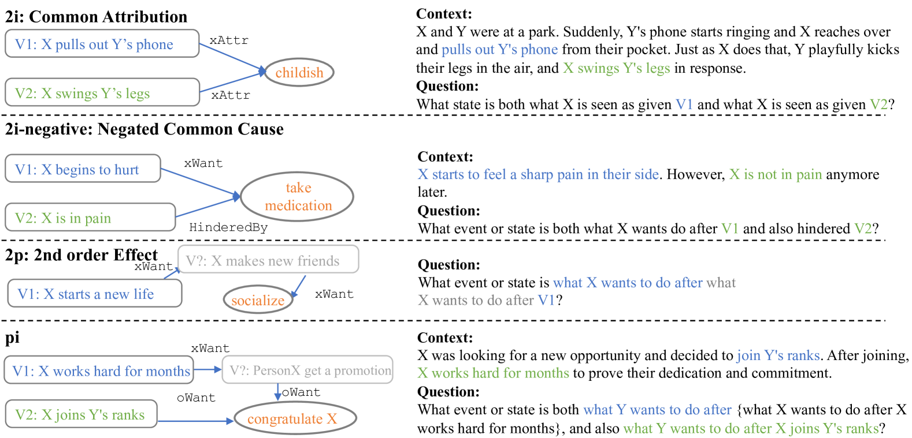
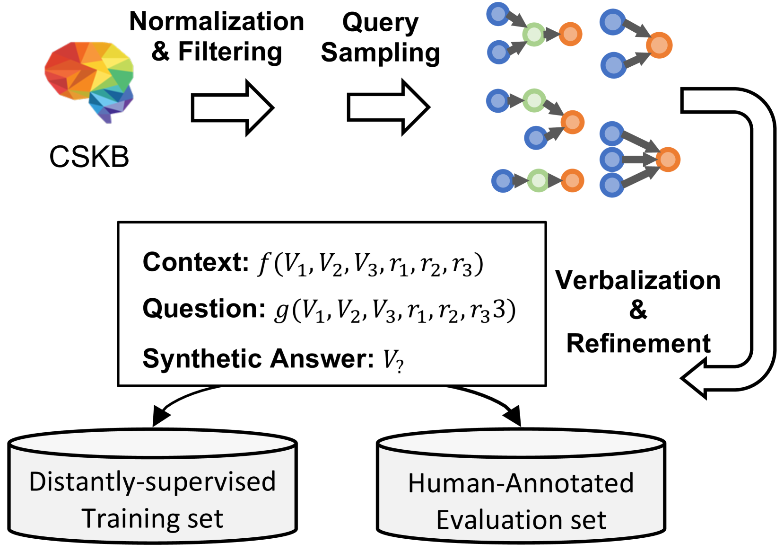
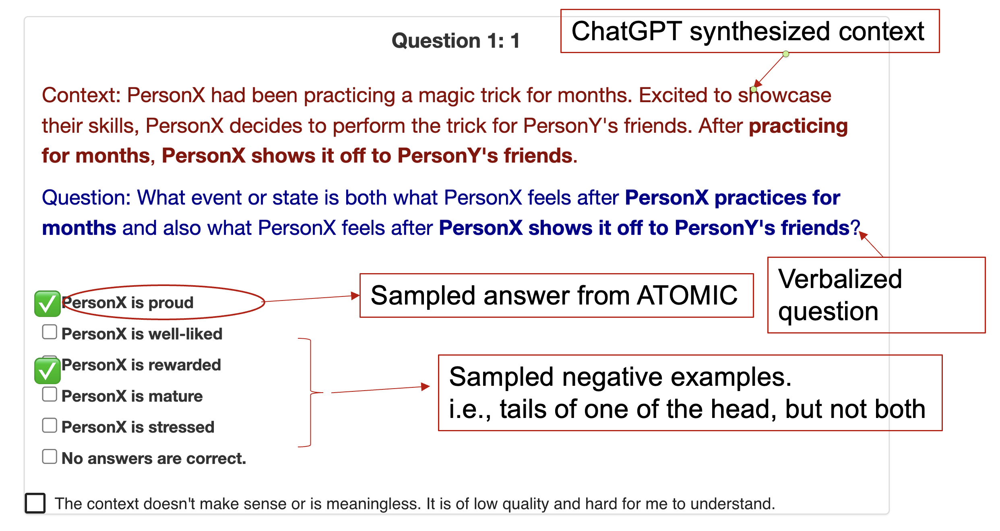

# [在本研究中，我们专注于在常识知识图谱上对逻辑查询进行深入复杂的推理探索。](https://arxiv.org/abs/2403.07398)

发布时间：2024年03月12日

`LLM应用`

> Complex Reasoning over Logical Queries on Commonsense Knowledge Graphs

> 事件常识推理要求深入解析事件间关联，并挖掘这些关联背后的潜在情境。受限于数据稀疏性，语言模型在处理涉及复杂事件互动的问题和情境时，学会生成常识推理颇具挑战。为此，我们创新构建了COM2数据集，它从现有的常识知识图谱中选取多级逻辑查询，并通过精心设计的规则与大型语言模型合作，将这些查询转化为选择题和文本生成任务。实验结果显示，COM2训练后的语言模型在复杂推理方面取得显著进步，不仅增强了领域内问题回答与生成式常识推理的零样本表现，而且同样提升了跨领域的任务效果，且这一过程中无需依赖耗时费力的人工注释。

> Event commonsense reasoning requires the ability to reason about the relationship between events, as well as infer implicit context underlying that relationship. However, data scarcity makes it challenging for language models to learn to generate commonsense inferences for contexts and questions involving interactions between complex events. To address this demand, we present COM2 (COMplex COMmonsense), a new dataset created by sampling multi-hop logical queries (e.g., the joint effect or cause of both event A and B, or the effect of the effect of event C) from an existing commonsense knowledge graph (CSKG), and verbalizing them using handcrafted rules and large language models into multiple-choice and text generation questions. Our experiments show that language models trained on COM2 exhibit significant improvements in complex reasoning ability, resulting in enhanced zero-shot performance in both in-domain and out-of-domain tasks for question answering and generative commonsense reasoning, without expensive human annotations.

