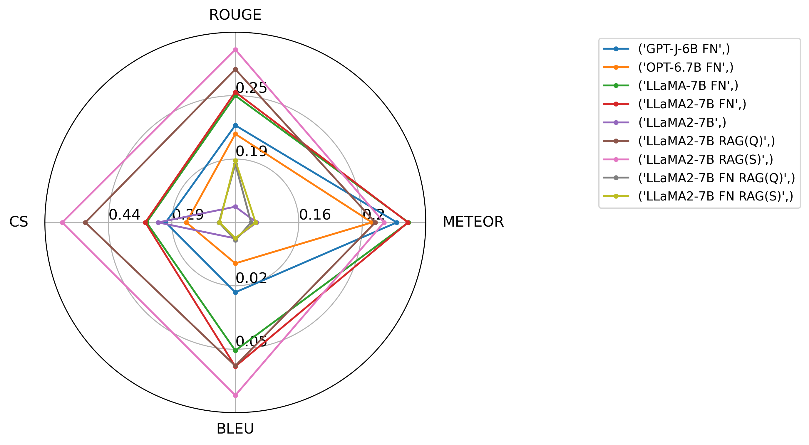
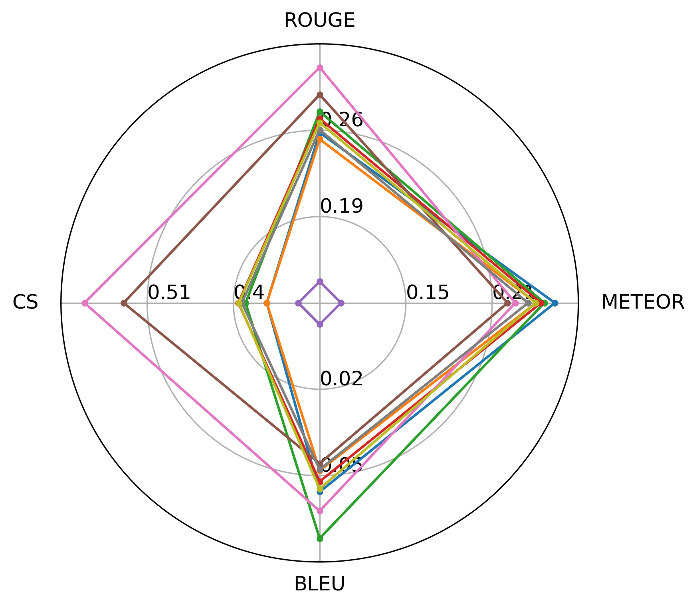
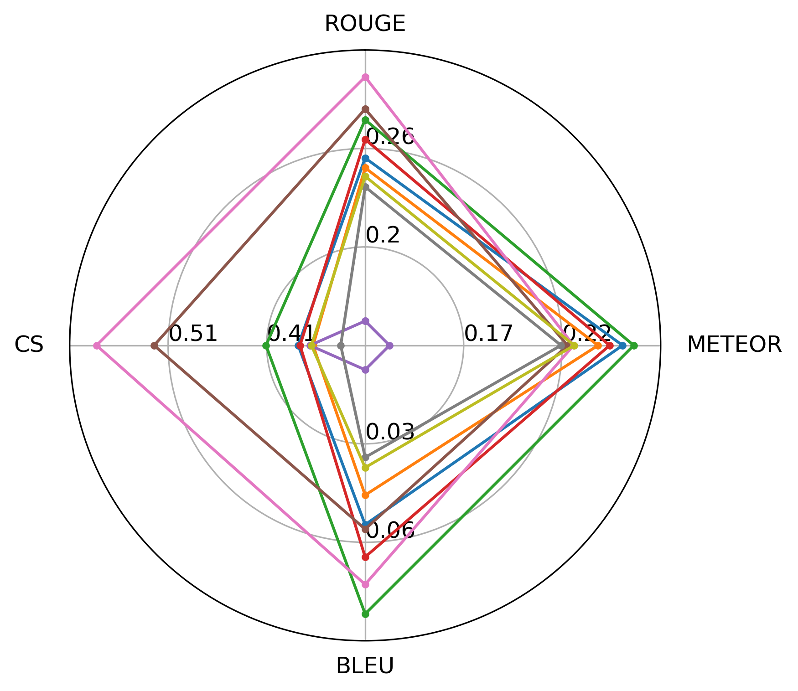
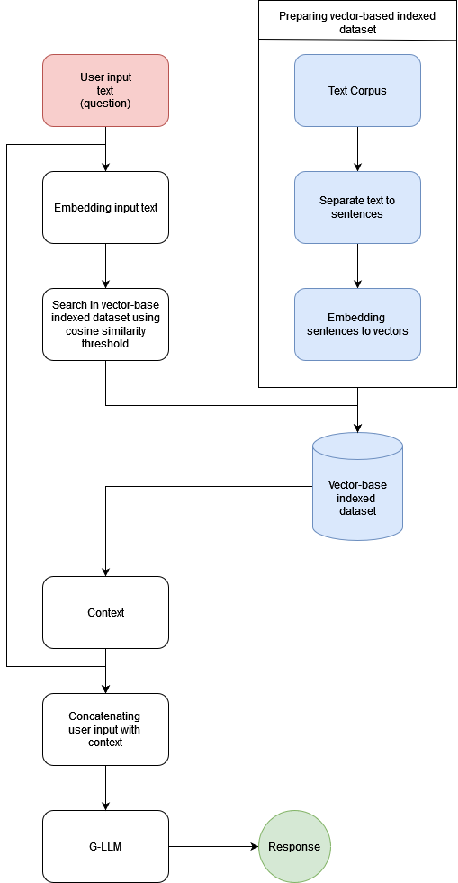

# 本研究探讨了检索增强生成与微调技术在构建AI驱动的知识系统中的性能表现，旨在深入理解并提升相关系统的效能。

发布时间：2024年03月12日

`RAG` `知识系统`

> Investigating the performance of Retrieval-Augmented Generation and fine-tuning for the development of AI-driven knowledge-based systems

> 随着G-LLM技术的突破，诸如ChatGPT、Bing和Gemini一类创新型知识系统的研发迎来了崭新的可能。其中，通过微调（FN）和检索增强生成（RAG）技术，可以有效实现G-LLM驱动的知识系统的领域适应性优化。我们在本次研究中运用多种评价指标（如ROUGE、BLEU、METEOR及余弦相似度），对比分析了GPT-J-6B、OPT-6.7B、LlaMA及其升级版LlaMA-2等语言模型在应用RAG与FN方法时的表现差异。实验结果显示，基于RAG构建的模型在各种数据集上的性能普遍优于经过FN调整的模型。值得注意的是，简单地将FN与RAG进行融合并不容易，因其可能导致整体性能下滑。同时，我们设计出一种简洁的基于RAG的框架结构，其在ROUGE得分上平均提升了16%，BLEU得分上增长15%，并且基于余弦相似度的提升高达53%。这些数据有力证明了在防止产生“幻觉”现象这一方面，RAG相比于FN具有显著优势，即使FN模型在METEOR平均得分上展现出比RAG高出8%的创造力，但仍然无法抹去RAG在这一领域的优越性。

> The development of generative large language models (G-LLM) opened up new opportunities for the development of new types of knowledge-based systems similar to ChatGPT, Bing, or Gemini. Fine-tuning (FN) and Retrieval-Augmented Generation (RAG) are the techniques that can be used to implement domain adaptation for the development of G-LLM-based knowledge systems. In our study, using ROUGE, BLEU, METEOR scores, and cosine similarity, we compare and examine the performance of RAG and FN for the GPT-J-6B, OPT-6.7B, LlaMA, LlaMA-2 language models. Based on measurements shown on different datasets, we demonstrate that RAG-based constructions are more efficient than models produced with FN. We point out that connecting RAG and FN is not trivial, because connecting FN models with RAG can cause a decrease in performance. Furthermore, we outline a simple RAG-based architecture which, on average, outperforms the FN models by 16% in terms of the ROGUE score, 15% in the case of the BLEU score, and 53% based on the cosine similarity. This shows the significant advantage of RAG over FN in terms of hallucination, which is not offset by the fact that the average 8% better METEOR score of FN models indicates greater creativity compared to RAG.

[Arxiv](https://arxiv.org/abs/2403.09727)