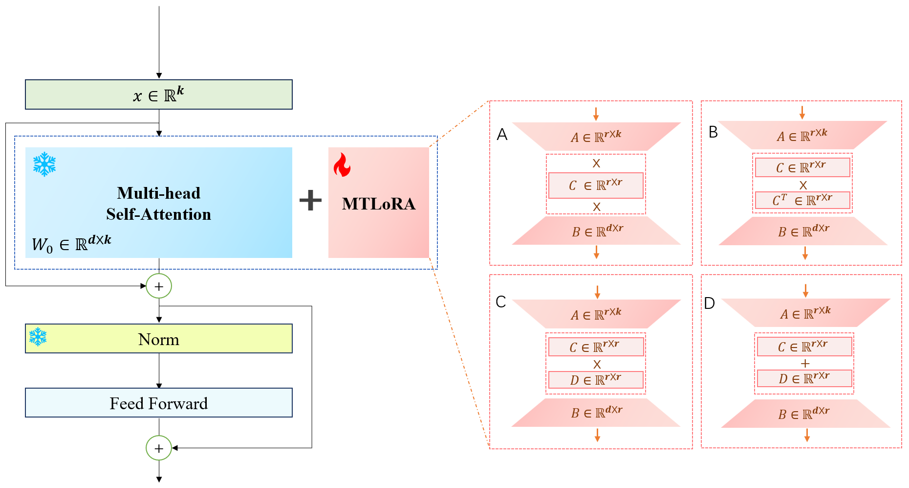
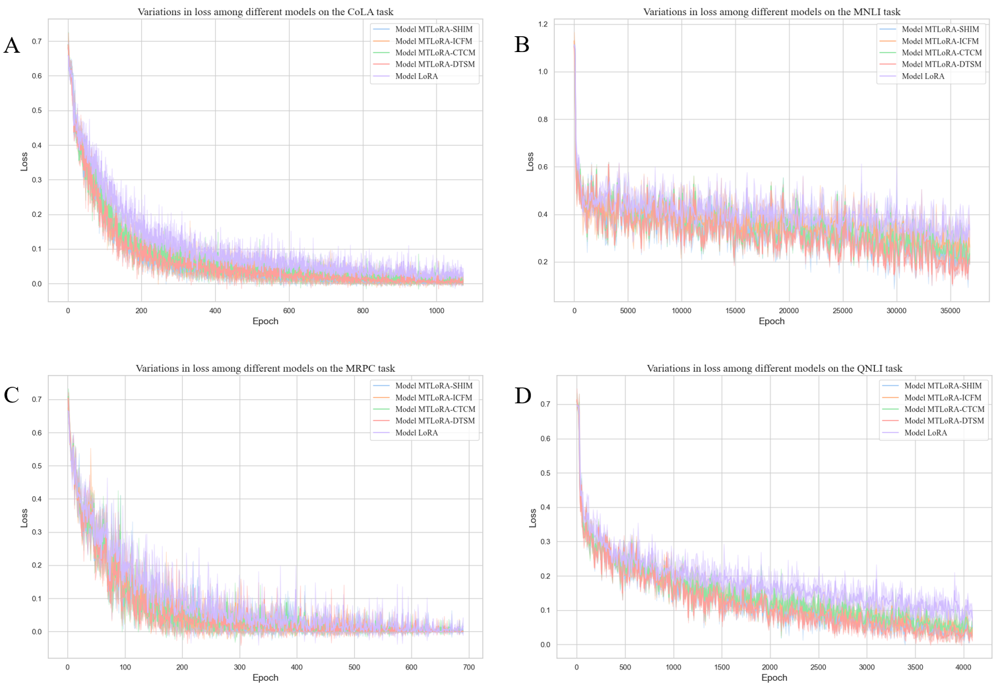
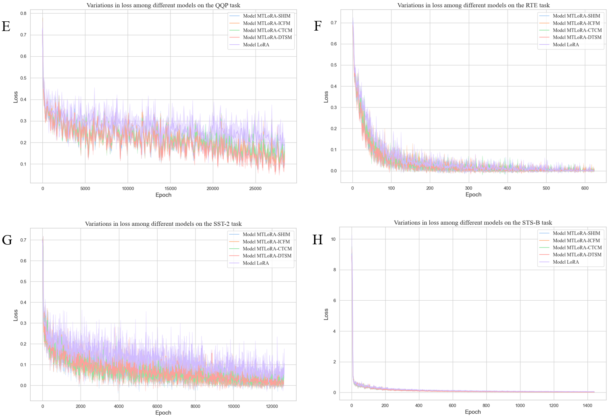

# [MTLoRA，一种借鉴脑科学原理的创新方法，采用矩阵变换实现低秩适应，在保持参数高效的同时完成精准微调任务。]

发布时间：2024年03月12日

`LLM应用`

> Matrix-Transformation Based Low-Rank Adaptation (MTLoRA): A Brain-Inspired Method for Parameter-Efficient Fine-Tuning

> 针对LPLM的微调技术已证实能极大提升各类下游任务的表现，并有效调控模型输出。近期涌现了一系列针对开源LPLM的轻量级参数微调方案，降低了对计算与存储资源的需求。其中，以LoRA为代表的重新参数化微调方法颇受青睐，但此类方法在处理复杂任务适应性、性能稳定性及算法复杂度时，仍有较大优化潜力。为解决这一问题，本文从大脑功能与其几何结构关系的启示出发，创造性地将此思想结合至LoRA技术内，提出了一种创新的基于矩阵变换的低秩适应微调方法——MTLoRA。MTLoRA通过运用转换矩阵T对任务特有参数矩阵施加线性变换（如旋转、缩放、平移），动态重塑其空间几何结构，形成模仿大脑复杂几何特征对功能驱动作用的新矩阵特征模式，从而助力模型在下游任务上取得更好的表现。在NLU任务上，利用GLUE基准测试验证，MTLoRA在八大任务上平均提升了大约1.0%的整体性能；而在NLG任务上，MTLoRA在DART任务和WebNLG任务中分别取得了平均0.95%和0.31%的性能提升。

> Fine-tuning techniques based on Large Pretrained Language Models (LPLMs) have been proven to significantly enhance model performance on a variety of downstream tasks and effectively control the output behaviors of LPLMs. Recent studies have proposed numerous methods for fine-tuning a small number of parameters based on open-source LPLMs, reducing the demand for computational and storage resources. Among these, reparameterization fine-tuning methods represented by LoRA (Low-Rank Adaptation) have gained popularity. We find that although these methods perform well in many aspects, there is still considerable room for improvement in terms of complex task adaptability, performance, stability, and algorithm complexity. In response to this, inspired by the idea that the functions of the brain are shaped by its geometric structure, this paper integrates this idea into LoRA technology and proposes a new matrix transformation-based reparameterization method for efficient fine-tuning, named Matrix-Transformation based Low-Rank Adaptation (MTLoRA). MTLoRA aims to dynamically alter its spatial geometric structure by applying a transformation-matrix T to perform linear transformations, such as rotation, scaling, and translation, on the task-specific parameter matrix, generating new matrix feature patterns (eigenvectors) to mimic the fundamental influence of complex geometric structure feature patterns in the brain on functions, thereby enhancing the model's performance in downstream tasks. In Natural Language Understanding (NLU) tasks, it is evaluated using the GLUE benchmark test, and the results reveal that MTLoRA achieves an overall performance increase of about 1.0% across eight tasks; in Natural Language Generation (NLG) tasks, MTLoRA improves performance by an average of 0.95% and 0.31% in the DART and WebNLG tasks, respectively.

[Arxiv](https://arxiv.org/abs/2403.07440)