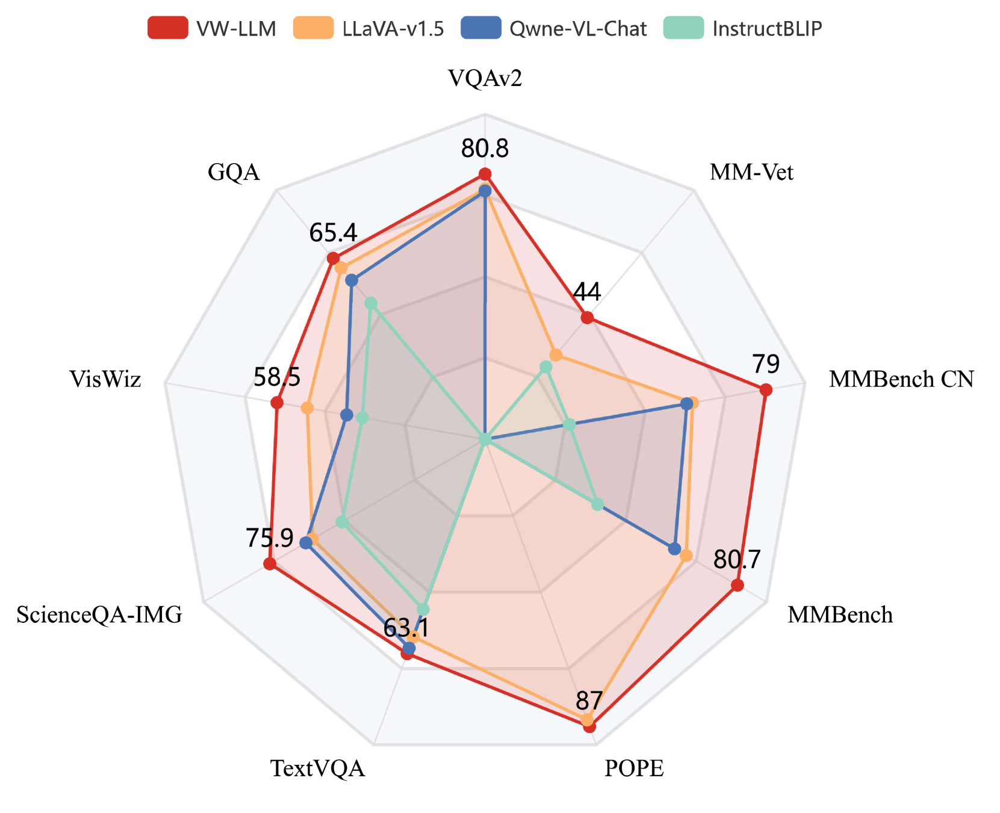
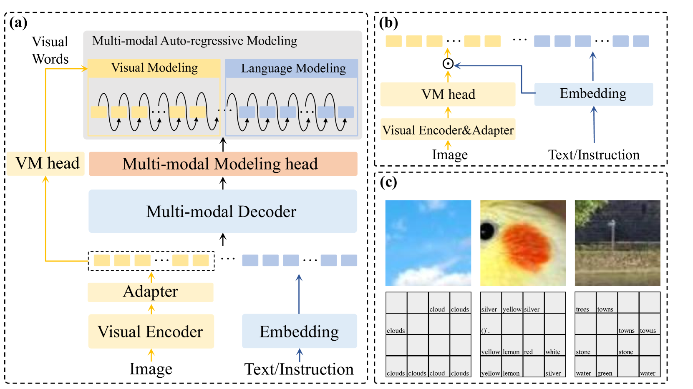

# [借助“视觉词汇”，我们探索多模态自回归模型的构建，旨在整合图像与文本信息，实现跨模态的联合建模与预测。]

发布时间：2024年03月12日

`LLM应用`

> Multi-modal Auto-regressive Modeling via Visual Words

> 得益于对海量未标注文本资源采用自回归建模技术，大型语言模型（LLMs）展现出了卓越的感知与推理能力。但在尝试将自回归建模拓展至多模态领域构建大型多模态模型（LMMs）时，面临一个棘手问题——连续的视觉嵌入在LMM中难以获取离散的监督分类标签。本研究率先成功运用统一目标函数实现多模态自回归建模，创新性地提出“视觉词”概念，即将视觉特征映射至LLM词汇表上的概率分布，从而为视觉建模提供指导。我们还深入探究了LMM内部语义空间中视觉特征分布规律，并探讨了利用文本嵌入来表达视觉信息的可能性。通过在5项VQA任务及4个基准工具集上的实验和消融研究，有力验证了我们所提方法的有效性和优越性。

> Large Language Models (LLMs), benefiting from the auto-regressive modelling approach performed on massive unannotated texts corpora, demonstrates powerful perceptual and reasoning capabilities. However, as for extending auto-regressive modelling to multi-modal scenarios to build Large Multi-modal Models (LMMs), there lies a great difficulty that the image information is processed in the LMM as continuous visual embeddings, which cannot obtain discrete supervised labels for classification. In this paper, we successfully perform multi-modal auto-regressive modeling with a unified objective for the first time. Specifically, we propose the concept of visual words, which maps the visual features to probability distributions over LLM's vocabulary, providing supervision information for visual modelling. We further explore the distribution of visual features in the semantic space within LMM and the possibility of using text embeddings to represent visual information. Experimental results and ablation studies on 5 VQA tasks and 4 benchmark toolkits validate the powerful performance of our proposed approach.

[Arxiv](https://arxiv.org/abs/2403.07720)