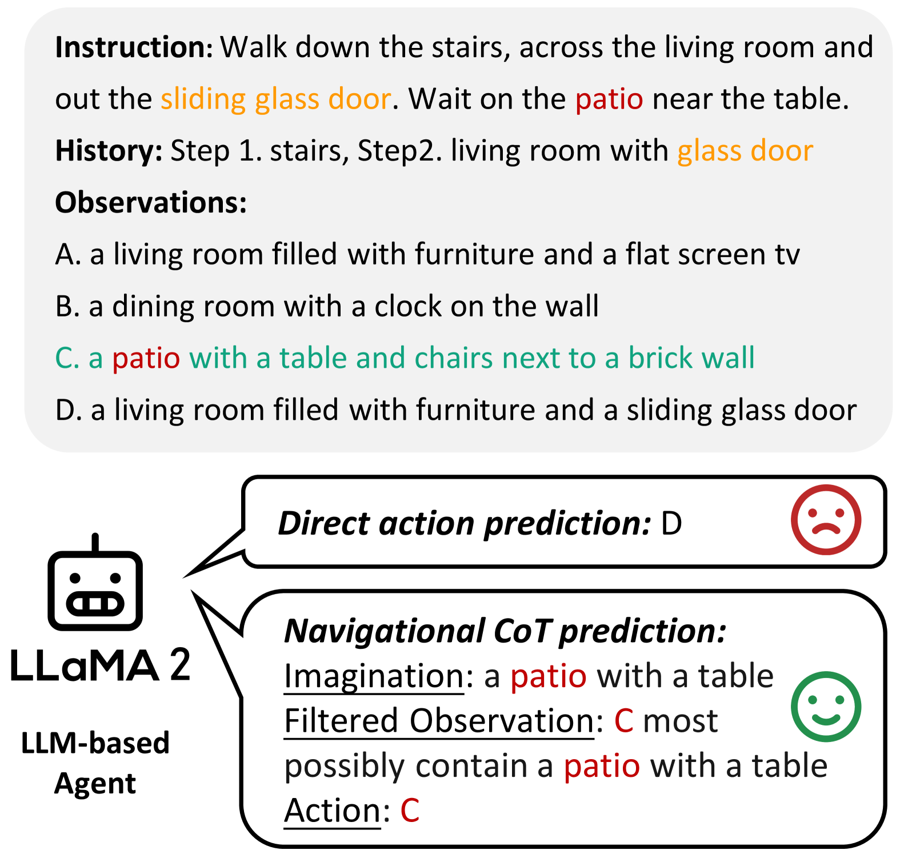
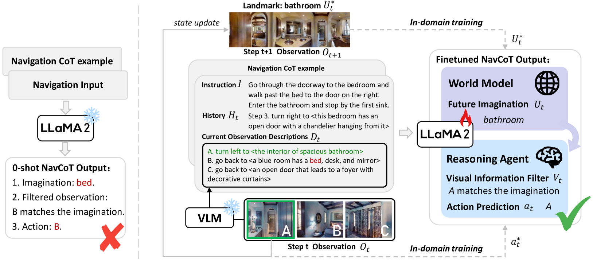
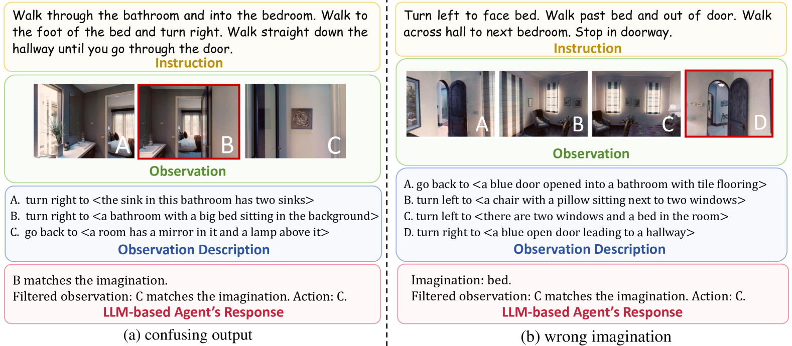
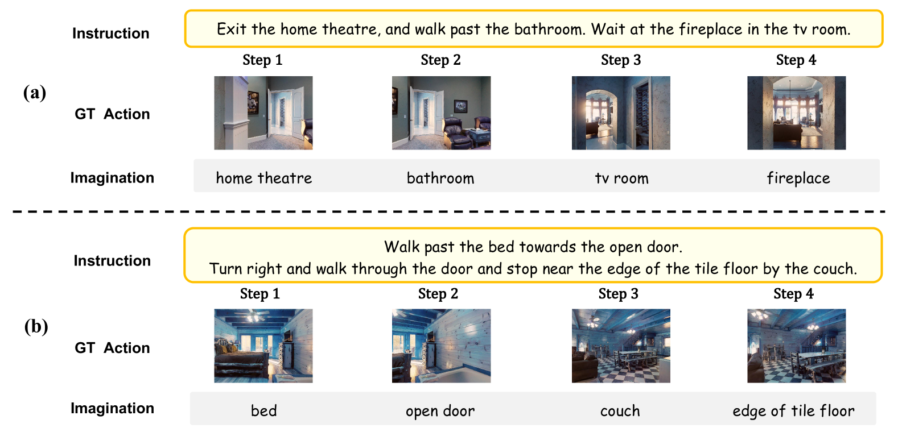
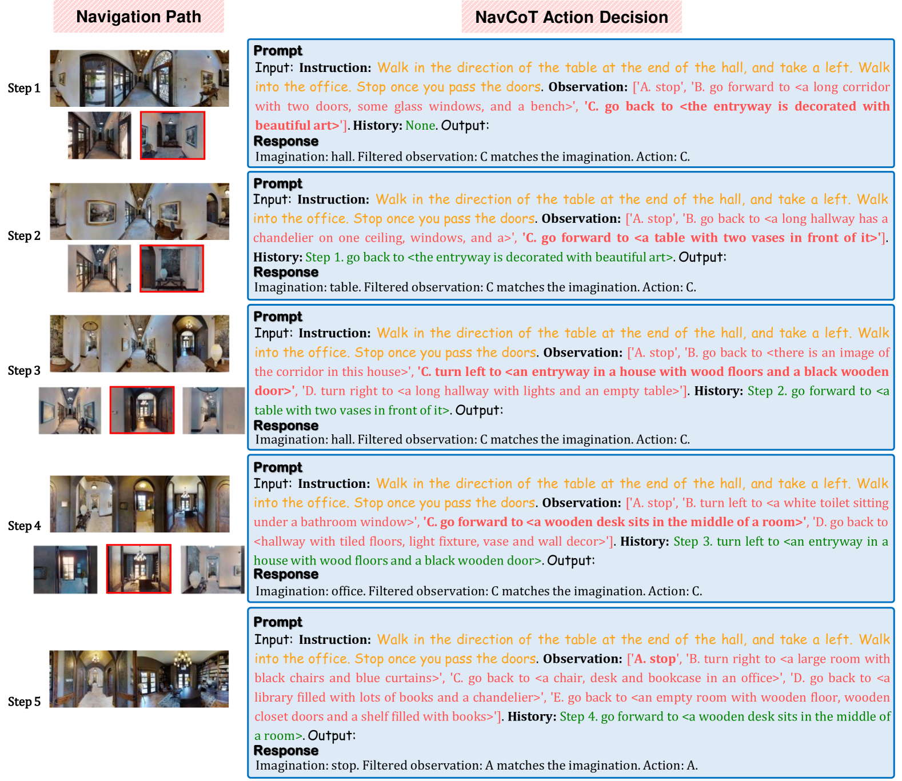
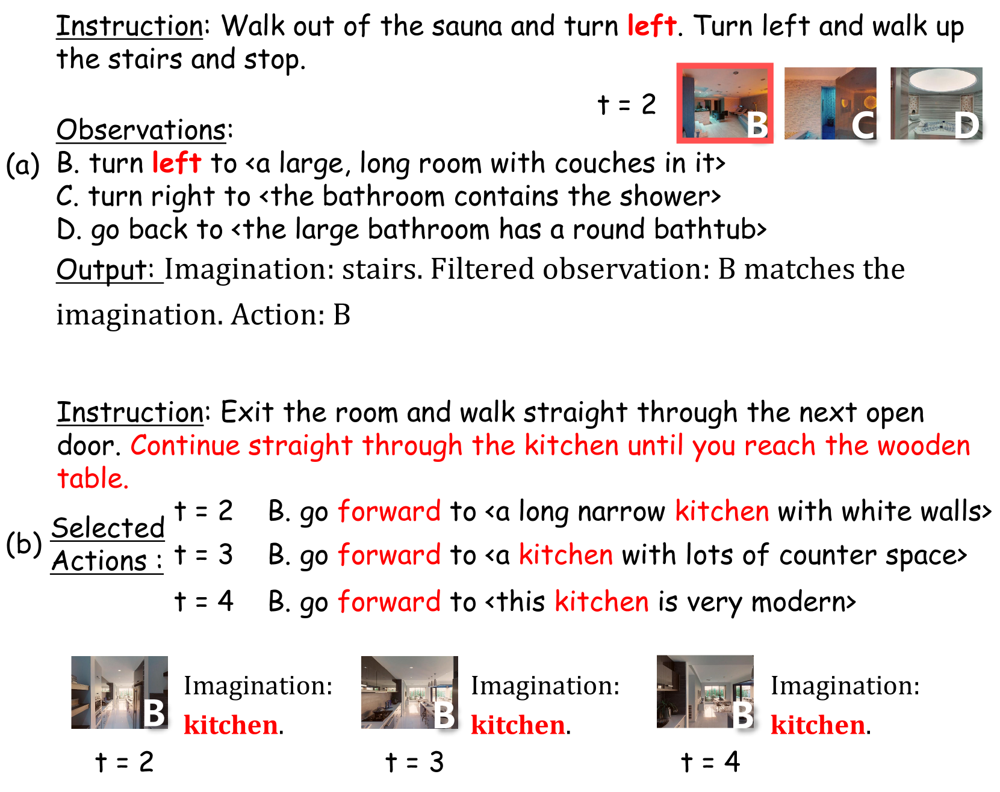

# [NavCoT 项目致力于增强大型语言模型（LLM）在视觉与语言导航任务中的表现，其策略是通过学习分离式的推理机制实现这一目标。](https://arxiv.org/abs/2403.07376)

发布时间：2024年03月12日

`Agent`

> NavCoT: Boosting LLM-Based Vision-and-Language Navigation via Learning Disentangled Reasoning

> VLN作为具身AI的核心挑战之一，要求智能体依据自然语言指令在复杂3D环境中游刃有余地穿梭。近期研究表明，大型语言模型（LLMs）在提升VLN任务的导航推理精度与可理解性方面展现出了巨大潜能。然而，这些模型主要以离线方式运用时，往往受限于VLN任务与LLM训练数据集间的显著领域差异。为此，本论文创新性地提出了“导航思维链”（NavCoT）策略，通过实施高效参数化领域内训练，使智能体能够自主进行导航决策，并有效地以较低成本弥合上述领域鸿沟。具体而言，NavCoT让LLM在每个时间节点上，按照以下三步法预测导航思维链：首先，模拟世界模型，依据指令预测下一观察状态；其次，从候选观察中挑选最贴合想象的结果；最后，根据前期推理决定执行的动作。通过构建规范化的训练标签，LLM得以学习生成理想且合理的思维链输出，进而优化行动决策。跨多个训练配置和主流VLN基准测试（如R2R、RxR、R4R等）的实验证明，NavCoT在效果上明显优于直接动作预测的同类方案。仅需简单进行参数高效的微调，我们的NavCoT便能在R2R数据集上比肩甚至超越基于GPT4的最新方法，实现了大约7%的相对性能提升。我们深信NavCoT将进一步释放出更具任务适应性和扩展性的LLM驱动具身智能体的力量，为现实世界的机器人应用开发提供有力支持。项目代码已开源，访问地址：https://github.com/expectorlin/NavCoT。

> Vision-and-Language Navigation (VLN), as a crucial research problem of Embodied AI, requires an embodied agent to navigate through complex 3D environments following natural language instructions. Recent research has highlighted the promising capacity of large language models (LLMs) in VLN by improving navigational reasoning accuracy and interpretability. However, their predominant use in an offline manner usually suffers from substantial domain gap between the VLN task and the LLM training corpus. This paper introduces a novel strategy called Navigational Chain-of-Thought (NavCoT), where we fulfill parameter-efficient in-domain training to enable self-guided navigational decision, leading to a significant mitigation of the domain gap in a cost-effective manner. Specifically, at each timestep, the LLM is prompted to forecast the navigational chain-of-thought by: 1) acting as a world model to imagine the next observation according to the instruction, 2) selecting the candidate observation that best aligns with the imagination, and 3) determining the action based on the reasoning from the prior steps. Through constructing formalized labels for training, the LLM can learn to generate desired and reasonable chain-of-thought outputs for improving the action decision. Experimental results across various training settings and popular VLN benchmarks (e.g., Room-to-Room (R2R), Room-across-Room (RxR), Room-for-Room (R4R)) show the significant superiority of NavCoT over the direct action prediction variants. Through simple parameter-efficient finetuning, our NavCoT outperforms a recent GPT4-based approach with ~7% relative improvement on the R2R dataset. We believe that NavCoT will help unlock more task-adaptive and scalable LLM-based embodied agents, which are helpful for developing real-world robotics applications. Code is available at https://github.com/expectorlin/NavCoT.

