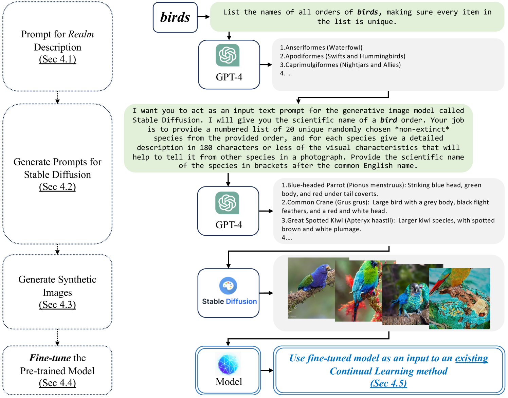
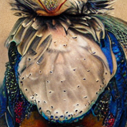
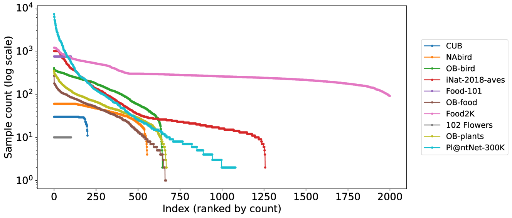

# [预见未来：本文探讨如何在连续学习场景下运用生成模型预判未来数据变化，以应对持续学习中的挑战。](https://arxiv.org/abs/2403.07356)

发布时间：2024年03月12日

`LLM应用`

> Premonition: Using Generative Models to Preempt Future Data Changes in Continual Learning

> 持续学习需要模型紧跟数据分布及任务需求的变化步伐，而实际上数据和任务变更并非全然无法预料。设想一下，若有一个覆盖广泛目标或数据主题的描述——我们称其为“领域”，人们往往能凭借直觉猜出与此领域关联的概念。本文表明，大型语言模型与图像生成模型联手，也能像人一样对未来可能出现的持续学习挑战进行有效预见。通过让大型语言模型描绘未来数据流中可能出现的语义相关类别，并借助 Stable Diffusion 技术将这些描述转化为带有标签的新图像样本，构建了一个合成数据集。该数据集服务于预训练阶段，但会在启动持续学习前被抛弃，一同抛弃的还有预训练阶段的分类头部。研究结果显示，预训练模型的核心部分能在下游持续学习任务中习得有价值的特征表达，从而为现有的各种持续学习方法提供有力的支持。尽管真实图像与合成图像间的领域鸿沟带来了一定复杂性，但采用此法预训练的模型在细粒度图像分类基准上确实提升了多种类增量学习（CIL）方法的表现。相关代码可访问 https://github.com/cl-premonition/premonition 获取。

> Continual learning requires a model to adapt to ongoing changes in the data distribution, and often to the set of tasks to be performed. It is rare, however, that the data and task changes are completely unpredictable. Given a description of an overarching goal or data theme, which we call a realm, humans can often guess what concepts are associated with it. We show here that the combination of a large language model and an image generation model can similarly provide useful premonitions as to how a continual learning challenge might develop over time. We use the large language model to generate text descriptions of semantically related classes that might potentially appear in the data stream in future. These descriptions are then rendered using Stable Diffusion to generate new labelled image samples. The resulting synthetic dataset is employed for supervised pre-training, but is discarded prior to commencing continual learning, along with the pre-training classification head. We find that the backbone of our pre-trained networks can learn representations useful for the downstream continual learning problem, thus becoming a valuable input to any existing continual learning method. Although there are complexities arising from the domain gap between real and synthetic images, we show that pre-training models in this manner improves multiple Class Incremenal Learning (CIL) methods on fine-grained image classification benchmarks. Supporting code can be found at https://github.com/cl-premonition/premonition.

[Arxiv](https://arxiv.org/abs/2403.07356)