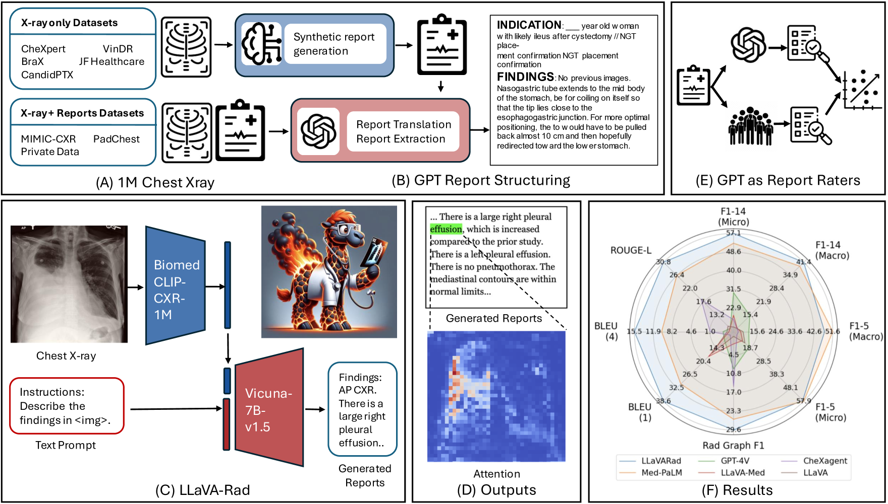
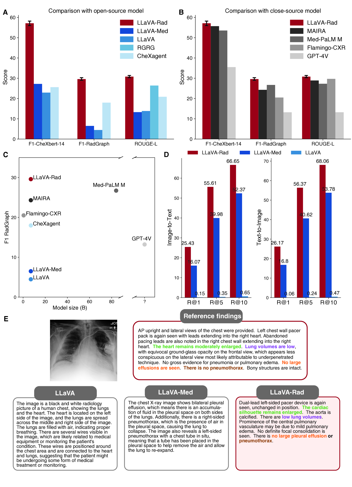
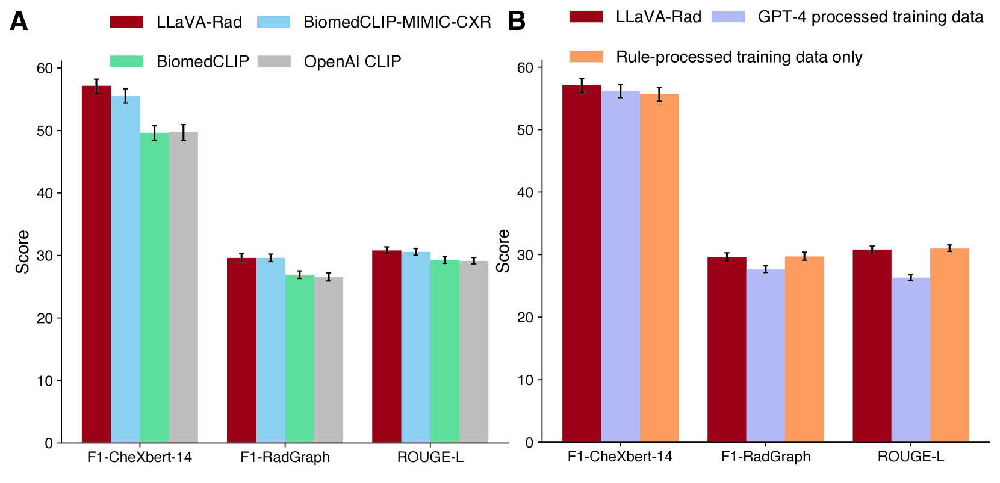
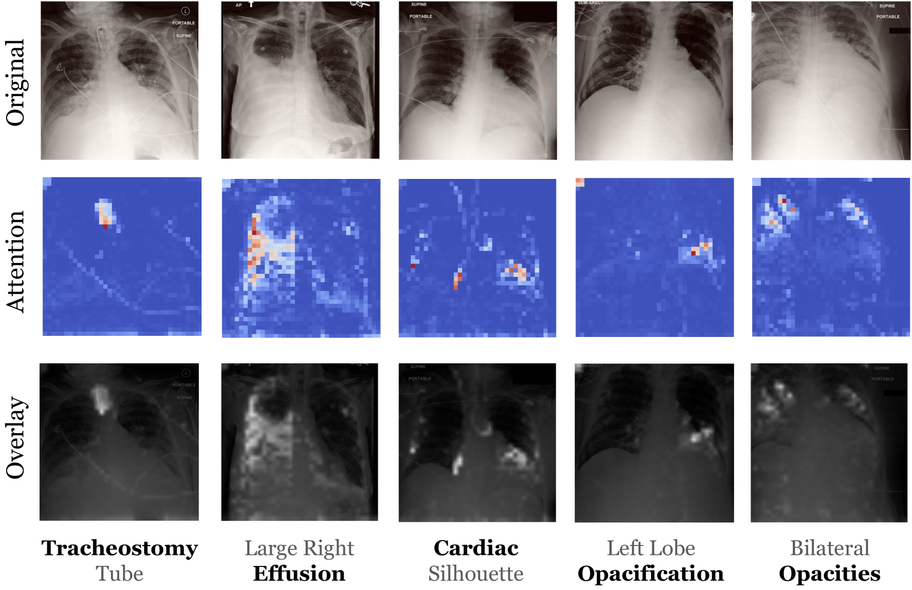
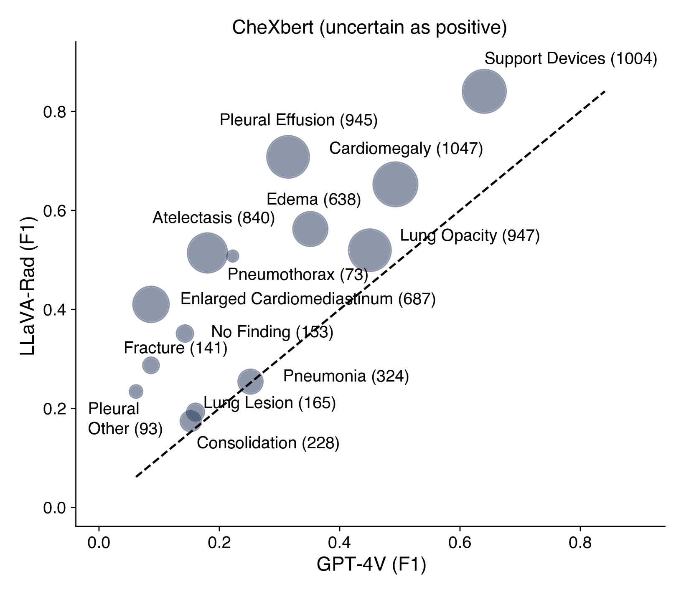

# [为缩小生物医学领域的能力差距，我们进行了一项针对放射影像学的案例研究，通过训练小巧而强大的多模态模型来实现这一目标。](https://arxiv.org/abs/2403.08002)

发布时间：2024年03月12日

`LLM应用`

`生物医学`

`放射影像`

> Training Small Multimodal Models to Bridge Biomedical Competency Gap: A Case Study in Radiology Imaging

> 鉴于大型基础模型的强大表现和扩展规律，它们在生物医学领域的研发及应用备受鼓舞。尽管在部分生物医学基准测试中已有积极成果，但要真正将这类模型投入实际应用，还需解决一系列重要挑战。例如，GPT-4V 等前沿模型在满足生物医学应用场景所需的多模态能力上仍有显著不足。同时，由于访问权限、成本、延迟和合规性等因素，医生很难直接在私人患者数据上运用尖端的大型私有托管模型。本文研究如何通过训练小巧且开源的多模态模型（SMM）来弥合临床未满足需求的生物医学技能鸿沟。为了最大程度提升数据利用效率，我们采取模块化策略，整合当下最优的预训练图像和文本模型，并集中精力训练一个轻量级适配器，使其能够将各模态与文本嵌入空间相结合。针对这一方案，我们在放射影像领域进行了深入探究，收集并构建了一个包含逾百万对图像-文本样本的大数据集用于训练，并设计了一种基于 GPT-4 的临床导向新评估方法，证明其与专家评估结果相当。我们还借助注意力机制对模型的定性锚定效果进行了研究。在此基础上，我们进行了一系列系统的消融实验，探索了数据工程和多模态训练中的不同选项。最终诞生的 LLaVA-Rad (7B) 模型在放射报告生成和跨模态检索等任务上取得了突破性进展，甚至超越了 GPT-4V 和 Med-PaLM M (84B) 等更为庞大的模型。值得一提的是，LLaVA-Rad 具备高效能，在私密环境下仅需单块 V100 GPU 即可快速运行，为真实世界的临床应用带来了一款潜力巨大的顶级工具。

> The scaling laws and extraordinary performance of large foundation models motivate the development and utilization of such large models in biomedicine. However, despite early promising results on some biomedical benchmarks, there are still major challenges that need to be addressed before these models can be used in real-world applications. Frontier models such as GPT-4V still have major competency gaps in multimodal capabilities for biomedical applications. Moreover, pragmatic issues such as access, cost, latency, and compliance make it hard for clinicians to use privately-hosted state-of-the-art large models directly on private patient data. In this paper, we explore training open-source small multimodal models (SMMs) to bridge biomedical competency gaps for unmet clinical needs. To maximize data efficiency, we adopt a modular approach by incorporating state-of-the-art pre-trained models for image and text modalities, and focusing on training a lightweight adapter to ground each modality to the text embedding space. We conduct a comprehensive study of this approach on radiology imaging. For training, we assemble a large dataset with over 1 million image-text pairs. For evaluation, we propose a clinically driven novel approach using GPT-4 and demonstrate its parity with expert evaluation. We also study grounding qualitatively using attention. For best practice, we conduct a systematic ablation study on various choices in data engineering and multimodal training. The resulting LLaVA-Rad (7B) model attains state-of-the-art results on radiology tasks such as report generation and cross-modal retrieval, even outperforming much larger models such as GPT-4V and Med-PaLM M (84B). LLaVA-Rad is fast and can be run on a single V100 GPU in private settings, offering a promising state-of-the-art tool for real-world clinical applications.

