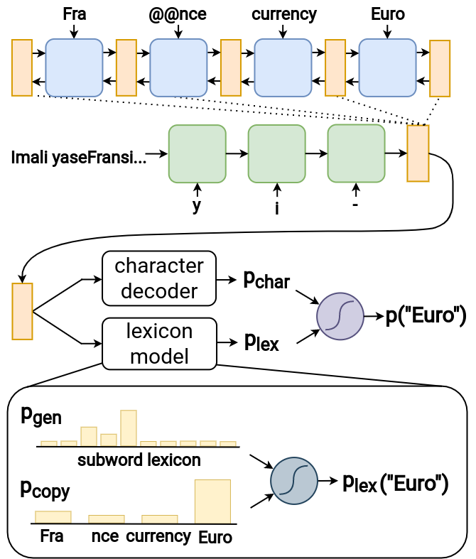

# [T2X项目专注于解决低资源环境下将三元组数据转化为isiXhosa文本这一难题，特别是在处理粘着语特性时所面临的挑战。](https://arxiv.org/abs/2403.07567)

发布时间：2024年03月12日

`LLM应用`

> Triples-to-isiXhosa (T2X): Addressing the Challenges of Low-Resource Agglutinative Data-to-Text Generation

> 当前，大部分数据转文本的数据集集中于英文，而对于资源匮乏且语法黏着性强的语言的数据转文本建模难题则鲜有探究。本篇论文聚焦isiXhosa这种低资源黏着型语言，推出了一个名为T2X的新数据集，其源自WebNLG的一个子集，为模型构建带来了以子词驱动技术为主导的新语言应用场景。同时，我们设计了一套严谨的T2X评估体系，能准确衡量生成文本对数据描述的贴切程度，让后续使用者在评估时可以突破表层指标的局限。在模型建构层面，我们分别考察了从零开始训练的专业数据转文本模型与预训练语言模型（PLMs）两类方法。我们创新提出了适用于黏着型语言的数据转文本架构——子词分段指针生成器（SSPG），此架构可同时习得单词分割与实体复制技能，并在isiXhosa和芬兰语这两种黏着型语言上的表现优于现存专业模型。经过对T2X应用预训练方案的研究，我们发现标准PLMs在此任务上略显不足，而微调后的机器翻译模型总体表现出色。这些发现凸显了T2X带来的特殊挑战：无论是已广为认可的数据转文本架构，还是常规的预训练策略，在此情境下并非最佳选择。最后，我们通过深入剖析生成错误的性质并进行消融实验，总结了相关研究发现。

> Most data-to-text datasets are for English, so the difficulties of modelling data-to-text for low-resource languages are largely unexplored. In this paper we tackle data-to-text for isiXhosa, which is low-resource and agglutinative. We introduce Triples-to-isiXhosa (T2X), a new dataset based on a subset of WebNLG, which presents a new linguistic context that shifts modelling demands to subword-driven techniques. We also develop an evaluation framework for T2X that measures how accurately generated text describes the data. This enables future users of T2X to go beyond surface-level metrics in evaluation. On the modelling side we explore two classes of methods - dedicated data-to-text models trained from scratch and pretrained language models (PLMs). We propose a new dedicated architecture aimed at agglutinative data-to-text, the Subword Segmental Pointer Generator (SSPG). It jointly learns to segment words and copy entities, and outperforms existing dedicated models for 2 agglutinative languages (isiXhosa and Finnish). We investigate pretrained solutions for T2X, which reveals that standard PLMs come up short. Fine-tuning machine translation models emerges as the best method overall. These findings underscore the distinct challenge presented by T2X: neither well-established data-to-text architectures nor customary pretrained methodologies prove optimal. We conclude with a qualitative analysis of generation errors and an ablation study.

[Arxiv](https://arxiv.org/abs/2403.07567)