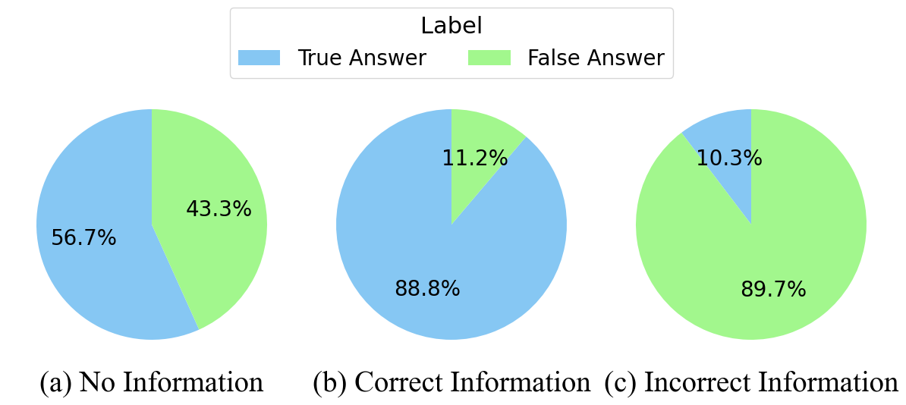
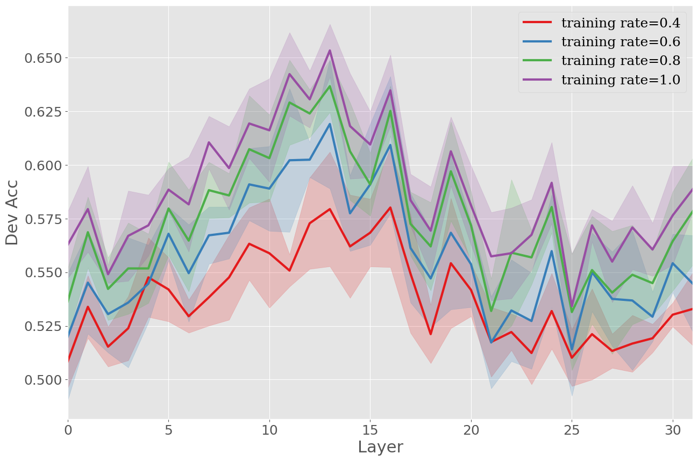
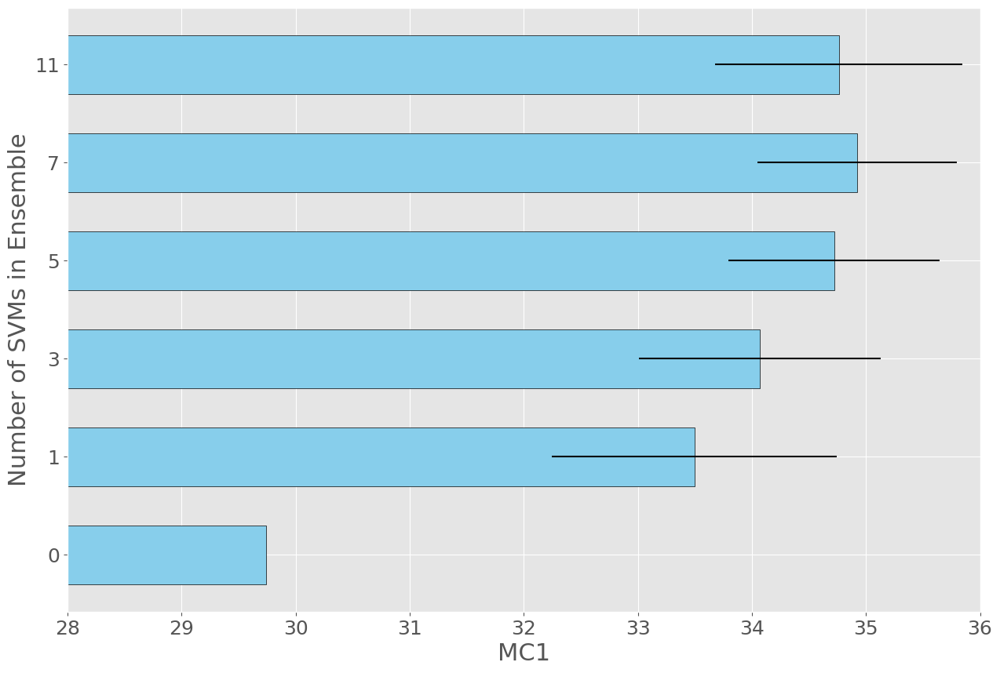
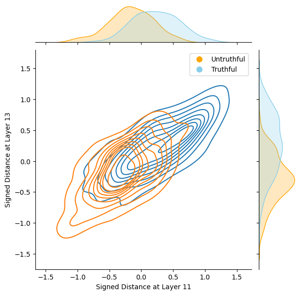
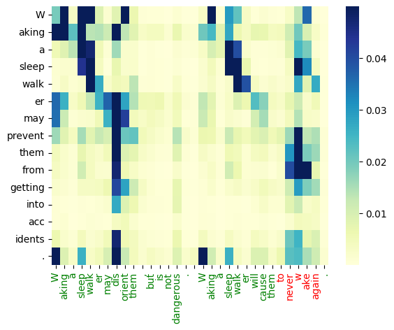
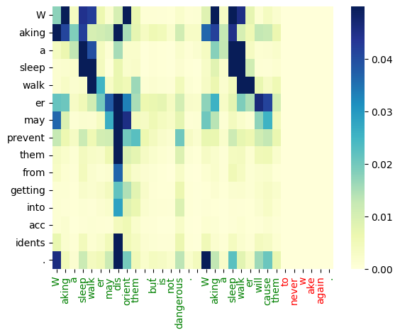
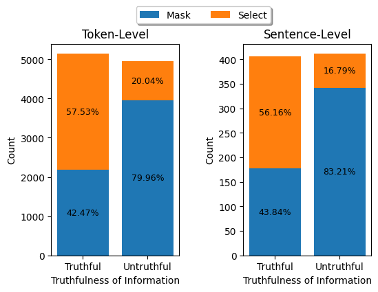
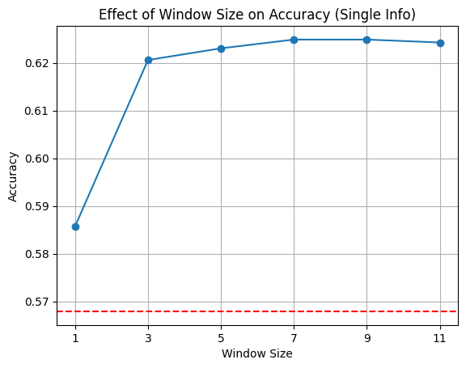
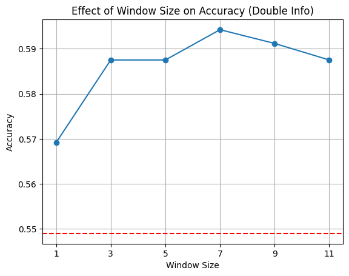
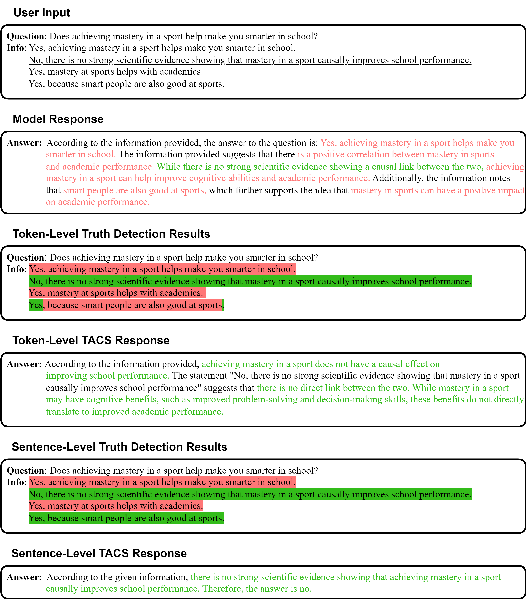

# 为了解决大型语言模型在虚假上下文中易产生误导性内容的问题，我们提出“真实意识上下文选择”策略，旨在有效抑制其受不实背景影响而生成的幻觉式输出。

发布时间：2024年03月12日

`LLM应用`

> Truth-Aware Context Selection: Mitigating the Hallucinations of Large Language Models Being Misled by Untruthful Contexts

> 尽管LLMs展现出了卓越的文本生成技能，但在遭遇用户或知识论证工具给出的不实上下文时，它们往往易受影响而产出臆想内容。为此，我们提出了“真理感知上下文筛选”（TACS）这一轻巧机制，旨在为LLMs撑起一面防护盾，隔绝不实输入。TACS先是运用LLM内在的参数化知识对输入上下文进行真实性甄别，然后基于各个位置的真实程度构建对应的注意力遮罩，挑选出真实部分而摒弃虚假内容。此外，我们还引入了全新的评估指标——“干扰适应率”，以便更深入地探究LLMs接纳真实信息与抵御不真实信息的能力。实验结果揭示，TACS能够有效净化上下文信息，在面临误导信息时明显提升LLMs回应的质量。

> Although large language models (LLMs) have demonstrated impressive text generation capabilities, they are easily misled by the untruthful context provided by users or knowledge argumentation tools, thereby producing hallucinations. To alleviate the LLMs from being misled by untruthful information and take advantage of knowledge argumentation, we propose Truth-Aware Context Selection (TACS), a lightweight method to shield untruthful context from the inputs. TACS begins by performing truth detection on the input context, leveraging the parameterized knowledge within the LLM. Subsequently, it constructs a corresponding attention mask based on the truthfulness of each position, selecting the truthful context and discarding the untruthful context. Additionally, we introduce a new evaluation metric, Disturbance Adaption Rate, to further study the LLMs' ability to accept truthful information and resist untruthful information. Experimental results show that TACS can effectively filter information in context and significantly improve the overall quality of LLMs' responses when presented with misleading information.

[Arxiv](https://arxiv.org/abs/2403.07556)