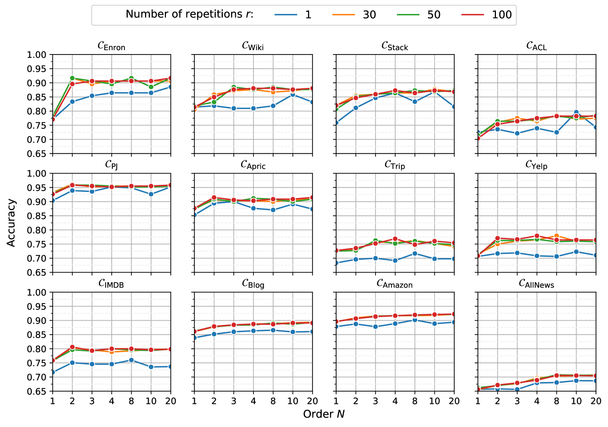
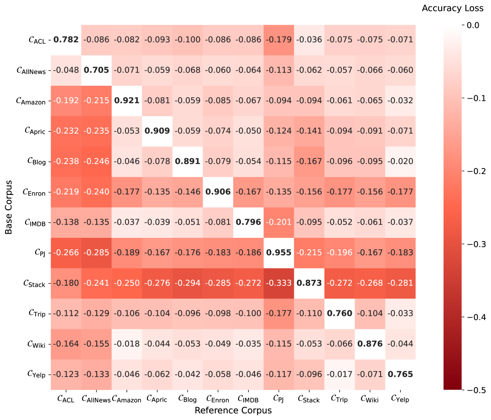
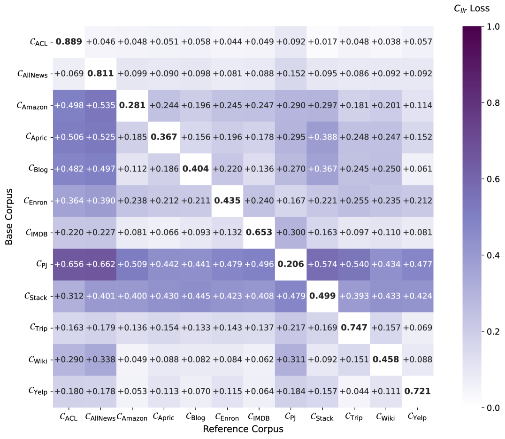

# [通过对语法模型的似然比分析进行作者身份验证的研究]

发布时间：2024年03月13日

`LLM理论` `司法鉴定` `作者身份验证`

> Authorship Verification based on the Likelihood Ratio of Grammar Models

> 作者身份验证（AV）主要用于判断一组文档是否出自同一特定作者之手，尤其在司法鉴定中，如文档成为犯罪证据时尤为重要。然而，现有的尖端AV技术虽表现出色，但其背后的运作原理缺乏令人信服的科学解释，且对分析人员而言不易理解。为此，我们创新性地提出了LambdaG方法，通过计算候选作者和参考群体在各自语法规则模型下的文档概率比值，实现对作者身份的精准判定。值得注意的是，这些语法规则模型仅基于语法特征训练而成的n元语言模型进行估计。即使无需大量训练数据，LambdaG也能超越包含深度学习Siamese Transformer网络在内的、计算复杂度更高的现有AV方法，在准确率和AUC指标上，在十一种情形下表现更优，而在仅考虑无主题偏向的方法时，十二种测试数据集全部胜出。此外，LambdaG算法在面对参考群体文体类型发生显著变化时仍保持高度稳健性。更为关键的是，相比当前最优方法，LambdaG因其与认知语言学中的语言处理理论相契合，使得其解释性更强，更具优势。

> Authorship Verification (AV) is the process of analyzing a set of documents to determine whether they were written by a specific author. This problem often arises in forensic scenarios, e.g., in cases where the documents in question constitute evidence for a crime. Existing state-of-the-art AV methods use computational solutions that are not supported by a plausible scientific explanation for their functioning and that are often difficult for analysts to interpret. To address this, we propose a method relying on calculating a quantity we call $λ_G$ (LambdaG): the ratio between the likelihood of a document given a model of the Grammar for the candidate author and the likelihood of the same document given a model of the Grammar for a reference population. These Grammar Models are estimated using $n$-gram language models that are trained solely on grammatical features. Despite not needing large amounts of data for training, LambdaG still outperforms other established AV methods with higher computational complexity, including a fine-tuned Siamese Transformer network. Our empirical evaluation based on four baseline methods applied to twelve datasets shows that LambdaG leads to better results in terms of both accuracy and AUC in eleven cases and in all twelve cases if considering only topic-agnostic methods. The algorithm is also highly robust to important variations in the genre of the reference population in many cross-genre comparisons. In addition to these properties, we demonstrate how LambdaG is easier to interpret than the current state-of-the-art. We argue that the advantage of LambdaG over other methods is due to fact that it is compatible with Cognitive Linguistic theories of language processing.

[Arxiv](https://arxiv.org/abs/2403.08462)