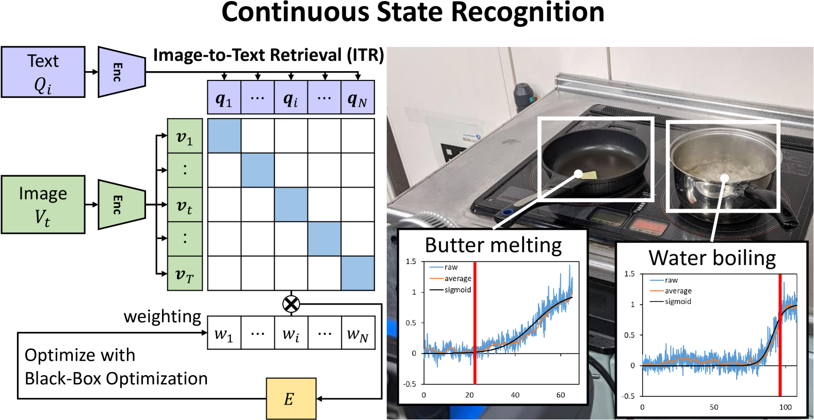
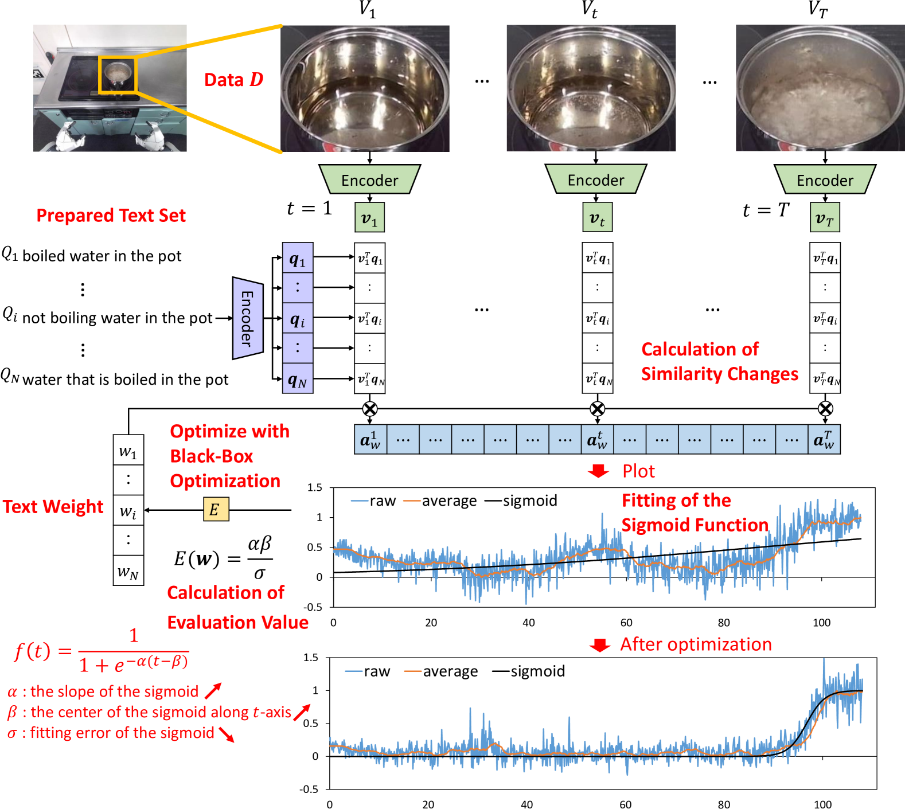
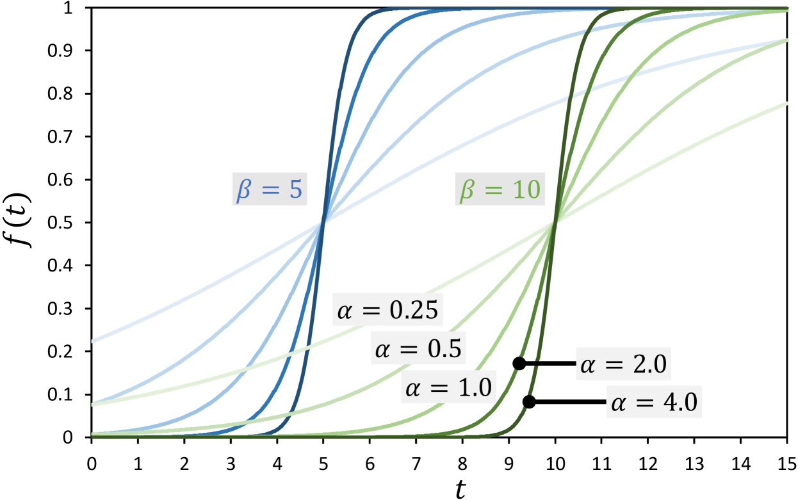
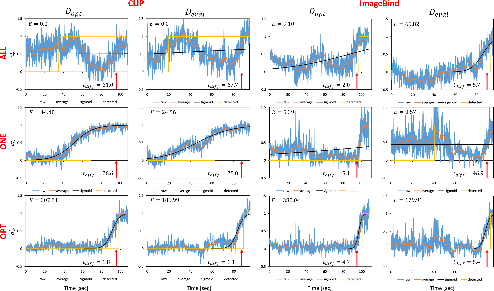
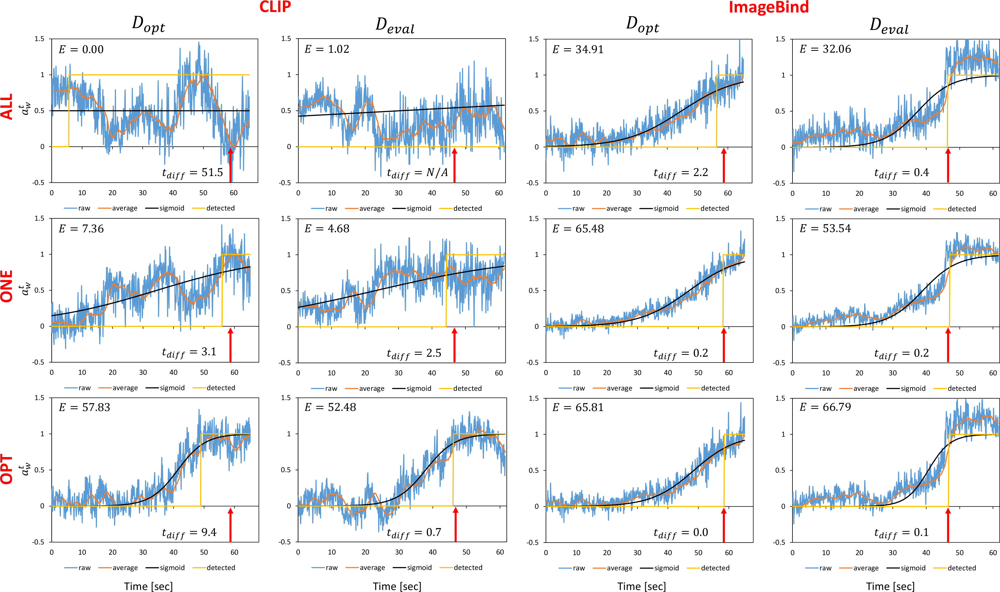
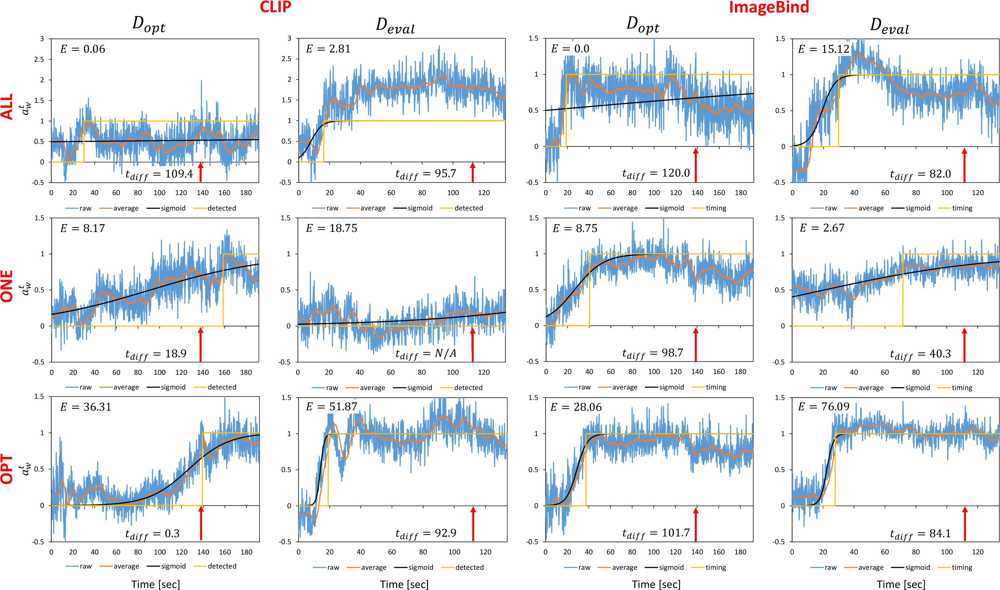
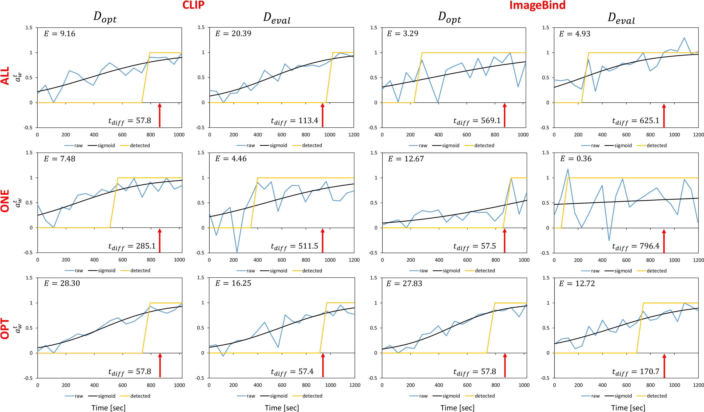

# 本研究运用预训练的视觉-语言模型与黑盒优化方法，助力烹饪机器人实现对连续物体状态的精准识别。

发布时间：2024年03月13日

`Agent` `机器人技术`

> Continuous Object State Recognition for Cooking Robots Using Pre-Trained Vision-Language Models and Black-box Optimization

> 机器人惯常以分类方式判断环境与物体状态，然而在烹饪场景下，食物状态持续演变，需实时且连续追踪其变化过程，而这无法仅依靠传统编程精准表述。为此，我们创新性地提出一种方法，利用预训练的大型视觉-语言模型，通过语音指令使烹饪机器人能够连续识别食物状态变化。我们运用能随时间连续计算图像与文本相似度的模型，在烹饪全程中实时捕捉食物状态演变。同时，我们通过拟合sigmoid函数调整各文本提示的权重，并进行黑盒优化，有效提升了连续状态识别的精确度和稳定性。通过演示水沸腾、黄油熔化、蛋类烹饪及洋葱爆炒等多种状态识别任务，我们验证了该方法的实际效果及其局限所在。

> The state recognition of the environment and objects by robots is generally based on the judgement of the current state as a classification problem. On the other hand, state changes of food in cooking happen continuously and need to be captured not only at a certain time point but also continuously over time. In addition, the state changes of food are complex and cannot be easily described by manual programming. Therefore, we propose a method to recognize the continuous state changes of food for cooking robots through the spoken language using pre-trained large-scale vision-language models. By using models that can compute the similarity between images and texts continuously over time, we can capture the state changes of food while cooking. We also show that by adjusting the weighting of each text prompt based on fitting the similarity changes to a sigmoid function and then performing black-box optimization, more accurate and robust continuous state recognition can be achieved. We demonstrate the effectiveness and limitations of this method by performing the recognition of water boiling, butter melting, egg cooking, and onion stir-frying.

[Arxiv](https://arxiv.org/abs/2403.08239)