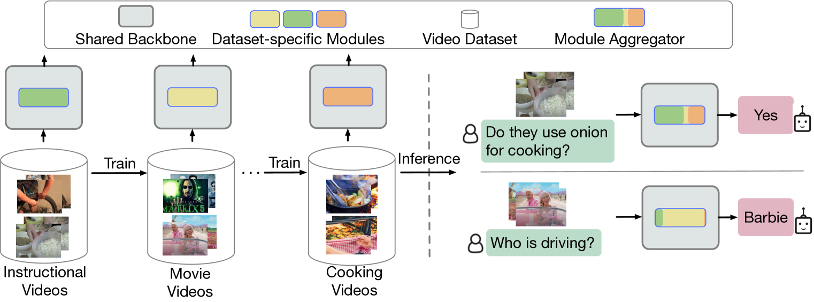
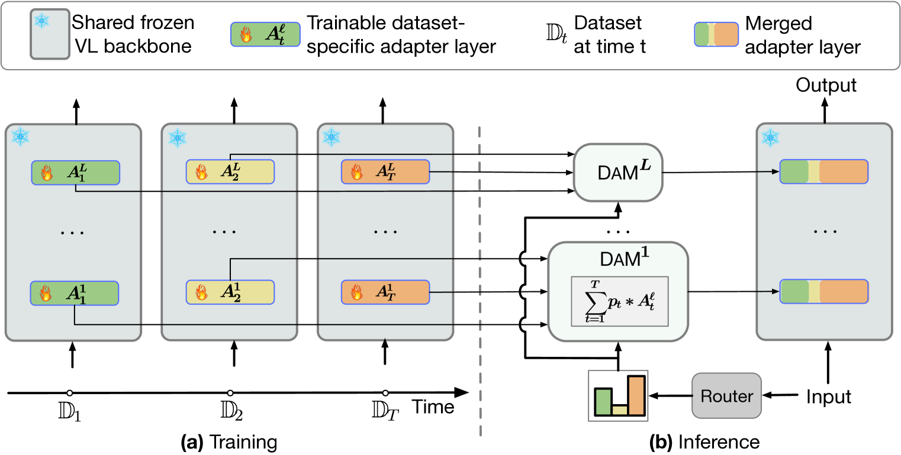
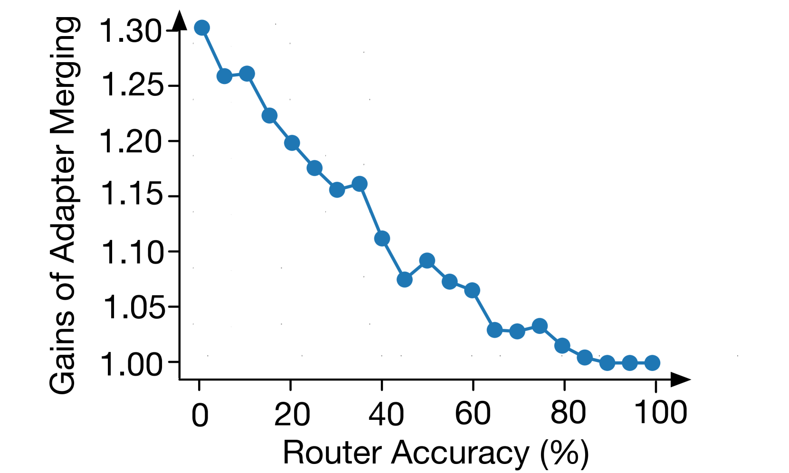

# [DAM 技术，即动态适配器融合，旨在解决连续视频问答学习场景下的问题，通过整合并适时调整适配器模块以适应不断变化的学习需求。](https://arxiv.org/abs/2403.08755)

发布时间：2024年03月13日

`Agent`

`视频理解`

`连续学习`

> DAM: Dynamic Adapter Merging for Continual Video QA Learning

> 本文介绍了一项创新成果——名为DAM的参数节省型方法，专为解决连续视频问答(VidQA)难题而设计。DAM运用独创的“动态适配器融合”技术，有效地解决了记忆衰退、快速适应新数据集、处理推理阶段未知来源的输入以及跨类似数据集领域共享知识这四大挑战。面对不断更新的VidQA数据集流，我们在保持大容量预训练视频-语言模型主体参数不变的前提下，逐个训练针对性的数据集适配器。在推理环节，面对未知领域的视频问题样本时，DAM借助新颖的非参数路由器功能，对每个适配器与当前视频问题输入的相关度进行概率评估。然后，动态适配器融合机制会整合所有适配器权重，生成一个专门针对该测试样本定制的新适配器实例，以得出最终的VidQA预测结果，巧妙地减轻了由于路由预测误差带来的影响，并促进了跨领域的知识迁移。实验证明，在涉及广泛领域的6个VidQA数据集中，DAM比现有最先进的持续学习方法性能高出9.1%，并且降低了1.9%的记忆遗忘率。此外，我们将DAM成功应用于连续图像分类和图像问答任务，并取得了显著优于其他方法的成绩。相关代码已开放获取，访问地址为：https://github.com/klauscc/DAM。

> We present a parameter-efficient method for continual video question-answering (VidQA) learning. Our method, named DAM, uses the proposed Dynamic Adapter Merging to (i) mitigate catastrophic forgetting, (ii) enable efficient adaptation to continually arriving datasets, (iii) handle inputs from unknown datasets during inference, and (iv) enable knowledge sharing across similar dataset domains. Given a set of continually streaming VidQA datasets, we sequentially train dataset-specific adapters for each dataset while freezing the parameters of a large pretrained video-language backbone. During inference, given a video-question sample from an unknown domain, our method first uses the proposed non-parametric router function to compute a probability for each adapter, reflecting how relevant that adapter is to the current video-question input instance. Subsequently, the proposed dynamic adapter merging scheme aggregates all the adapter weights into a new adapter instance tailored for that particular test sample to compute the final VidQA prediction, mitigating the impact of inaccurate router predictions and facilitating knowledge sharing across domains. Our DAM model outperforms prior state-of-the-art continual learning approaches by 9.1% while exhibiting 1.9% less forgetting on 6 VidQA datasets spanning various domains. We further extend DAM to continual image classification and image QA and outperform prior methods by a large margin. The code is publicly available at: https://github.com/klauscc/DAM

