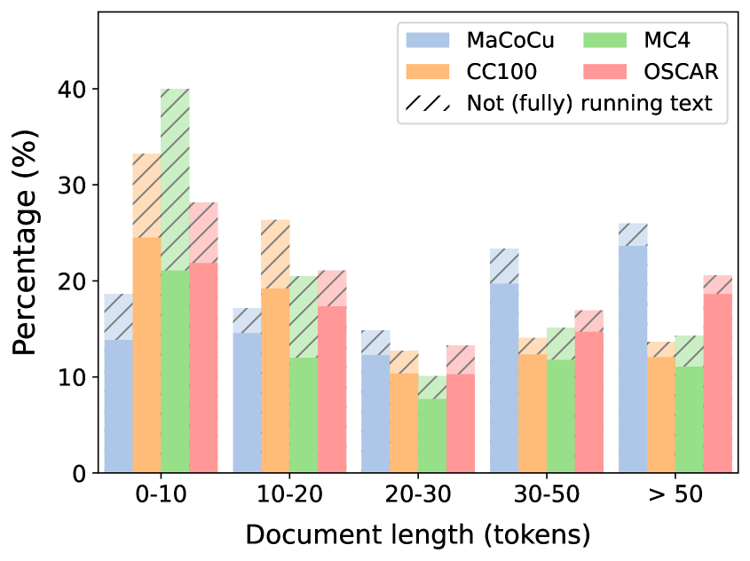
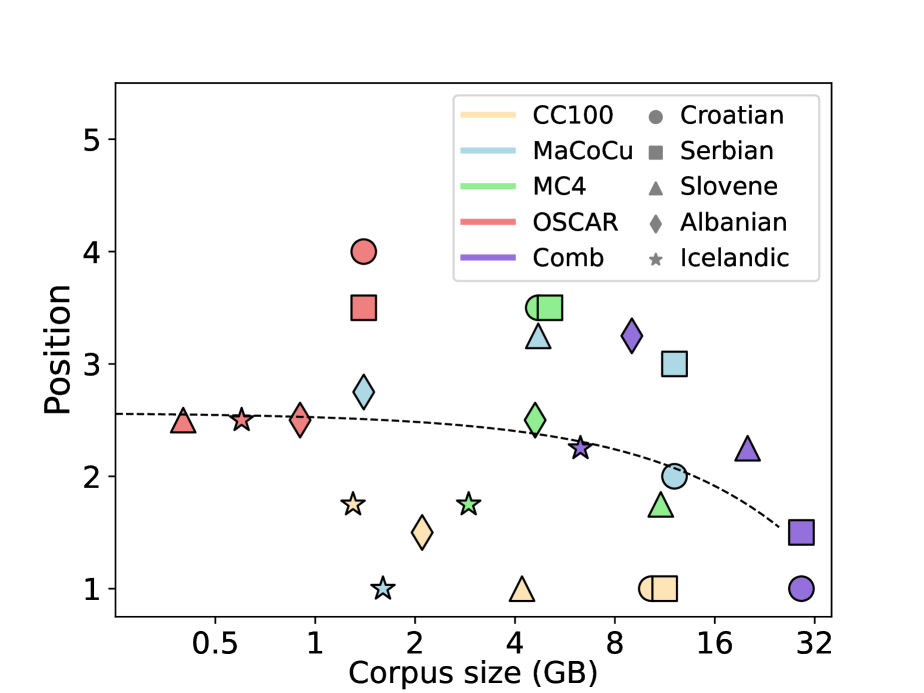

# [语言模型对文本质量有多在意？我们针对 11 种语言的网络抓取语料库进行评估，以探究其对文本质量的关注程度。](https://arxiv.org/abs/2403.08693)

发布时间：2024年03月13日

`LLM理论` `数据挖掘`

> Do Language Models Care About Text Quality? Evaluating Web-Crawled Corpora Across 11 Languages

> 大型精选网络爬取语料库是训练诸如GPT、LLaMA及XLM-RoBERTa等流行语言模型的核心支撑，但对其品质的关注却相对不足。本研究选取了四个颇具代表性的大型网络爬取语料库（CC100、MaCoCu、mC4和OSCAR），并以十一种低资源欧洲语言为背景进行了深度对比。我们采取双管齐下的策略，一方面从各语料库抽取样本进行人工质量评估，另一方面针对性地用各语料库训练特定的语言模型，并通过下游任务表现衡量质量差异的实际效果。研究揭示了各语料库间存在着明显的质量差距，其中MaCoCu与OSCAR表现最优，但在实际应用评估阶段，却发现CC100语料库的得分最高。因此，我们得出结论，在本次实验中，网络爬取语料库的质量对于训练语言模型的影响并不显著。

> Large, curated, web-crawled corpora play a vital role in training language models (LMs). They form the lion's share of the training data in virtually all recent LMs, such as the well-known GPT, LLaMA and XLM-RoBERTa models. However, despite this importance, relatively little attention has been given to the quality of these corpora. In this paper, we compare four of the currently most relevant large, web-crawled corpora (CC100, MaCoCu, mC4 and OSCAR) across eleven lower-resourced European languages. Our approach is two-fold: first, we perform an intrinsic evaluation by performing a human evaluation of the quality of samples taken from different corpora; then, we assess the practical impact of the qualitative differences by training specific LMs on each of the corpora and evaluating their performance on downstream tasks. We find that there are clear differences in quality of the corpora, with MaCoCu and OSCAR obtaining the best results. However, during the extrinsic evaluation, we actually find that the CC100 corpus achieves the highest scores. We conclude that, in our experiments, the quality of the web-crawled corpora does not seem to play a significant role when training LMs.

[Arxiv](https://arxiv.org/abs/2403.08693)