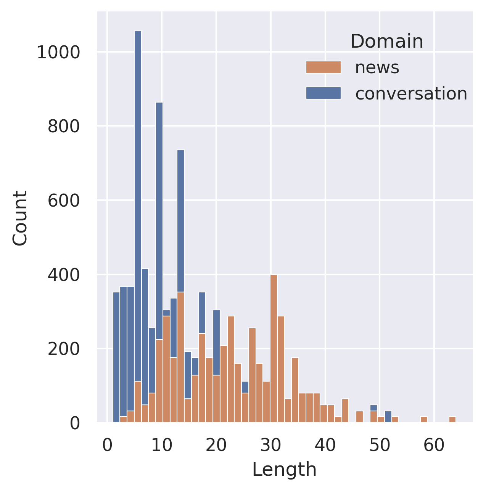
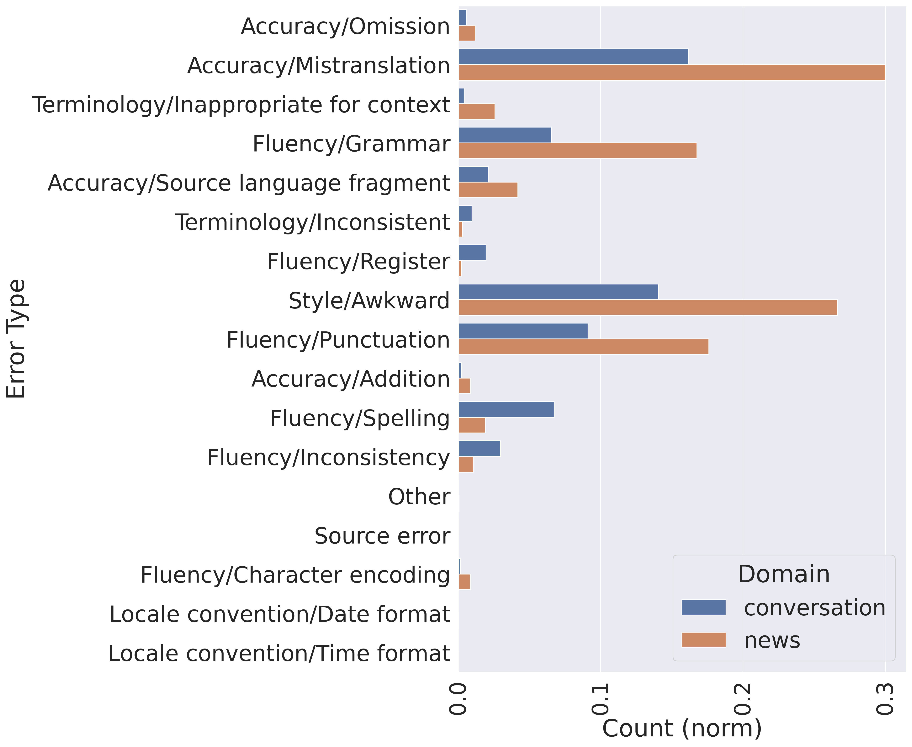
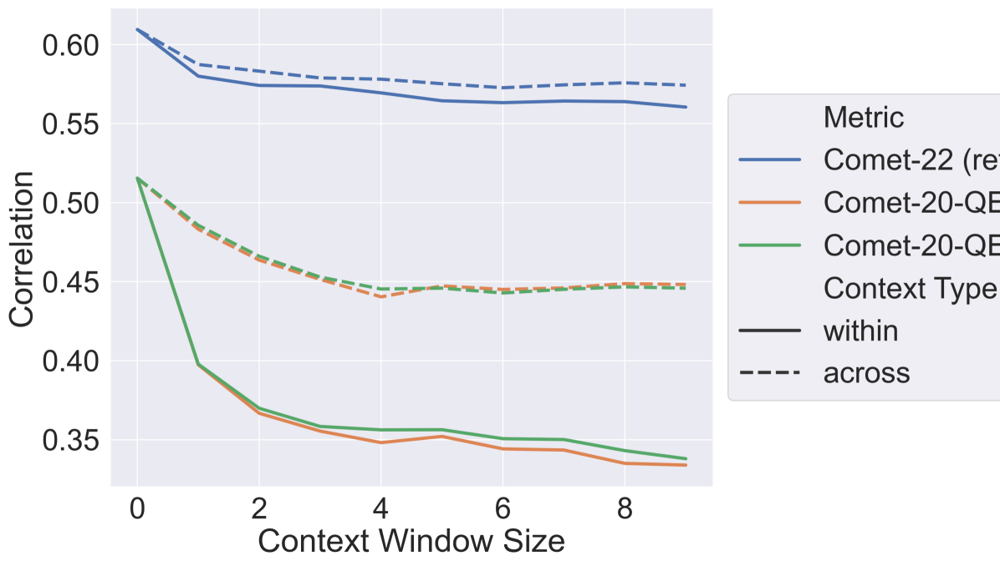
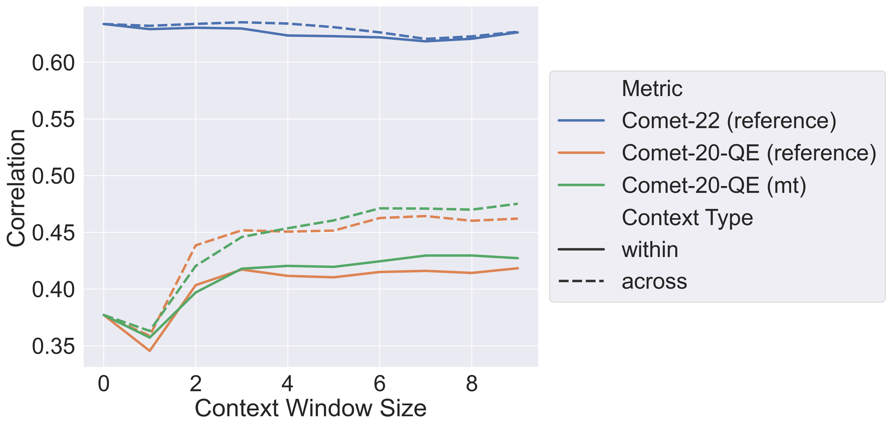
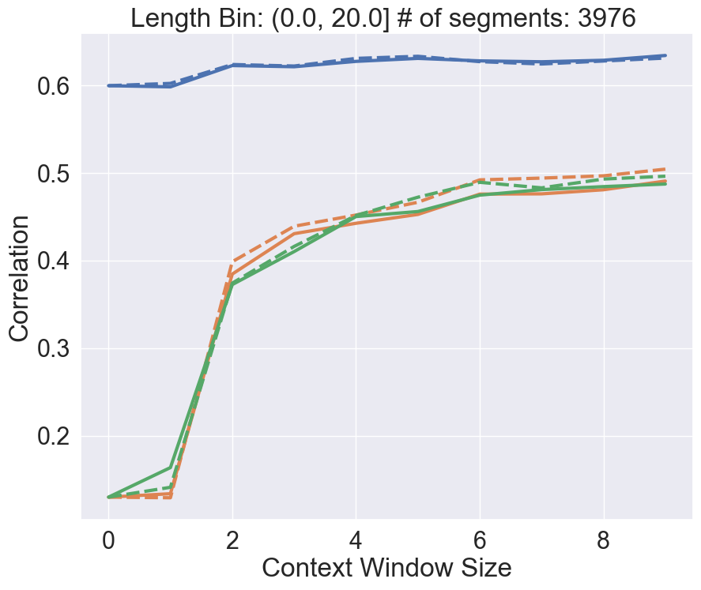
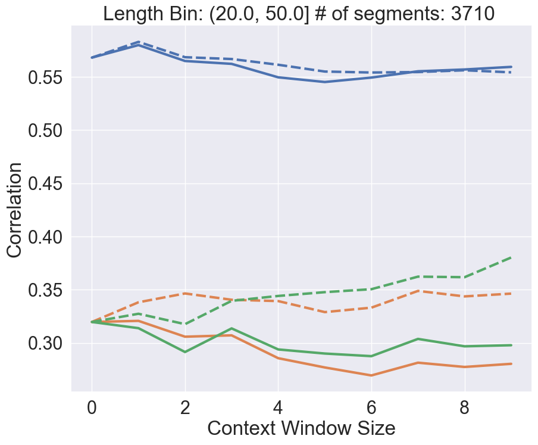
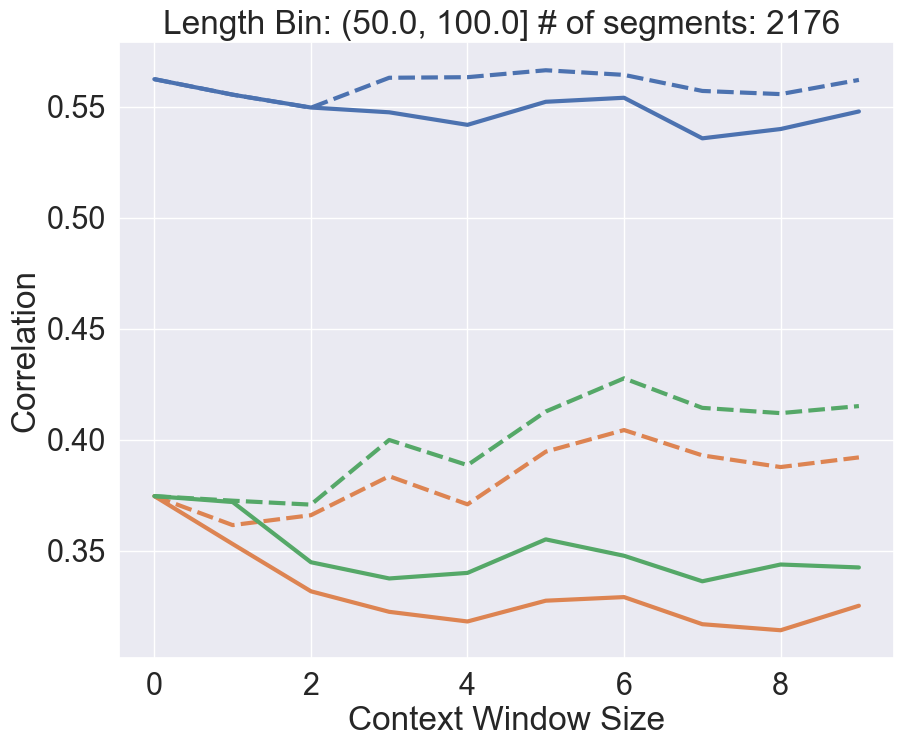
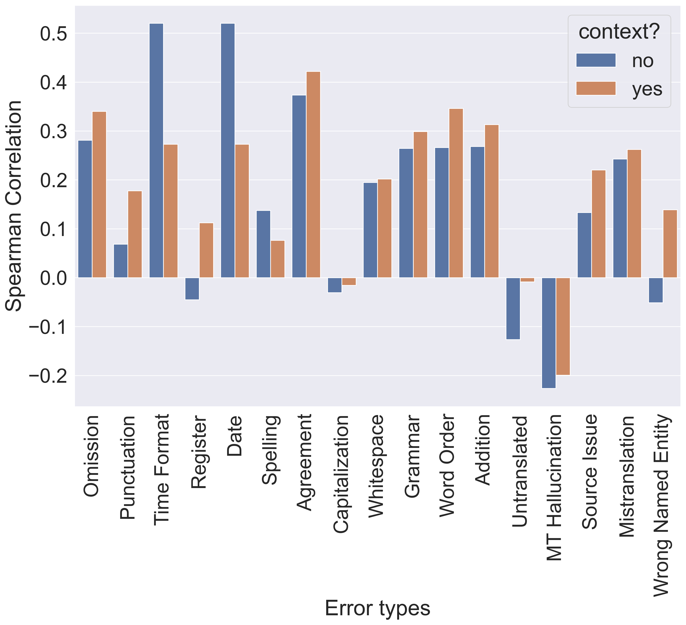
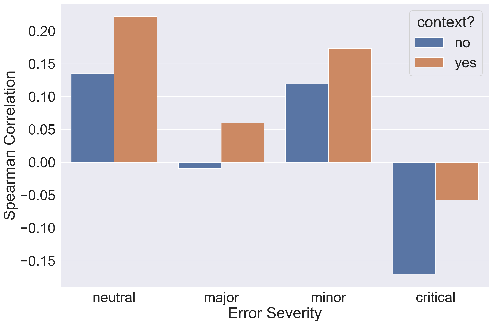
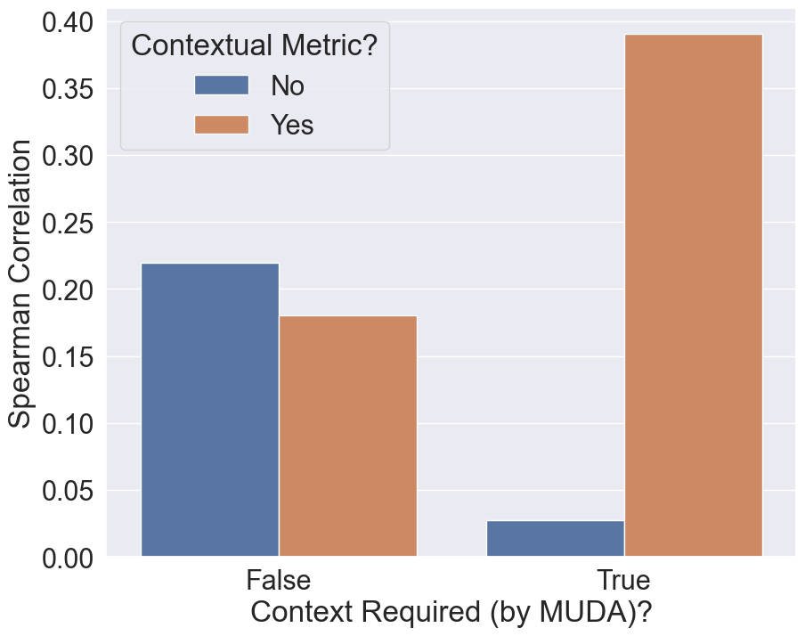

# [在聊天翻译评估中，引入上下文真的能起到积极作用吗？](https://arxiv.org/abs/2403.08314)

发布时间：2024年03月13日

`LLM应用` `机器翻译` `聊天对话`

> Is Context Helpful for Chat Translation Evaluation?

> 尽管自动评估翻译质量的指标在近期取得显著成效，但在评估机器翻译的聊天对话质量上却未得到广泛应用。聊天对话因其非结构化、简短及高度依赖上下文特性，使得原本为新闻等结构化文本设计的基于句子级别的指标在此领域内面临可靠性和上下文考量的挑战。为此，我们对这类指标进行了一次针对机器翻译聊天对话质量评估的元评价，并发现无参考译文的度量标准在评估非英语环境下的翻译质量时明显逊色于基于参考译文的标准。接下来，我们探究了将对话上下文信息融入这些度量标准对其性能的影响。实验结果显示，通过在神经网络学习的无参考译文度量标准中加入上下文信息，可以有效提升其与人工评判的相关性，特别是在处理非英语环境的翻译评估时。最终，我们提出一种名为Context-MQM的新评估指标，该指标巧妙结合了双语上下文信息和大型语言模型（LLM），进一步证实即便对于基于LLM的评估指标，引入上下文信息也有助于提高评估准确性。

> Despite the recent success of automatic metrics for assessing translation quality, their application in evaluating the quality of machine-translated chats has been limited. Unlike more structured texts like news, chat conversations are often unstructured, short, and heavily reliant on contextual information. This poses questions about the reliability of existing sentence-level metrics in this domain as well as the role of context in assessing the translation quality. Motivated by this, we conduct a meta-evaluation of existing sentence-level automatic metrics, primarily designed for structured domains such as news, to assess the quality of machine-translated chats. We find that reference-free metrics lag behind reference-based ones, especially when evaluating translation quality in out-of-English settings. We then investigate how incorporating conversational contextual information in these metrics affects their performance. Our findings show that augmenting neural learned metrics with contextual information helps improve correlation with human judgments in the reference-free scenario and when evaluating translations in out-of-English settings. Finally, we propose a new evaluation metric, Context-MQM, that utilizes bilingual context with a large language model (LLM) and further validate that adding context helps even for LLM-based evaluation metrics.

[Arxiv](https://arxiv.org/abs/2403.08314)